# UT1 — Digitalización en la 4ª revolución industrial

## De qué va esta unidad

Es habitual haber oído hablar de "Industria 4.0", de fábricas inteligentes o de que "todo se está digitalizando". Esta unidad analiza esas expresiones para entender qué significan realmente. La idea central es sencilla: las empresas llevan más de dos siglos cambiando su forma de producir, y cada cierto tiempo ocurre un salto tan grande que se le llama "revolución industrial". Se han vivido ya tres (vapor, electricidad, electrónica) y actualmente se está de lleno en la cuarta, la de los datos, la conectividad y la inteligencia artificial.

Para entender la digitalización de una empresa industrial hay que mirarla desde dos ángulos que conviven en toda fábrica: el ángulo de la información (llamado **IT**, de *Information Technology*) y el ángulo de la operación física, de las máquinas y de la producción (llamado **OT**, de *Operation Technology*). Tradicionalmente estos dos mundos han ido cada uno por su lado: en la oficina se gestionaban pedidos y facturas con ordenadores, y en la planta las máquinas hacían su trabajo con controladores propios, sin apenas comunicarse entre sí. La gran promesa —y el gran reto— de la digitalización actual es conectar ambos mundos para que la información fluya de la planta a la dirección y viceversa, en tiempo real.

El objetivo de esta unidad es analizar el concepto de digitalización y su repercusión en los sectores productivos, sabiendo identificar y diferenciar los entornos IT y OT de una empresa. A lo largo de las siguientes páginas se aborda de dónde viene todo esto (las cuatro revoluciones industriales), qué es exactamente un "sistema ciberfísico", cómo se organiza una empresa por dentro, qué diferencia a IT de OT, cómo se conectan ambos mundos y, para terminar, qué gana realmente una empresa que se digitaliza de arriba abajo.

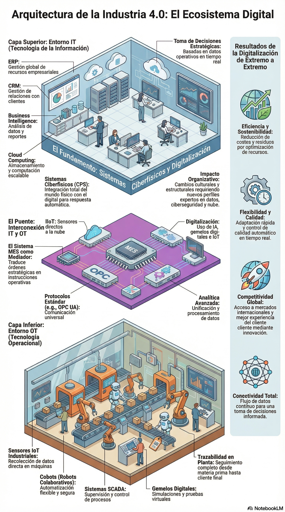
*Figura: visión de conjunto de una empresa digitalizada, con la capa IT (ERP, CRM, Business Intelligence, cloud) arriba, el puente de interconexión (MES, protocolos como OPC UA) en el centro, y la capa OT (sensores, cobots, SCADA) abajo. Cada pieza de este mapa se desarrolla a lo largo de la unidad. Origen: imagen suelta de la carpeta de la unidad.*

## Qué se espera saber hacer al terminar la unidad

En términos normativos, el objetivo de esta unidad es "analizar el concepto de digitalización y su repercusión en los sectores productivos teniendo en cuenta la actividad de la empresa e identificando entornos IT y OT característicos". Traducido a la práctica, al terminar esta unidad se debe ser capaz de:

- Explicar con palabras propias qué es la digitalización y en qué se diferencia de simplemente "meter ordenadores" en una empresa.
- Relacionar la llegada de la tecnología digital con cambios reales en cómo se organiza una empresa (procesos, atención al cliente, modelos de negocio, estructura interna).
- Distinguir un entorno IT de un entorno OT, explicando en qué se parecen y en qué no.
- Reconocer qué departamentos de una empresa suelen formar parte del entorno IT.
- Identificar tecnologías típicas de la digitalización tanto en planta (OT) como en el negocio (IT).
- Explicar por qué es importante conectar los entornos IT y OT, y de qué formas se puede hacer esa conexión.
- Enumerar las ventajas de digitalizar una empresa industrial de extremo a extremo (desde el pedido hasta la entrega).

---

## 1. Cronología de las revoluciones industriales. Principales elementos.

A lo largo de la historia se han producido grandes cambios de paradigma en la forma de producir: momentos en los que se rompe con lo anterior y se instala un nuevo modelo de pensamiento y de trabajo. A estos saltos se les llama **revoluciones industriales**, y hasta ahora se cuentan cuatro.

**Primera Revolución Industrial (1784-1870).** En 1784 James Watt inventa la máquina de vapor y esto provoca el primer gran cambio de paradigma: se pasa de una producción artesanal y agrícola, hecha a mano, a una producción mecanizada. La fuente de energía fue el carbón, y gracias a esta revolución se desarrollaron la industria textil, la del hierro y el transporte ferroviario. En las fábricas de vapor, todas las máquinas tenían que conectarse mediante correas y poleas a un único eje de transmisión central movido por la máquina de vapor, así que la disposición de las máquinas dependía de dónde estuviera ese eje, no de la lógica del proceso de producción.

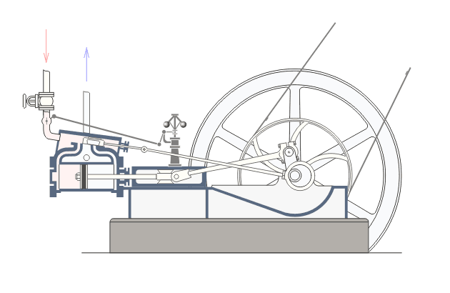
*Figura: esquema de una máquina de vapor de las que impulsaron la Primera Revolución Industrial. Origen: `UT 1 Digitalización en 4a revolucion.pdf`.*

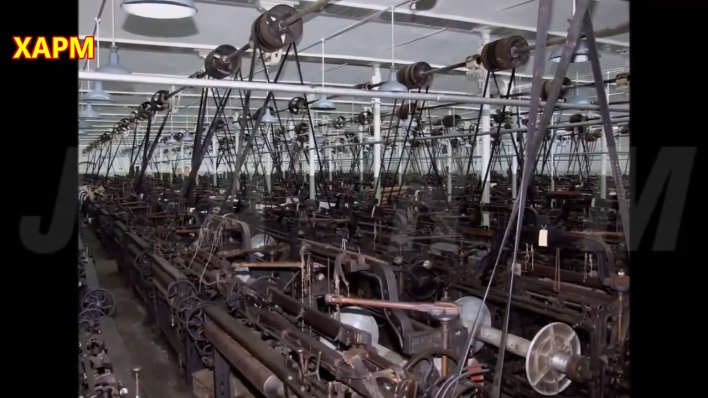
*Figura: fotograma de una fábrica textil de la época del vapor. Se aprecia el eje de transmisión central del que salen las correas hacia cada máquina. Origen: `UT 1 Digitalización en 4a revolucion.pdf` (vídeo de la hilandería Queen Street Mill Textile Museum, Reino Unido).*

**Segunda Revolución Industrial (1870-1969).** Con el desarrollo de la electricidad, la producción pasó de mecánica a eléctrica. Esto permitió la producción en masa y la famosa cadena de montaje, popularizada por Henry Ford. La clave fue la **flexibilidad**: cada máquina pasó a tener su propio motor eléctrico alimentado por cable, así que las fábricas ya no tenían que colocar las máquinas alrededor de un eje central, sino según el flujo lógico del trabajo, permitiendo que el producto avanzara de estación en estación. Esto hizo posible ordenar las máquinas en línea secuencial (corte, ensamblaje, pintura...) y usar cintas transportadoras.

Un dato curioso de la época: gracias a la cadena de montaje, el tiempo de montaje del Ford Modelo T se redujo de 12 horas a 93 minutos, lo que abarató el producto y permitió la producción a gran escala. Para reducir la altísima rotación de personal en su fábrica (el trabajo era agotador y repetitivo), Ford llegó a ofrecer 5 dólares al día (3 dólares más que el salario habitual), lo que le llevó a tener a la puerta a 10.000 hombres dispuestos a trabajar al día siguiente.

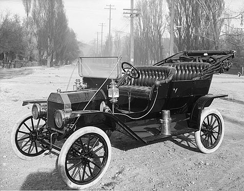
*Figura: Ford Modelo T, el coche que popularizó la cadena de montaje de Henry Ford. Origen: `UT 1 Digitalización en 4a revolucion.pdf`.*

**Tercera Revolución Industrial (1969-2016).** Surge la electrónica y, con ella, la producción pasó de eléctrica a automatizada: las máquinas (ordenadores, robots, PLC) se pueden programar para hacer tareas distintas sin modificar su estructura física. La **automatización** es precisamente el uso de tecnología, como la robótica o el software, para realizar tareas con mínima intervención humana. Antes de la electrónica, si querías cambiar la tarea de una máquina mecánica tenías que rediseñarla por dentro (engranajes, levas, moldes); con la electrónica, un robot de soldadura puede cambiar de tarea simplemente cargando un programa distinto. Esta revolución también trajo la extensión de la informática personal, la fabricación de los primeros teléfonos móviles y, ya en los años 90, la difusión de internet y la World Wide Web (la llamada "era de la información").

**Cuarta Revolución Industrial (Industria 4.0).** Aquí llegamos al presente. Los materiales de esta unidad no se ponen del todo de acuerdo en el año exacto de arranque: los apuntes de la unidad la sitúan en 2016, año en que Klaus Schwab —fundador del Foro Económico Mundial— popularizó y definió el concepto en su libro *La cuarta revolución industrial*; el libro de texto de la editorial Paraninfo, en cambio, la sitúa aproximadamente en 2011. Ambas fuentes coinciden en que estamos en el siglo XXI y en que el rasgo distintivo es el paso de una producción simplemente automatizada a una producción **autónoma**, capaz de tomar sus propias decisiones apoyándose en datos. A las tecnologías que hacen posible este salto (IA, IoT, Big Data, cloud...) se las conoce como **tecnologías habilitadoras digitales (THD)**, y las estudiaremos en profundidad en la UT2; en esta unidad basta con saber que existen y que son las responsables de "flexibilizar" las fábricas igual que hicieron en su día la electricidad y la electrónica.

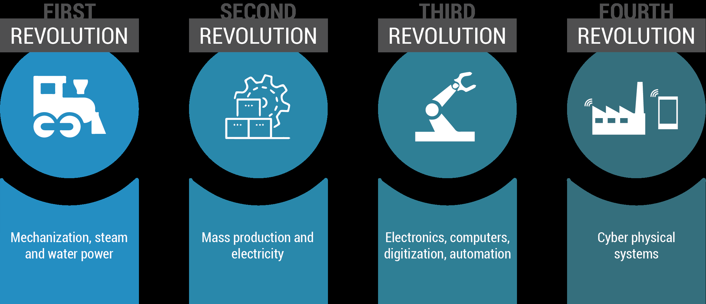
*Figura: resumen visual de las cuatro revoluciones industriales y su rasgo principal. Origen: `UT 1 Digitalización en 4a revolucion.pdf`.*

> **Ejemplo actual — Gigafactorías de baterías en España.** En los últimos años varias plantas de fabricación de baterías y vehículos eléctricos se han instalado o ampliado en España (por ejemplo, en el entorno de Valencia y Sagunto), con procesos altamente automatizados y digitalizados desde el primer día. Son un buen ejemplo de que hoy ya no se construyen fábricas "de la tercera revolución" para digitalizarlas después, sino que nacen directamente pensadas como fábricas 4.0.

> **En las noticias — Software que "recuerda" a la primera revolución.** Es curioso comprobar cómo, según se ha informado en medios especializados en manufactura, algunas fábricas textiles centenarias en Europa y Asia siguen operativas conservando parte de su maquinaria original de la época del vapor, ahora convertida en pieza de museo o en atracción turística, mientras a pocos metros se instalan líneas 100% robotizadas. Conviven, literalmente, la primera y la cuarta revolución industrial bajo el mismo techo.

### Ideas clave de esta sección
- Ha habido 4 revoluciones industriales: vapor (1784), electricidad (1870), electrónica/automatización (1969) y digitalización/Industria 4.0 (en torno a 2011-2016, según la fuente).
- Cada revolución trajo una fuente de energía o tecnología nueva y, sobre todo, más **flexibilidad** para organizar la producción.
- La cadena de montaje de Ford es el ejemplo clásico de cómo la electricidad cambió la organización física de una fábrica.
- La cuarta revolución se caracteriza por pasar de máquinas automatizadas a máquinas autónomas gracias a las THD.

## 2. Revoluciones industriales. Cuarta revolución industrial. Digitalización y elementos que la definen.

Una vez situados en el tiempo, toca definir bien el concepto estrella de la unidad: la **digitalización**. Digitalizar es el proceso de cambiar los estados de los elementos de analógicos a digitales: el papel, el archivado de documentos, los sistemas locales... todo pasa a estar en formato digital, accesible desde cualquier lugar y en cualquier momento (dependiendo de los permisos de cada usuario). La digitalización aplicada a la industria 4.0 va un paso más allá: es el proceso mediante el cual se utilizan tecnologías digitales avanzadas —inteligencia artificial, gemelos digitales, Internet de las Cosas— para mejorar la eficiencia y la productividad, convirtiendo la fábrica tradicional en una **fábrica inteligente** (*smart factory*).

Una fábrica inteligente es una planta de producción que usa tecnologías de la Industria 4.0 (IA, análisis de datos en tiempo real) para automatizar procesos, mejorar la eficiencia y tomar decisiones más rápidas e informadas. Sus máquinas y equipos están conectados entre sí mediante una red central, intercambiando datos en tiempo real, lo que le permite reaccionar con rapidez a cambios en la demanda o en las condiciones de producción. Para ilustrarlo, puede considerarse la fabricación de botellas de plástico en dos fábricas distintas:

- **Fábrica automatizada (Industria 3.0):** el pedido llega por teléfono o email, un encargado planifica el turno a mano, las máquinas repiten siempre el mismo ciclo, un inspector revisa botellas al azar y el mantenimiento se hace por calendario, sin sensores que anticipen fallos. Los datos no fluyen entre la planta y la oficina.
- **Fábrica inteligente (Industria 4.0):** el pedido entra online y el ERP lo registra solo; un sistema MES organiza la producción y lanza compras automáticas si falta materia prima; sensores IoT controlan temperatura y presión mientras cobots manipulan las piezas; cámaras con visión artificial detectan defectos con IA; los propios sensores predicen averías antes de que ocurran (mantenimiento predictivo); y el cliente recibe notificaciones en tiempo real del estado de su pedido.

La diferencia no es solo tecnológica: la implantación de tecnología digital provoca cambios en los procesos internos (más eficiencia, menos tiempos y costes), en la relación con los clientes (apps, redes sociales, comercio electrónico), en los modelos de negocio (nuevos servicios digitales asociados a productos físicos, como el mantenimiento predictivo) y en la propia estructura organizativa, que necesita perfiles especializados en datos, ciberseguridad, cloud o IA. En definitiva: la digitalización no es solo tecnológica, también es cultural y organizativa, y requiere planificación para aprovechar de verdad sus beneficios.

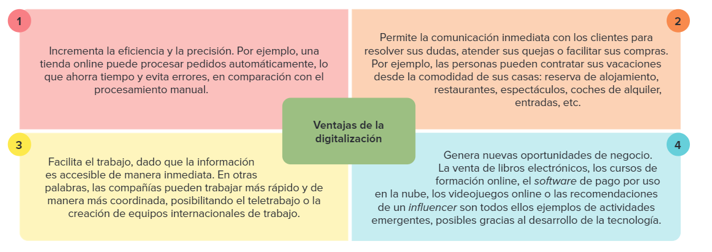
*Figura: ventajas generales de la digitalización de una empresa. Origen: `Unidad 1 Digitalizacion de CAMPUS.pdf`.*

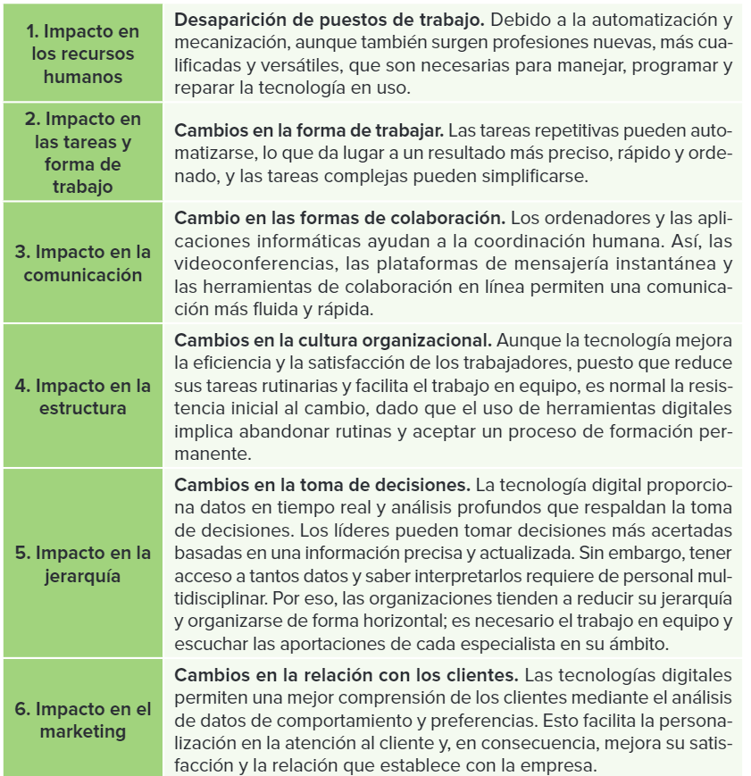
*Figura: principales impactos internos de la digitalización en una organización. Origen: `Unidad 1 Digitalizacion de CAMPUS.pdf`.*

Un apunte interesante que recoge el libro de texto de la unidad: ya se habla de una posible **quinta revolución industrial** (Industria 5.0), todavía en proceso, centrada en compatibilizar los beneficios de la digitalización con la sostenibilidad, el cuidado del medioambiente y el respeto por los derechos humanos, buscando una fusión más equilibrada entre el ser humano y la máquina. Es una idea abierta, no un hecho cerrado, pero conviene tenerla en el radar.

> **Ejemplo actual — IA generativa en el diseño de producto.** Empresas de sectores tan distintos como la automoción o la moda usan ya herramientas de IA generativa para acelerar el diseño de piezas o prototipos, reduciendo semanas de trabajo a horas. Es un ejemplo muy actual de "elemento que define" la cuarta revolución: no se trata solo de automatizar una tarea repetitiva, sino de que el sistema proponga soluciones nuevas.

> **En las noticias — Regulación europea de la IA.** En 2024 la Unión Europea aprobó el Reglamento de Inteligencia Artificial (conocido como AI Act), la primera norma integral del mundo sobre IA, que clasifica los sistemas según su nivel de riesgo. Según se informó en su momento, afecta directamente a empresas industriales que usen IA en procesos críticos, y es un buen ejemplo de que la digitalización no avanza solo por la tecnología, sino también por el marco legal que la acompaña.

### Ideas clave de esta sección
- Digitalizar es pasar de lo analógico a lo digital; en la Industria 4.0 implica además usar IA, IoT y gemelos digitales para ganar eficiencia.
- Una fábrica inteligente se diferencia de una simplemente automatizada en que aprende, predice y conecta datos de toda la cadena, no solo repite tareas.
- La digitalización tiene impacto cultural y organizativo, no solo tecnológico.
- Hay quien ya habla de una Industria 5.0 centrada en las personas y la sostenibilidad, aunque todavía está en desarrollo.

## 3. Sistemas ciberfísicos.

**Sistema ciberfísico (CPS, de *Cyber Physical System*)** es el nombre "paraguas" que sirve para denominar desde una fábrica inteligente hasta un automóvil autónomo. Son sistemas que combinan hardware, software y redes para interactuar con el mundo físico y controlarlo mediante la recogida de datos: tienen una parte física (sensores, actuadores, máquinas, robots) y una parte digital o cibernética (software, algoritmos, redes y procesamiento de datos) que coordina a la primera. La clave es que están conectados en red, recopilan datos en tiempo real, los procesan y responden de manera automática para optimizar procesos.

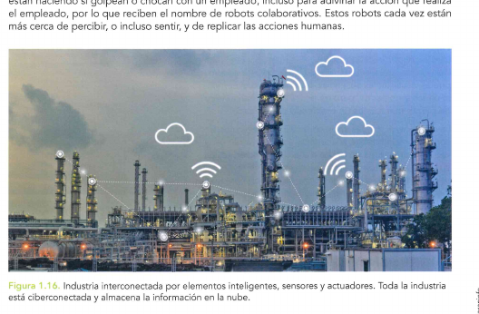
*Figura: una industria interconectada por elementos inteligentes, sensores y actuadores; toda la planta está ciberconectada y almacena su información en la nube. Origen: `UD1 Digitalización en los sectores productivos.pdf`.*

Los sistemas ciberfísicos no son exclusivos de la fábrica. El material de la unidad recoge aplicaciones en campos muy variados: **ciberseguridad** (protegiendo redes y dispositivos frente a ciberamenazas), ámbito **militar** (vigilancia autónoma y recogida de datos en tiempo real), **agricultura** (drones y sensores que miden humedad y salud de las plantas, ganado monitorizado a distancia) y **aeroespacial** (sistemas de control que mejoran la seguridad del vuelo). También se mencionan aplicaciones más cotidianas: monitorización de la salud de pacientes mediante sensores portátiles, vehículos autónomos, sistemas de tráfico inteligentes, cadenas alimentarias rastreables o edificios que optimizan su consumo energético.

Un punto que los materiales subrayan especialmente es la seguridad: los robots colaborativos (los que trabajan junto a personas, también llamados **cobots**) provocaron en su día algunos accidentes laborales cuando aún no estaban pensados para convivir con humanos; hoy están programados para detectar y detenerse si golpean o chocan con un empleado. Aun así, los sistemas ciberfísicos siguen estando en sus primeras etapas de madurez en muchas industrias y plantean retos importantes de fiabilidad, seguridad y, sobre todo, privacidad, ya que corren el riesgo de sufrir ataques al estar tan conectados.

> **Ejemplo actual — Gemelos digitales en la Fórmula 1.** Varias escuderías de F1 utilizan gemelos digitales de sus monoplazas: réplicas virtuales que simulan cómo se comportará una pieza o un ajuste aerodinámico antes de fabricarlo físicamente, ahorrando tiempo y presupuesto en los túneles de viento. Es un ejemplo muy visual de sistema ciberfísico aplicado fuera de una fábrica tradicional.

> **En las noticias — Ciberataques a sistemas industriales.** En los últimos años se han hecho públicos varios incidentes de ciberseguridad que afectaron a la producción de empresas industriales conocidas, obligándolas a detener temporalmente sus líneas de fabricación. Según se ha informado en distintos análisis del sector, este tipo de ataques a sistemas ciberfísicos y de control industrial va en aumento a medida que crece la conectividad de las plantas.

### Ideas clave de esta sección
- Un sistema ciberfísico combina hardware, software y red para percibir y actuar sobre el mundo físico de forma automática.
- Los cobots son un ejemplo de sistema ciberfísico pensado para trabajar junto a personas, con medidas de seguridad para evitar accidentes.
- Los CPS se usan en industria, agricultura, sanidad, transporte y muchos otros ámbitos, no solo en fábricas.
- A mayor conectividad, mayor superficie de ataque: la ciberseguridad es uno de los grandes retos de estos sistemas.

## 4. Estructura de la empresa.

Antes de hablar de digitalizar una empresa conviene tener claro cómo se organiza por dentro. La **estructura de la empresa** está formada por unidades organizativas agrupadas jerárquicamente: departamentos, equipos o áreas que se distribuyen normalmente en forma de árbol, donde las ramas son los departamentos y las hojas son los propios empleados. El número y el tipo de estas unidades varía de una empresa a otra —son personalizables y dinámicas—, pero suele haber un esquema reconocible con una **Dirección General** en la cúspide y, colgando de ella, áreas como Producción, Compraventa, Recursos Humanos, Contabilidad o Marketing, a veces junto a un área de I+D+i que reporta directamente a dirección.

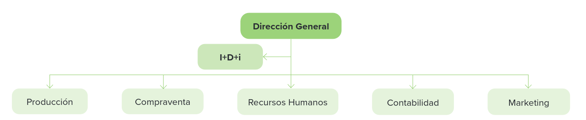
*Figura: ejemplo de organigrama básico de una empresa. Origen: `Unidad 1 Digitalizacion de CAMPUS.pdf`.*

Esta representación gráfica de la jerarquía se llama **organigrama**. El cargo de mayor responsabilidad suele ser el CEO (*Chief Executive Officer*), que figura en el nivel superior. Cuando una empresa se digitaliza, esta jerarquía de unidades organizativas se traduce también en el mundo informático: se crean directorios para cada unidad, con los permisos, los recursos y los perfiles de acceso que corresponden a cada empleado. Por ejemplo, la cuenta de la dirección de Recursos Humanos puede visualizar las ausencias, las nóminas o el currículo de los empleados, pero no podrá acceder al número de piezas que fabrica un operario en planta; cada perfil de usuario se replica automáticamente cada vez que se incorpora una persona nueva a ese puesto.

La llegada de la digitalización también ha hecho aparecer **nuevos departamentos** o ha transformado los que ya existían dentro del entorno IT de una empresa, con nombres que pueden variar según la organización:

| Departamento | Qué hace |
| --- | --- |
| Tecnología de la Información (TI) | Infraestructura y sistemas informáticos: administradores de sistemas, ingenieros de red, técnicos de soporte |
| Desarrollo de software | Crea y mantiene aplicaciones web, móviles y software a medida |
| Gestión de datos | Recopila, almacena y gestiona la información: analistas y científicos de datos, administradores de bases de datos |
| Seguridad de la información | Protege datos y sistemas frente a amenazas, de forma preventiva y reactiva |
| Desarrollo web y multimedia | Mantiene la web y los contenidos digitales de la empresa |
| Soporte técnico | Resuelve incidencias de hardware y software del personal |
| Innovación y estrategia digital | Detecta oportunidades de nuevas tecnologías y tendencias digitales |

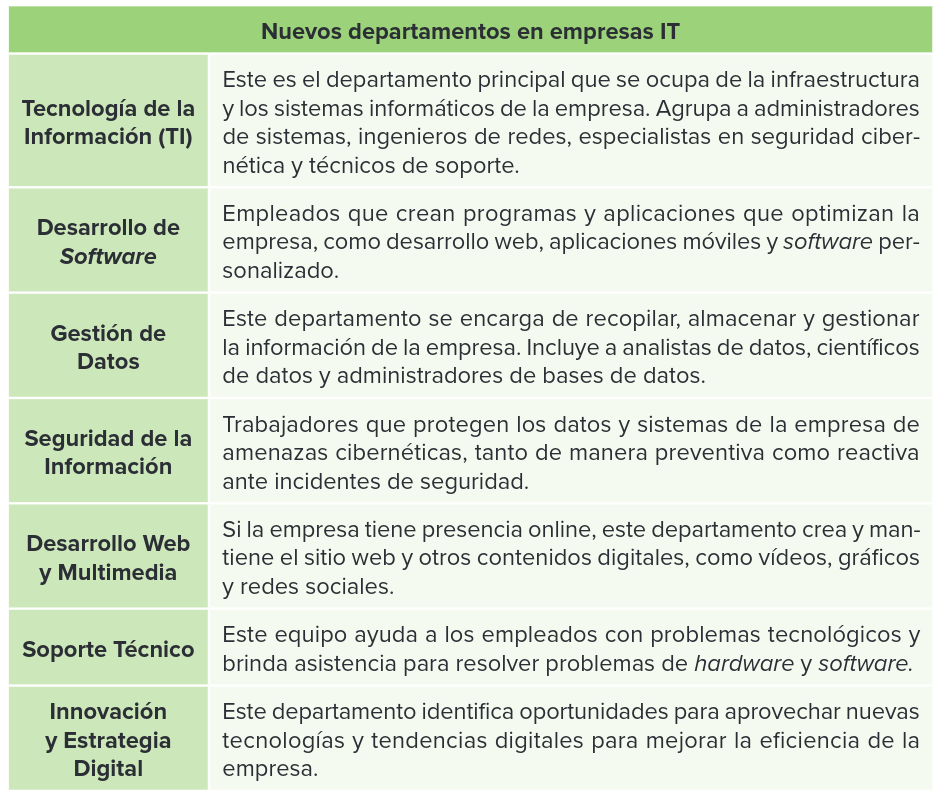
*Figura: nuevos departamentos que la digitalización introduce en el entorno IT de una empresa. Origen: `Unidad 1 Digitalizacion de CAMPUS.pdf`.*

> **Ejemplo actual — El auge del *Chief Data Officer* (CDO).** Cada vez más empresas medianas y grandes incorporan a su organigrama un puesto de dirección específico para los datos (Chief Data Officer) o para la transformación digital (Chief Digital Officer), algo prácticamente inexistente hace una década. Refleja muy bien cómo la digitalización cambia la propia estructura de una empresa, no solo sus herramientas.

> **En las noticias — Escasez de perfiles digitales.** Distintos informes de consultoras de recursos humanos publicados en los últimos años señalan que las empresas españolas tienen dificultades para cubrir puestos relacionados con ciberseguridad, análisis de datos o cloud computing. Según se ha informado, esta escasez de talento digital es uno de los frenos más citados a la hora de digitalizar por completo una organización.

### Ideas clave de esta sección
- La estructura de una empresa se organiza jerárquicamente en unidades (departamentos) representadas en un organigrama.
- El CEO ocupa el nivel superior del organigrama; de él dependen las distintas áreas (Producción, RRHH, Marketing...).
- Digitalizar la estructura significa crear directorios y perfiles de acceso que reflejan esa jerarquía real.
- La digitalización ha hecho aparecer nuevos departamentos (datos, ciberseguridad, innovación digital) dentro del entorno IT.

## 5. Entornos IT y OT. Convergencia entre entornos IT y OT.

En toda empresa industrial conviven dos mundos tecnológicos con lógicas distintas:

- **IT (Information Technology / Tecnología de la Información).** Está orientada a la gestión de la información y al soporte del negocio: sistemas de gestión, bases de datos, redes corporativas, correo electrónico, ERP, CRM. Su ámbito natural son las oficinas, la administración, las ventas y la logística.
- **OT (Operation Technology / Tecnología Operacional).** Está orientada al control y la supervisión de los procesos físicos en planta: sensores, PLC (controladores lógicos programables), sistemas SCADA, robots, líneas de producción automatizadas. Su ámbito natural son las fábricas, las líneas de producción y la maquinaria.

Una forma sencilla de recordarlo, con un símil doméstico: si estás preparando una receta, el IT sería el móvil o la tablet donde consultas la receta, y el OT sería el robot de cocina que la ejecuta. O, dicho de otro modo, el IT es como el "cerebro" de la empresa (organiza, comunica, decide) y el OT es como sus "brazos y piernas" (máquinas, sensores, robots que actúan sobre el mundo físico).

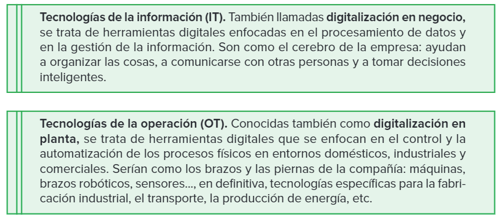
*Figura: IT y OT explicados con el símil del cerebro y las extremidades. Origen: `Unidad 1 Digitalizacion de CAMPUS.pdf`.*

Ambos entornos **se parecen** en que requieren infraestructura tecnológica y personal especializado, y en que generan y consumen datos relevantes para la empresa. Pero también tienen **diferencias** claras: el enfoque de IT es recopilar información, analizarla y tomar decisiones de negocio, mientras que el de OT es operar y controlar la fabricación, la energía o la logística; IT usa software, redes y bases de datos, mientras que OT emplea sensores, controladores industriales y sistemas de automatización; la seguridad en IT se centra en proteger datos frente a amenazas cibernéticas, mientras en OT se centra en proteger los sistemas de control frente a ataques que puedan tener consecuencias físicas; y, por último, los equipos de IT suelen tener ciclos de vida más cortos (se renuevan con cada actualización tecnológica) frente a los de OT, que se mantienen más años por el coste de los equipos y la necesidad de estabilidad en la producción.

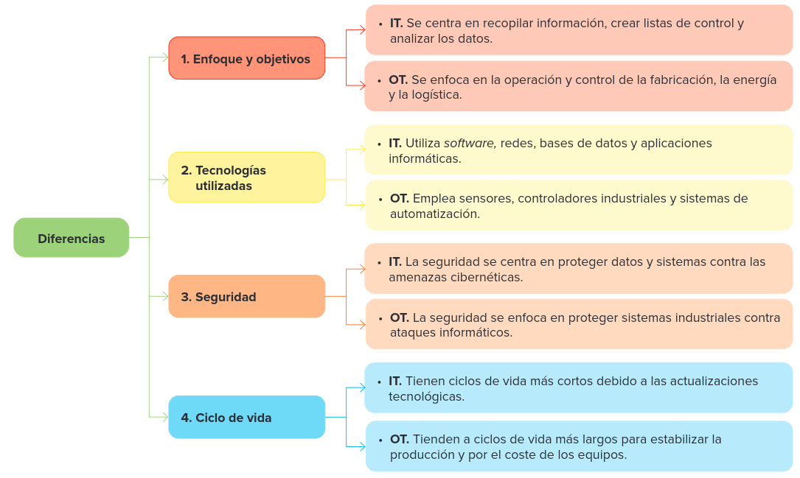
*Figura: diferencias entre IT y OT. Origen: `Unidad 1 Digitalizacion de CAMPUS.pdf`.*

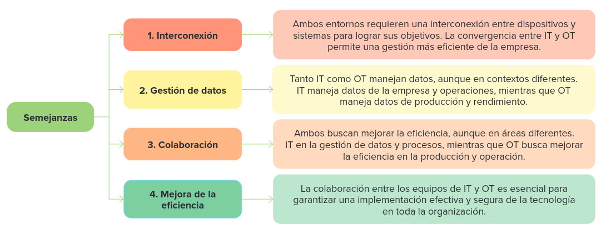
*Figura: semejanzas entre IT y OT. Origen: `Unidad 1 Digitalizacion de CAMPUS.pdf`.*

**Departamentos y tecnologías típicas.** Dentro de una empresa, el entorno IT suele reunir departamentos como el de sistemas (administración de servidores, redes y usuarios), el de desarrollo de software, el de soporte técnico, el de seguridad informática y el de análisis de datos o *Business Intelligence*. Las tecnologías típicas del **negocio (IT)** incluyen el **ERP** (*Enterprise Resource Planning*, software que gestiona de forma integral compras, ventas, contabilidad, RR. HH. e inventario de toda la empresa; ejemplos citados en los materiales son SAP, de pago, y Odoo, de código abierto), el **CRM** (*Customer Relationship Management*, gestión de la relación con clientes), el *Business Intelligence* combinado con Big Data, y el cloud computing para gestión de información.

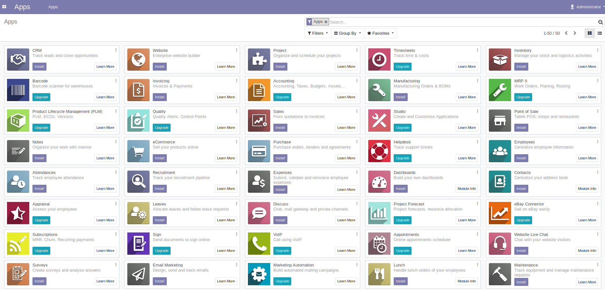
*Figura: pantalla de aplicaciones del ERP Odoo; cada icono es un módulo que gestiona un proceso de la empresa. Origen: `UT 1 Digitalización en 4a revolucion.pdf`.*

En **planta (OT)** las tecnologías típicas son el IoT industrial (sensores conectados), los robots colaborativos, el mantenimiento predictivo con IA, los gemelos digitales de procesos y, sobre todo, dos sistemas clave que conviene distinguir bien:

- **MES (*Manufacturing Execution System*):** gestiona el trabajo en planta en tiempo real —qué máquina produce, qué turno trabaja, cuántas piezas se han hecho y en qué condiciones—. Trabaja en el plano operativo, cerca de la planta, pero se comunica constantemente con el ERP.
- **SCADA (*Supervisory Control And Data Acquisition*, control de supervisión y adquisición de datos):** gestiona directamente las máquinas, sensores y procesos, recogiendo datos de los PLC (temperaturas, presiones, vibraciones) y permitiendo al operario ver gráficas, alarmas y actuar sobre las máquinas desde una interfaz.

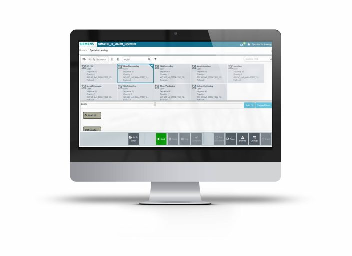
*Figura: interfaz de un sistema MES (Siemens Simatic IT). Origen: `UT 1 Digitalización en 4a revolucion.pdf`.*

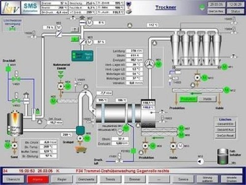
*Figura: interfaz de un sistema SCADA (Siemens WinCC). Origen: `UT 1 Digitalización en 4a revolucion.pdf`.*

La diferencia clave entre los tres: el ERP sabe qué hay que fabricar y cuándo, pero no cómo se está fabricando en ese momento; el MES baja al detalle del proceso en planta, lo controla en tiempo real y asegura la **trazabilidad** (la capacidad de seguir el rastro completo de un producto, desde las materias primas hasta el cliente final, sabiendo quién, cómo, cuándo y con qué se hizo cada lote); y el SCADA baja aún más, hasta el control directo de las máquinas.

**¿Por qué conectar IT y OT?** Tradicionalmente ambos entornos funcionaban aislados: el IT permitía enviar correos y salir a internet, y el OT desplegaba máquinas que ni siquiera podían manipularse desde fuera de la fábrica. La **convergencia IT/OT** consiste en integrar los datos que generan los sistemas OT (valores de sensores y actuadores) con los del IT (producción, control de stock, monitorización de materias primas mediante un ERP), y aporta flujo de datos en tiempo real desde la planta hasta la dirección, capacidad de analizar la producción para optimizar decisiones de negocio y mayor visibilidad y control global de la empresa. Los materiales describen varias formas de conectar ambos mundos: el **MES como puente**, que traduce las órdenes del ERP en instrucciones para la fábrica; el **IoT industrial (IIoT)**, con sensores que envían datos directamente a sistemas IT; el **cloud computing**, donde los datos de planta suben a la nube para analizarse con IA o Big Data y los resultados vuelven a la planta; y **protocolos e interfaces estándar** como OPC UA, MQTT o las API REST, que permiten que máquinas y software de fabricantes distintos se entiendan entre sí.

La convergencia no es solo un proceso técnico: según recoge uno de los materiales de la unidad, esta integración ha pasado históricamente por varias etapas —entornos IT y OT totalmente separados (décadas de 1970 a 1990), una convergencia gradual apoyada en estándares de comunicación (1990-2000), una etapa marcada por la necesidad de ciberseguridad ante el aumento de sensores, redes industriales, cloud e IoT (2000-2010), la incorporación de IA y edge computing para procesar datos cerca de la fuente (2010-2020), y la tendencia actual hacia una integración completa con gemelos digitales de toda la operación física.

Esa mayor conexión trae también más riesgo: al aumentar la superficie de dispositivos interconectados, crece la posibilidad de sufrir ciberataques, por lo que la transmisión de datos entre IT y OT requiere asegurar la información con elementos como *routers*, *firewalls* y *switches* autogestionables, así como personal especializado en ciberseguridad.

> **Ejemplo actual — Ataques de ransomware a la industria.** Distintos informes de ciberseguridad de los últimos años señalan que una parte muy significativa de las empresas industriales ha sufrido algún ataque de tipo *ransomware* dirigido a sus sistemas OT, un tipo de ataque que bloquea el acceso a los sistemas y exige un rescate económico para recuperarlo. Es una muestra muy real de por qué proteger la convergencia IT/OT se ha convertido en una prioridad para cualquier empresa conectada.

> **En las noticias — El Centro Criptológico Nacional y la protección de infraestructuras.** En España, organismos como el CCN-CERT publican periódicamente alertas y guías sobre ciberseguridad industrial dirigidas a proteger infraestructuras críticas (energía, agua, transporte) que dependen de sistemas OT cada vez más conectados a redes IT. Es un buen ejemplo de cómo la convergencia IT/OT también se aborda a nivel institucional, no solo dentro de cada empresa.

### Ideas clave de esta sección
- IT gestiona información y da soporte al negocio; OT controla y supervisa procesos físicos en planta.
- ERP, CRM y Business Intelligence son tecnologías típicas de IT; MES, SCADA, IoT industrial y cobots lo son de OT.
- El MES es el "puente" habitual entre ERP (IT) y SCADA/PLC (OT), y garantiza la trazabilidad del producto.
- Conectar IT y OT (convergencia) da más visibilidad y mejores decisiones, pero exige reforzar la ciberseguridad.

## 6. Ventajas de digitalizar una empresa extremo a extremo.

Digitalizar una empresa industrial "de extremo a extremo" significa implementar tecnologías digitales en todas (o casi todas) sus operaciones y procesos, desde el desarrollo del producto hasta su fabricación y entrega, y no solo en un departamento aislado. Los materiales de la unidad coinciden en un conjunto de ventajas muy similares:

- **Eficiencia operativa y reducción de costes.** Se minimizan la impresión en papel y el almacenamiento físico de documentos; migrar los datos a la nube posibilita un acceso en tiempo real desde cualquier dispositivo, reduciendo el uso de recursos físicos y aportando flexibilidad.
- **Disponibilidad 24/7.** La información y la documentación empresarial dejan de depender del horario de oficina: los datos son accesibles en cualquier momento.
- **Flexibilidad y adaptación rápida.** La empresa puede responder con agilidad a cambios de mercado, ajustando la producción según la demanda.
- **Calidad y trazabilidad en tiempo real**, gracias a la integración entre sensores de planta y sistemas de gestión.
- **Innovación**, con nuevos productos y servicios digitales asociados a los físicos.
- **Mejora de la competitividad**, tanto por el acceso a mercados globales como por una mejor experiencia de cliente (una empresa preocupada por su impacto también gana atractivo ante clientes más sensibilizados con el medioambiente).
- **Aumento de la productividad**, ya que automatizar tareas repetitivas y aburridas permite que las personas empleadas se centren en objetivos de mayor valor.
- **Sostenibilidad**, optimizando el uso de recursos y reduciendo residuos.

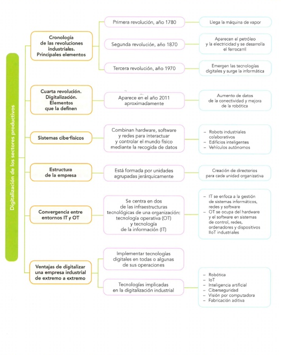
*Figura: mapa conceptual con los contenidos completos de la unidad, incluidas las ventajas de digitalizar una empresa de extremo a extremo. Origen: `UD1 Digitalización en los sectores productivos.pdf`.*

Estas ventajas no aparecen solo en la parte de negocio: también se dan cuando se integran de verdad los entornos IT y OT. La integración permite, por ejemplo, que la información recogida por los sistemas OT sirva para optimizar la planificación y el inventario desde IT; que la monitorización en tiempo real de la producción permita detectar problemas antes y mejorar los estándares de calidad; que el mantenimiento se vuelva predictivo en lugar de solo correctivo; y que las medidas de seguridad protejan a la vez los sistemas informáticos y los sistemas de control industrial, algo especialmente delicado porque un ataque a estos últimos puede tener consecuencias físicas (por ejemplo, un corte de suministro eléctrico), no solo pérdida de datos.

*Figura: efectos concretos de integrar los entornos IT y OT en una empresa. Origen: `Unidad 1 Digitalizacion de CAMPUS.pdf`.*

En definitiva, la digitalización es un motor de cambio en todos los sectores productivos. Su correcta implantación requiere integrar IT y OT, aplicar tecnologías digitales adaptadas al negocio concreto y, sobre todo, fomentar una cultura organizativa orientada a los datos y a la innovación; no basta con comprar tecnología si la empresa no cambia también su forma de trabajar y de tomar decisiones.

> **Ejemplo actual — Programas de "fábricas faro" (*Lighthouse Factories*).** El Foro Económico Mundial mantiene desde hace años una red de "fábricas faro" que reconoce a plantas industriales de todo el mundo —incluidas varias en España, del sector automoción y de electrodomésticos— como referentes en la aplicación de tecnologías 4.0 de extremo a extremo. Es un buen ejemplo de cómo las ventajas descritas en esta sección se traducen en reconocimiento real para las empresas que las aplican.

> **En las noticias — Electrificación e industria 4.0 en la automoción española.** Varias plantas automovilísticas españolas han anunciado en los últimos años fuertes inversiones para adaptar sus líneas a la fabricación de vehículos eléctricos, combinando esa transición con una digitalización más profunda de sus procesos (robótica, gemelos digitales, trazabilidad de baterías). Según se ha informado en prensa económica, este tipo de proyectos se presentan habitualmente como palanca tanto de competitividad como de sostenibilidad para el sector.

### Ideas clave de esta sección
- Digitalizar "de extremo a extremo" implica llevar la tecnología digital a todos los procesos de la empresa, no a uno solo.
- Las ventajas más citadas son: eficiencia, disponibilidad continua, reducción de costes, flexibilidad, calidad/trazabilidad, innovación, competitividad, productividad y sostenibilidad.
- Muchas de estas ventajas dependen directamente de haber conseguido una buena convergencia entre IT y OT.
- La tecnología por sí sola no basta: hace falta una cultura organizativa orientada a los datos.

---

## Glosario rápido

| Término | En una frase |
| --- | --- |
| Digitalización | Proceso de convertir información y procesos analógicos en digitales para ganar eficiencia. |
| IT (*Information Technology*) | Tecnologías centradas en gestionar información y dar soporte al negocio (oficina). |
| OT (*Operation Technology*) | Tecnologías centradas en controlar procesos físicos y máquinas (planta). |
| Sistema ciberfísico (CPS) | Sistema que combina hardware, software y red para percibir y actuar sobre el mundo físico. |
| Fábrica inteligente (*smart factory*) | Planta conectada que usa IA y datos en tiempo real para decidir y optimizarse sola. |
| Automatización | Uso de tecnología para realizar tareas con mínima intervención humana. |
| THD | Tecnologías Habilitadoras Digitales: IA, IoT, Big Data, cloud, robótica, etc. (se ven en detalle en la UT2). |
| ERP | Software que gestiona de forma global los procesos de una empresa (ventas, RR. HH., inventario...). |
| CRM | Sistema de gestión de las relaciones con el cliente. |
| MES | Sistema que gestiona y controla la producción en planta en tiempo real. |
| SCADA | Sistema de supervisión y adquisición de datos que controla máquinas, sensores y procesos. |
| Trazabilidad | Capacidad de seguir el rastro completo de un producto desde la materia prima hasta el cliente. |
| Cobot | Robot colaborativo diseñado para trabajar junto a personas de forma segura. |
| Convergencia IT/OT | Integración de los datos y sistemas de los entornos IT y OT de una empresa. |
| Organigrama | Representación gráfica de la jerarquía de departamentos de una empresa. |

## Repaso: 8-10 preguntas de autoevaluación

1. ¿Qué invento marcó el inicio de la Primera Revolución Industrial y en qué año? *(sección 1)*
2. ¿Qué cambio de flexibilidad trajo la electricidad respecto a las fábricas de vapor? *(sección 1)*
3. ¿Por qué no hay un acuerdo total entre las fuentes sobre el año de inicio de la Cuarta Revolución Industrial? *(sección 1)*
4. ¿Qué diferencia a una fábrica automatizada (Industria 3.0) de una fábrica inteligente (Industria 4.0)? *(sección 2)*
5. ¿Qué es un sistema ciberfísico y qué dos partes lo componen? *(sección 3)*
6. ¿Qué es un organigrama y quién ocupa normalmente su nivel superior? *(sección 4)*
7. ¿En qué se diferencian el ERP, el MES y el SCADA? *(sección 5)*
8. ¿Qué significa "convergencia IT/OT" y por qué es importante reforzar la ciberseguridad al aplicarla? *(sección 5)*
9. Cita al menos cuatro ventajas de digitalizar una empresa industrial de extremo a extremo. *(sección 6)*
10. ¿Qué departamentos suelen formar parte del entorno IT de una empresa digitalizada? *(secciones 4 y 5)*

Ver respuestas

1. La máquina de vapor, inventada por James Watt en 1784 (sección 1).
2. Permitió que cada máquina tuviera su propio motor y se organizaran según el flujo de trabajo, en vez de alrededor de un eje central (sección 1).
3. Porque una fuente (los apuntes) la sitúa en 2016, tomando como referencia el libro de Klaus Schwab, y otra (el libro de texto) la sitúa hacia 2011; ambas coinciden en el siglo, no en el año exacto (sección 1).
4. La fábrica inteligente conecta datos de todo el proceso en tiempo real, usa IA para decidir y predecir (mantenimiento, calidad), mientras la automatizada solo repite tareas fijas con supervisión manual (sección 2).
5. Es un sistema que combina hardware, software y redes para interactuar con el mundo físico; tiene una parte física (sensores, actuadores) y una parte digital (software, algoritmos) (sección 3).
6. Es la representación gráfica de la jerarquía de una empresa; su nivel superior lo ocupa el CEO o la Dirección General (sección 4).
7. El ERP gestiona la empresa a nivel global (qué fabricar y cuándo); el MES controla la producción en planta en tiempo real y asegura la trazabilidad; el SCADA controla directamente máquinas y sensores (sección 5).
8. Es la integración de los datos y sistemas de los entornos IT y OT; al aumentar la conectividad crece también la superficie de posibles ciberataques, por lo que hace falta proteger la comunicación con firewalls, routers y switches gestionados (sección 5).
9. Por ejemplo: eficiencia operativa, disponibilidad 24/7, reducción de costes, flexibilidad, mejora de la calidad/trazabilidad, innovación, competitividad, aumento de la productividad y sostenibilidad (sección 6).
10. Sistemas/TI, desarrollo de software, soporte técnico, seguridad informática o de la información, análisis de datos/Business Intelligence, desarrollo web y multimedia, e innovación y estrategia digital (secciones 4 y 5).

