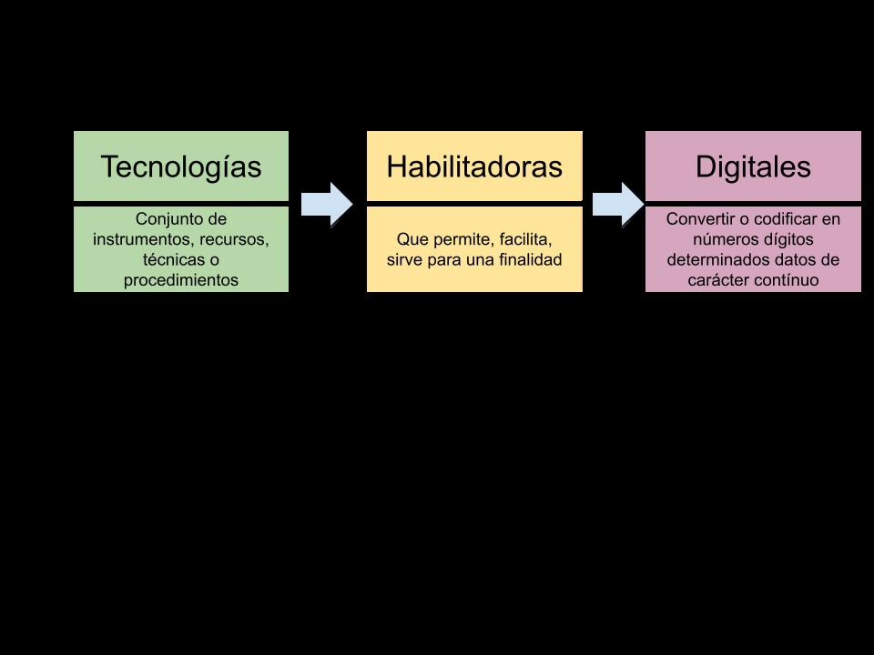
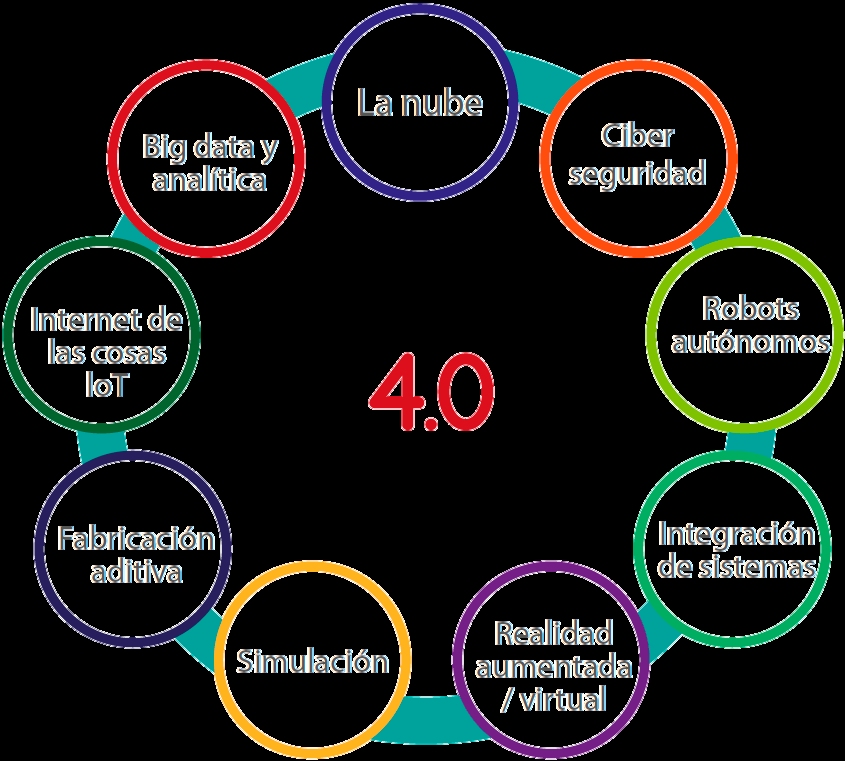
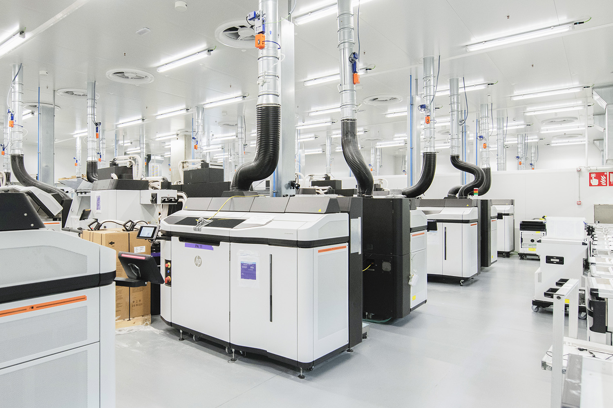
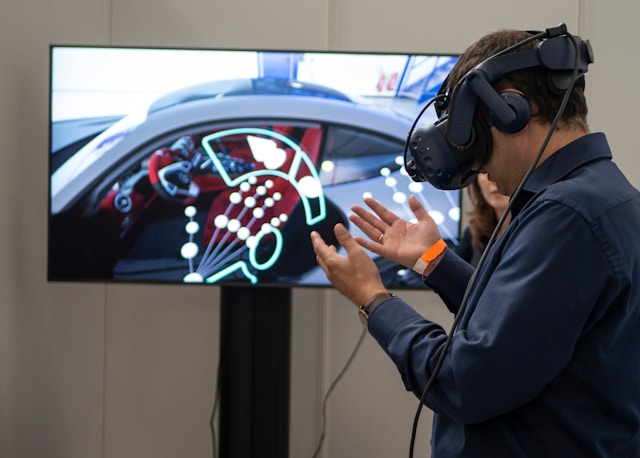
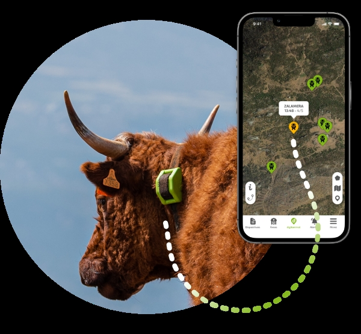
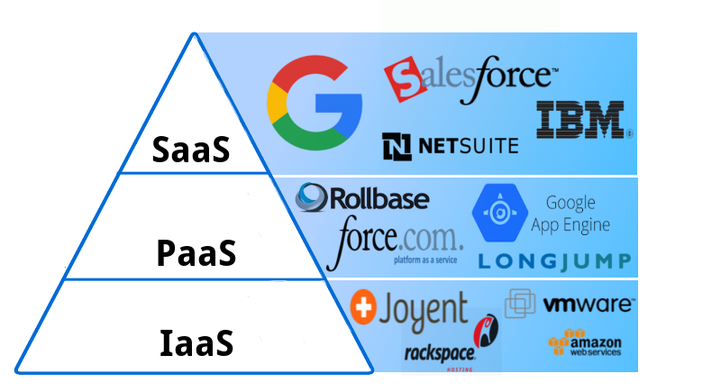
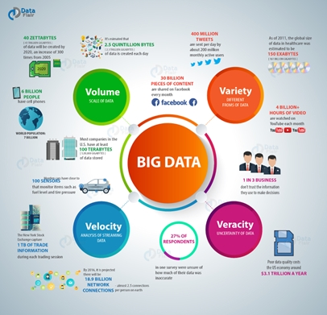
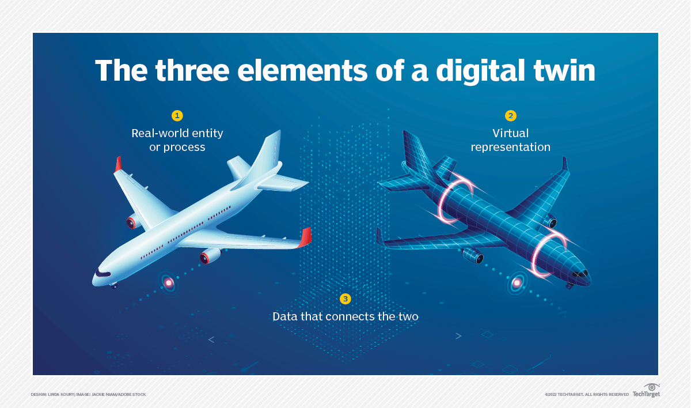

# UT2 — Tecnologías habilitadoras digitales

> Resumen de estudio elaborado a partir de los materiales de la carpeta «UT2 - Tecnologías habilitadoras digitales».
> Estructurado según los Contenidos de la UT2 de la programación del módulo DJK
> (Digitalización aplicada a los sectores productivos, 1.º DAM).

## De qué va esta unidad

En la UT1 viste que la cuarta revolución industrial se apoya en la digitalización y en la conexión entre los entornos IT (Tecnologías de la Información) y OT (Tecnologías de la Operación). Pero, ¿con qué herramientas concretas se hace esa digitalización? Esa es la pregunta que responde esta unidad.

Las **Tecnologías Habilitadoras Digitales (THD)**, o *Digital Enabling Technologies*, son el conjunto de tecnologías que hacen posible (que "habilitan") la transformación digital de una empresa: el internet de las cosas, la inteligencia artificial, el big data, la nube, la ciberseguridad, la realidad aumentada y virtual, el blockchain, las redes 5G, la robótica, la impresión 3D, la biometría o los gemelos digitales. Ninguna de ellas funciona sola ni es un fin en sí misma: son piezas de un mismo ecosistema que una empresa combina según sus necesidades.

Piensa en un supermercado que usa sensores para saber cuándo se agota un producto en la estantería (IoT), analiza esos datos para prever la demanda (Big Data e IA), gestiona todo desde servidores en internet en lugar de tener su propio centro de datos (cloud) y protege esa información de ataques (ciberseguridad). Esas cuatro tecnologías trabajando juntas son un ejemplo sencillo de THD aplicadas al día a día.

A lo largo de esta unidad conocerás qué THD existen, cómo se usan para crear productos y servicios nuevos, qué relación tienen con la sostenibilidad, qué mercados nuevos han creado y cuáles son las tecnologías emergentes que están empezando a asomar.

## Qué deberías saber hacer al terminar (resultados de aprendizaje)

El resultado de aprendizaje de esta unidad (RA2) dice que debes **caracterizar las THD necesarias para la transformación digital de las empresas, describiendo sus características y aplicaciones**. En la práctica, al terminar la unidad deberías ser capaz de:

- Identificar y nombrar las principales tecnologías habilitadoras digitales.
- Relacionar cada THD con el desarrollo de productos y servicios concretos.
- Explicar por qué las THD son importantes para una economía más sostenible y eficiente, y también qué impactos ambientales negativos generan.
- Identificar nuevos mercados y modelos de negocio que han aparecido gracias a las THD.
- Analizar cómo se aplican las THD tanto en la parte de negocio (IT) como en la parte de planta (OT) de una empresa.
- Identificar qué mejoras aportan las THD a los entornos IT y OT.
- Elaborar un informe sencillo que relacione cada tecnología con sus características y sus áreas de aplicación.

---

## 1. Tecnologías Habilitadoras Digitales (THD)

### Qué significa "THD"

Antes de listar tecnologías, conviene desmontar el propio nombre, palabra por palabra:

- **Tecnologías**: conjunto de instrumentos, recursos, técnicas o procedimientos diseñados para ejecutar una tarea.
- **Habilitadoras**: su función no es un fin en sí mismas, sino que *permiten* o *facilitan* alcanzar algo que antes no era posible.
- **Digitales**: el proceso de convertir o codificar en números (dígitos) datos que antes eran de carácter continuo (analógico), para poder procesarlos por ordenador.

*Figura: análisis del término THD palabra por palabra. Origen: Tecnologías Habilitadoras Digitales.pdf.*

Puesto todo junto, las THD son el conjunto de tecnologías fundamentales que impulsan y hacen posible la transformación digital de las empresas. No son herramientas aisladas: forman un ecosistema en el que unas tecnologías se apoyan en otras (por ejemplo, el Big Data necesita del IoT para tener datos que analizar, y de la nube para almacenarlos).

### El catálogo de THD

Cruzando los distintos materiales de la unidad, las tecnologías habilitadoras digitales que se repiten en todas las fuentes son:

| THD | En una frase |
| --- | --- |
| **Internet de las Cosas (IoT)** | Dispositivos físicos (sensores, actuadores, módulos embebidos) conectados a una red que recopilan, procesan y/o comunican datos. En la industria se habla de **IIoT** (Industrial IoT), con más exigencias de fiabilidad, latencia y robustez. |
| **Inteligencia Artificial (IA)** | Sistemas que simulan procesos de inteligencia humana (aprendizaje, decisión, resolución de problemas). |
| **Big Data y analítica** | Herramientas para analizar volúmenes de datos tan grandes que las herramientas tradicionales no pueden con ellos, y extraer de ahí conocimiento útil. |
| **Cloud Computing** | Entrega de servicios informáticos (cómputo, almacenamiento, plataformas, software) a través de internet, con pago por uso. Se estudiará con detalle en la UT3, pero aquí aparece como una THD más. |
| **Ciberseguridad** | Protección de redes, sistemas y datos frente a amenazas digitales: cifrado, autenticación, detección de ataques. |
| **Realidad Aumentada (AR) y Realidad Virtual (VR)** | La AR superpone información digital sobre el mundo real (a través del móvil o de gafas). La VR crea un entorno digital inmersivo completo, cerrado, sin conexión a datos reales en tiempo real. |
| **Blockchain** | Registro digital descentralizado y cifrado que no se puede alterar sin el consenso de toda la red. |
| **Redes 5G** | Quinta generación de telefonía móvil: más velocidad, más capacidad y menor latencia para comunicar datos. |
| **Robótica y automatización** (incluida la robótica colaborativa o *cobótica*) | Robots que realizan tareas repetitivas o que trabajan codo con codo con personas compartiendo espacio y tareas. |
| **Impresión 3D (fabricación aditiva)** | Fabricación de piezas capa a capa a partir de un modelo digital, en lugar de partir de un bloque y eliminar material (fabricación sustractiva). |
| **Biometría** | Identificación de personas mediante rasgos físicos o de comportamiento (huella, reconocimiento facial, voz). |
| **Gemelo digital (Digital Twin)** | Réplica virtual de un sistema físico —una máquina, una línea de producción o una planta entera— que se actualiza con datos reales para simular, predecir y optimizar antes de aplicar los cambios al mundo real. |

*Figura: la nube, ciberseguridad, robots autónomos, integración de sistemas, realidad aumentada/virtual, simulación, fabricación aditiva, IoT y big data y analítica, representadas como las tecnologías nucleares de la Industria 4.0. Origen: Tecnologías Habilitadoras Digitales.pdf.*

El Internet de las Cosas merece una mención aparte porque es la "puerta de entrada" de datos para casi todas las demás THD: sin sensores conectados no habría datos que analizar con Big Data ni con IA.

*Figura: ejemplos de dispositivos que se conectan a la nube en un entorno IoT (móviles, cámaras, electrodomésticos, wearables...). Origen: Transformación digital gracias a las THD.pdf.*

> **Ejemplo actual — la IA generativa como THD de moda.** Herramientas como ChatGPT, Microsoft Copilot o Gemini se han incorporado en pocos años a empresas de todos los tamaños para redactar informes, programar o atender a clientes. Es un buen ejemplo de cómo una THD (la IA) pasa de ser un concepto de laboratorio a una herramienta de uso diario en cualquier oficina.

### Las características que comparten todas las THD

Aunque cada THD es distinta, los materiales de la unidad coinciden en señalar unos rasgos comunes (hasta nueve, según las fuentes) que explican por qué se llaman "habilitadoras":

- **Versatilidad**: sirven en sectores muy distintos. El mismo sistema de gestión de inventario que usa un almacén logístico puede adaptarse a una tienda de barrio.
- **Automatización**: reducen la intervención humana en tareas repetitivas, con menos errores. Por ejemplo, los robots que ensamblan piezas en una cadena de montaje de automóviles.
- **Interconexión**: fomentan la comunicación entre dispositivos, sistemas y personas (un termostato inteligente que habla con el sistema de gestión energética de un edificio).
- **Analítica avanzada**: convierten datos brutos en información útil, como el análisis predictivo que usa una tienda online para recomendar productos.
- **Seguridad**: incorporan medidas de protección, como la autenticación multifactor en la banca digital.
- **Escalabilidad**: pueden crecer o reducirse según la demanda sin grandes inversiones en hardware (los servicios en la nube tipo AWS son el ejemplo típico).
- **Personalización**: adaptan el producto o servicio al usuario, como las recomendaciones de Netflix según el historial de cada persona.
- **Ahorro**: optimizan procesos y reducen costes operativos, por ejemplo integrando contabilidad, inventario y ventas en un único sistema ERP.
- **Innovación**: impulsan soluciones nuevas, como probarse ropa virtualmente con una aplicación de realidad aumentada en una tienda.

### Ideas clave de esta sección

- Las THD son el conjunto de tecnologías (IoT, IA, Big Data, cloud, ciberseguridad, AR/VR, blockchain, 5G, robótica, impresión 3D, biometría, gemelo digital...) que hacen posible la transformación digital.
- No funcionan de forma aislada: se apoyan unas en otras dentro de un mismo ecosistema.
- Comparten rasgos comunes: versatilidad, automatización, interconexión, analítica avanzada, seguridad, escalabilidad, personalización, ahorro e innovación.

---

## 2. Las THD en el desarrollo de productos y servicios

Las THD no se quedan en la teoría: dan lugar a productos y entornos reconocibles que ya forman parte de nuestro día a día. La idea central de este bloque es que hemos pasado de la "automatización rígida" (un sistema que sigue siempre el mismo programa) a la "inteligencia digital" (un sistema capaz de aprender, razonar y decidir según su entorno).

### Edificios y hogares inteligentes

Un **edificio inteligente** incorpora sensores, dispositivos conectados e inteligencia artificial para gestionar de forma automática la climatización, la iluminación, la seguridad o el consumo energético. Un caso muy citado es **The Edge**, en Ámsterdam, considerado uno de los edificios más sostenibles y conectados del mundo: reconoce al empleado a través de una aplicación móvil y ajusta su puesto de trabajo automáticamente.

*Figura: The Edge (Ámsterdam), ejemplo de edificio inteligente que gestiona de forma proactiva su eficiencia energética. Origen: Transformación digital gracias a las THD.pdf.*

A escala doméstica, el mismo concepto se traduce en el **hogar inteligente** (vivienda domótica): termostatos, bombillas, sensores de humo, cerraduras o altavoces inteligentes (Amazon Echo, Google Home) que se controlan desde el móvil o por voz y que, poco a poco, dejan de limitarse a "automatizar tareas" para "anticiparse" a las necesidades de quien vive allí (por ejemplo, un sistema de riego que consulta la previsión meteorológica antes de regar).

### Fábricas inteligentes

Conviene no confundir una fábrica automatizada de toda la vida con una **fábrica inteligente** (*smart factory*). La fábrica inteligente es un ecosistema interconectado y en tiempo real que combina varias THD a la vez: IoT para monitorizar máquinas, Big Data para detectar patrones, IA para el mantenimiento predictivo, robots colaborativos (*cobots*) para tareas repetitivas o peligrosas, impresión 3D para prototipos y piezas de repuesto, ciberseguridad para proteger todo el sistema, cloud computing para almacenar y compartir datos, y AR/VR para formar a los operarios o simular procesos. Es, en definitiva, el núcleo de lo que en la UT1 llamaste industria 4.0.

*Figura: planta de fabricación aditiva (impresión 3D) a escala industrial. Origen: UT 2 THD.pdf.*

Un ejemplo muy claro de cómo la realidad aumentada ayuda a un producto o servicio es el uso del móvil para superponer un mueble virtual sobre una estancia real antes de comprarlo, o para guiar a un técnico durante una reparación sin que tenga que desplazarse un experto.

*Figura: aplicación de realidad aumentada (AR) mostrando un objeto virtual sobre el entorno físico real a través del móvil. Origen: UT 2 THD.pdf.*

La realidad virtual, en cambio, no tiene conexión con datos en tiempo real: es una simulación cerrada en la que el usuario "entra" en un entorno completamente digital, muy útil para formación técnica, simuladores de maquinaria o validación de prototipos sin arriesgar materiales ni personas.

*Figura: uso de gafas de realidad virtual (VR) para el diseño y visualización de un vehículo. Origen: UT 2 THD.pdf.*

### Ciudades inteligentes

Las **ciudades inteligentes** (*smart cities*) aplican la misma lógica a la escala urbana: sensores y redes de comunicación para gestionar en tiempo real el tráfico, la iluminación pública, la recogida de residuos, la calidad del aire o el consumo de agua. Por ejemplo, semáforos que ajustan sus tiempos según cámaras que miden el tráfico real, o contenedores que avisan cuando están llenos para optimizar las rutas de recogida.

### Servicios digitalizados: el caso de la reserva hotelera

Los materiales de la unidad recogen también un caso de digitalización de un **servicio** (no solo de un producto industrial): una cadena de hoteles pequeños que carecen de recepción física. Toda la gestión de la reserva y el registro de entrada se realiza *online*, sin que la persona tenga que interactuar con nadie: la reserva se lleva a cabo en la web del hotel, indicando fechas de entrada y salida y el número de personas; el *check-in* se hace mediante un código que llega al correo o al móvil y que se introduce en un teclado o máquina en la puerta de la habitación; y el *check-out* consiste simplemente en salir a la hora máxima permitida, sin ningún trámite adicional. Es un ejemplo de cómo las THD (aplicaciones web, dispositivos conectados, automatización) rediseñan un servicio completo de principio a fin.

> **Ejemplo actual — gemelos digitales de fábricas completas.** Varios fabricantes de automóviles y de bienes de consumo han empezado a construir "réplicas digitales" completas de sus plantas usando plataformas de simulación 3D en tiempo real (como NVIDIA Omniverse), de forma que pueden probar cambios en la distribución de la planta o en el proceso productivo de forma virtual antes de tocar la fábrica real.

> **En las noticias — tiendas sin cajas ni cajeros.** Cadenas de supermercados y tiendas de conveniencia (el caso más conocido es el de Amazon con sus tiendas "Just Walk Out") han probado formatos en los que sensores y visión artificial detectan qué producto coge el cliente y le cobran automáticamente al salir, sin pasar por caja. Es un ejemplo de cómo varias THD (IoT, IA, cloud, biometría o pago sin contacto) se combinan para crear un servicio nuevo.

### Ideas clave de esta sección

- Las THD dan lugar a entornos reconocibles: edificios y hogares inteligentes, fábricas inteligentes, ciudades inteligentes y servicios completamente digitalizados.
- El salto clave es pasar de la automatización rígida (programa fijo) a la inteligencia digital (el sistema aprende y decide).
- Un mismo caso (una fábrica, un hotel, una ciudad) suele combinar varias THD a la vez, no una sola.

---

## 3. Las THD y la economía sostenible

### Qué es la sostenibilidad

Según recogen los materiales, la sostenibilidad (definición de la Unión Europea) consiste en **satisfacer las necesidades del presente sin comprometer las de las generaciones futuras**. Se suele descomponer en tres dimensiones que deben ir equilibradas:

- **Ambiental**: uso responsable de los recursos y reducción del impacto ecológico.
- **Social**: bienestar, igualdad y condiciones laborales dignas.
- **Gobernanza**: gestión ética, transparente y responsable de las organizaciones.

### Cómo contribuye cada THD a la sostenibilidad

Cada tecnología habilitadora tiene su propia relación (a veces positiva, a veces con matices) con estas tres dimensiones:

- **Ciberseguridad** → dimensión de gobernanza: protege los datos y da continuidad a los sistemas, reforzando la confianza y la ética corporativa.
- **Robótica colaborativa** → dimensión social: los *cobots* asumen tareas repetitivas, peligrosas o físicamente exigentes, mejorando la ergonomía y la seguridad laboral.
- **Blockchain** → aunque el proceso de "minado" consume mucha energía, favorece la transparencia y el control ético de materiales y procesos, impulsando cadenas de suministro responsables y economía circular.
- **Realidad aumentada** → reduce desplazamientos y uso de materiales físicos en formación o mantenimiento remoto, bajando el impacto ambiental y los costes.
- **Realidad virtual** → permite entrenar sin riesgos, sin gastar materiales físicos y sin desplazamientos.
- **Impresión 3D** → permite fabricar solo la pieza de repuesto exacta (alargando la vida útil de un producto en vez de tirarlo entero), reduce el consumo de materiales y energía al usar solo lo necesario, y fomenta la economía circular al facilitar la reparación y la producción local.
- **IoT** → permite la monitorización y el mantenimiento predictivo, anticipándose a fallos y evitando averías (y el desperdicio de recursos que conllevan).
- **Cloud computing** → optimiza el uso energético de los centros de datos, reduce el hardware físico en las empresas (menos residuos electrónicos) y fomenta una "economía circular del software": un mismo servidor se comparte entre muchos usuarios y los servicios se amplían o reducen según la demanda.
- **IA y Big Data** → tienen un alto impacto ambiental (por el consumo energético de su infraestructura), pero en las dimensiones social y de gobernanza favorecen diagnósticos médicos tempranos, educación personalizada y una toma de decisiones más ética y transparente.
- **Gemelo digital** → al permitir el mantenimiento predictivo, reduce fallos, consumo y residuos físicos.

*Figura: sensor IoT aplicado a la ganadería para el seguimiento y la trazabilidad de los animales, un ejemplo de optimización de recursos mediante THD. Origen: UT 2 THD.pdf.*

### El otro lado de la balanza: impactos ambientales negativos

No todo son ventajas. Los materiales de la unidad señalan tres efectos negativos importantes de las THD sobre el medio ambiente:

| Efecto negativo | En qué consiste |
| --- | --- |
| **Huella de carbono digital** | Los centros de datos y las redes de comunicación necesitan mucha electricidad, y no toda procede de fuentes renovables. |
| **Residuos electrónicos (e-waste)** | La sustitución constante de sensores, hardware y dispositivos genera muchos residuos tecnológicos, a menudo difíciles de reciclar y con componentes tóxicos. |
| **Uso intensivo de recursos naturales** | La fabricación de dispositivos exige metales y minerales críticos (litio, cobalto, tierras raras), cuya extracción degrada suelos y contamina agua. |

Frente a ello, los efectos positivos más citados son: la **optimización de recursos** (la agricultura de precisión reduce el consumo de agua y de fertilizantes gracias a sensores y analítica), la **reducción del consumo energético** (redes eléctricas inteligentes, o *Smart Grids*, gestionadas con IA) y el **fomento de la economía circular** (mejor reciclaje y recuperación de componentes gracias al análisis de datos).

Un ejemplo curioso que aparece en el material es el del **amoniaco verde**: un producto de limpieza fabricado con procesos más sostenibles, que también se está empezando a estudiar como combustible alternativo, y que se promociona a través de canales *online*.

*Figura: la Casa BIQ (Hamburgo) usa una fachada de paneles con microalgas que generan energía mediante fotosíntesis y actúan como aislante térmico, un ejemplo de arquitectura sostenible apoyada en biotecnología. Origen: Transformación digital gracias a las THD.pdf.*

> **Ejemplo actual — el coste energético de la IA generativa.** El auge de modelos de inteligencia artificial cada vez más grandes ha disparado el consumo eléctrico de los centros de datos que los entrenan y ejecutan. Varias grandes tecnológicas (Google, Microsoft, Amazon) han anunciado en los últimos años inversiones en energía nuclear o renovable específicamente para alimentar sus centros de datos de IA, lo que ilustra bien la tensión entre innovación digital y sostenibilidad energética.

> **En las noticias — normativa europea sobre residuos electrónicos y baterías.** La Unión Europea ha reforzado en los últimos años su normativa sobre reciclaje de aparatos electrónicos y baterías (por ejemplo, exigiendo baterías extraíbles en los móviles), como respuesta directa al problema de los residuos que generan las THD. Según se ha informado, el objetivo es forzar a los fabricantes a diseñar dispositivos más fáciles de reparar y reciclar.

### Ideas clave de esta sección

- La sostenibilidad tiene tres dimensiones: ambiental, social y de gobernanza.
- Cada THD aporta algo distinto a la sostenibilidad: unas mejoran las condiciones laborales (robótica colaborativa), otras la transparencia (blockchain, ciberseguridad), otras el ahorro de materiales (impresión 3D, IoT, cloud).
- Las THD también tienen un lado negativo: huella de carbono digital, residuos electrónicos y consumo de recursos naturales críticos.

---

## 4. Mercados generados por las THD

Las THD no solo cambian cómo se fabrica o se presta un servicio: crean **sectores económicos y modelos de negocio que antes no existían**.

### Nuevos mercados ligados directamente a cada THD

| Tecnología | Nuevos mercados o servicios | Ejemplos reales citados en el material |
| --- | --- | --- |
| IoT / IIoT | Plataformas de monitorización industrial, mantenimiento predictivo | Siemens MindSphere, AWS IoT Core |
| Big Data | Servicios de análisis predictivo y consultoría de datos | Google BigQuery, IBM DataOps |
| Cloud | SaaS industriales, plataformas colaborativas | Azure IoT Hub, Salesforce |
| IA | Automatización inteligente, IA como servicio | AWS AI Services, ChatGPT Enterprise |
| Gemelo digital | Simulación de fábricas, gemelos digitales urbanos | Dassault Systèmes, Bentley Systems |

*Figura: los tres niveles de servicio de la computación en la nube (IaaS, PaaS, SaaS) han dado lugar a un mercado propio de proveedores especializados. Origen: UT 2 THD.pdf.*

### Otros mercados y modelos de negocio nuevos

El material recoge también ejemplos de negocios que han surgido directamente de la digitalización, sin encajar en una sola THD:

- **Alquiler de robots por horas o días**: en vez de comprar un robot industrial, algunas empresas ofrecen el servicio completo por tiempo de uso, en función de las necesidades puntuales de producción.
- **Adquisición de espacios abandonados o desérticos para construir viviendas**: grandes inmobiliarias localizan terrenos infrautilizados, los transforman en apartamentos y los alquilan por días, meses o años.
- ***Live shopping***: venta en directo por *streaming*, surgida con fuerza en China y ya presente en Europa; combina *e-commerce* con retransmisión de vídeo en tiempo real.
- **Drones guiados por IA**: se usan para actividades como la evaluación de daños tras catástrofes naturales o el guiado de operaciones complejas, un servicio que antes no existía como tal.
- **Startups *proptech*** (*property technology*): empresas que aplican tecnología (Big Data, blockchain) al sector inmobiliario para tasaciones, gestión y venta de propiedades; el material cita como ejemplos del sector inmobiliario español a Idealista y Fotocasa.
- **Realidad virtual aplicada a bienes raíces**: visualización de propiedades mediante vídeos de 360º y *tours* virtuales, sin necesidad de desplazarse a verlas.

*Figura: características del Big Data (volumen, variedad, velocidad, veracidad, valor) que han dado lugar a un mercado propio de análisis predictivo y consultoría de datos. Origen: UT 2 THD.pdf.*

### El impacto en los sectores tradicionales

Otras fuentes de la unidad detallan cómo las THD han transformado sectores completos: salud (telemedicina, *wearables*), fabricación (industria 4.0, mantenimiento predictivo), energía (*Smart Grids*, monitorización ambiental), transporte y logística (gestión de flotas, trazabilidad con blockchain), finanzas (banca digital, *fintech*), educación (*e-learning*, VR/AR), comercio electrónico, gobierno electrónico, seguridad y defensa (drones, análisis predictivo), medios y entretenimiento (*streaming*) y construcción (BIM, IoT en obra). En todos los casos se repite el mismo patrón: una THD conocida (IoT, IA, Big Data...) da lugar a un servicio o mercado que antes no existía en ese sector.

> **Ejemplo actual — economía del *live shopping*.** Plataformas como TikTok Shop han impulsado en los últimos años la venta en directo, donde un presentador muestra y vende productos mientras la audiencia compra en tiempo real desde la misma pantalla. Es una traducción muy visible de la tabla anterior: la conexión entre *e-commerce*, redes sociales y *streaming* crea un mercado nuevo.

> **En las noticias — reparto con drones.** Varias empresas de paquetería y algún operador postal han puesto en marcha, en distintos países, pruebas piloto de reparto de última milla con drones para zonas de difícil acceso. Según se ha informado, estos proyectos siguen en fase de expansión progresiva por las limitaciones regulatorias del espacio aéreo, pero apuntan a un futuro mercado logístico basado en THD como IoT, IA y redes 5G.

### Ideas clave de esta sección

- Cada THD genera su propio mercado de servicios asociados (plataformas de monitorización, consultoría de datos, SaaS, IA como servicio, simulación de gemelos digitales...).
- También aparecen modelos de negocio completamente nuevos que no dependen de una sola tecnología: alquiler de robots, aprovechamiento de espacios abandonados, *live shopping*, drones guiados por IA o *proptech*.
- Prácticamente todos los sectores tradicionales (salud, energía, transporte, finanzas, educación...) tienen ya una versión "digitalizada" gracias a las THD.

---

## 5. THD emergentes

Una tecnología se considera "emergente" cuando todavía está madurando técnicamente, pero ya apunta a romper los esquemas actuales. El material de la unidad destaca tres:

| Tecnología | Descripción | Potencial |
| --- | --- | --- |
| **5G / 6G** | Comunicación ultrarrápida y fiable para IoT y robótica autónoma. | Base de la hiperconectividad industrial. |
| **Biotecnología** | Integración de biología y digitalización (biosensores, bioimpresión). | Producción sostenible y materiales inteligentes. |
| **Computación cuántica** | Procesamiento de datos a velocidades imposibles para la computación clásica. | Optimización, simulación y ciberseguridad avanzada. |

A estas tres se suma, en otro de los materiales, el aprendizaje automático como motor "inteligente" de muchas THD: el **machine learning** (aprendizaje automático) desempeña un papel cada vez más importante al permitir que las máquinas mejoren su funcionamiento con la experiencia, sin ser programadas explícitamente para cada caso, adelantándose a problemas futuros en lugar de limitarse a identificarlos cuando ya han ocurrido. Se aplica, por ejemplo, en la optimización de vehículos autónomos (analizando el tráfico y las condiciones de conducción en tiempo real) y en el sector financiero (analizando probabilidades para detectar fraudes y mejorar la seguridad de las operaciones).

Dentro de este bloque emergente también se sitúa con más detalle el **gemelo digital**, que combina tres elementos: una entidad o proceso del mundo real, su representación virtual, y los datos que conectan a ambos en tiempo real.

*Figura: los tres elementos de un gemelo digital: la entidad real, la representación virtual y los datos que las conectan. Origen: UT 2 THD.pdf.*

Otra tecnología emergente muy relacionada con blockchain es la **DLT** (*Distributed Ledger Technology*, tecnología de libro contable distribuido): es la capa de seguridad que hay detrás de blockchain y que permite que las transacciones queden registradas de forma segura entre todos los ordenadores que participan en la red, sin depender de una autoridad central.

> **Ejemplo actual — despliegue de redes 5G y primeras pruebas de 6G.** En España y en el resto de Europa, los principales operadores móviles han completado en los últimos años el despliegue de redes 5G en las grandes ciudades y han comenzado pruebas de laboratorio orientadas a la futura tecnología 6G, que se espera que multiplique aún más la velocidad y reduzca la latencia para aplicaciones como los vehículos autónomos o la cirugía remota.

> **En las noticias — avances en computación cuántica.** Varias grandes tecnológicas (entre ellas Google e IBM) han presentado en los últimos años nuevos chips cuánticos con los que afirman haber resuelto en minutos cálculos que a un superordenador clásico le llevarían muchísimo más tiempo. Según se ha informado, estos avances siguen siendo experimentales, pero se consideran un paso relevante hacia aplicaciones prácticas en optimización, simulación de materiales y ciberseguridad.

### Ideas clave de esta sección

- Las tres tecnologías emergentes que cita el material son 5G/6G, biotecnología y computación cuántica.
- El machine learning es el "motor" que hace que muchas THD dejen de ser pasivas (solo medir) y pasen a ser inteligentes (aprender y decidir).
- El gemelo digital se construye con tres piezas: entidad real, representación virtual y datos que las conectan; la DLT es la base de seguridad de blockchain.

---

## Glosario rápido

| Término | En una frase |
| --- | --- |
| THD | Tecnologías Habilitadoras Digitales: el conjunto de tecnologías que hacen posible la transformación digital de una empresa. |
| IoT / IIoT | Internet de las Cosas: dispositivos físicos conectados a una red que recogen y transmiten datos; en la industria se habla de IIoT. |
| Big Data | Conjuntos de datos tan grandes, rápidos y variados que necesitan herramientas específicas para analizarlos. |
| Cloud Computing | Entrega de servicios informáticos (cómputo, almacenamiento, software) a través de internet, con pago por uso. |
| AR / VR | Realidad Aumentada (superpone datos digitales sobre el mundo real) y Realidad Virtual (crea un entorno digital cerrado e inmersivo). |
| Blockchain | Registro digital descentralizado y cifrado que no puede alterarse sin el consenso de la red. |
| DLT | Tecnología de libro contable distribuido; la capa de seguridad que sostiene a blockchain. |
| Gemelo digital | Réplica virtual de un sistema físico que se actualiza con datos reales para simular y predecir su comportamiento. |
| Machine learning | Aprendizaje automático: las máquinas mejoran su funcionamiento con la experiencia sin ser reprogramadas para cada caso. |
| Cobot | Robot colaborativo: trabaja junto a personas compartiendo espacio y tareas de forma segura. |
| Fabricación aditiva | Impresión 3D: crear objetos añadiendo material capa a capa, frente a la fabricación sustractiva tradicional. |
| Smart factory / smart city | Fábrica o ciudad que integra varias THD a la vez (IoT, IA, Big Data...) para operar de forma interconectada y en tiempo real. |
| Sostenibilidad | Satisfacer las necesidades del presente sin comprometer las de las generaciones futuras, en sus tres dimensiones: ambiental, social y de gobernanza. |

## Repaso: preguntas para autoevaluarte

1. ¿Qué significa cada una de las tres palabras que forman "Tecnologías Habilitadoras Digitales"?
2. Cita al menos seis THD distintas y explica en una frase qué hace cada una.
3. ¿Qué diferencia hay entre realidad aumentada y realidad virtual?
4. ¿Qué diferencia hay entre una fábrica automatizada tradicional y una fábrica inteligente (*smart factory*)?
5. Explica con tus palabras qué es un gemelo digital y qué tres elementos lo componen.
6. Nombra las tres dimensiones de la sostenibilidad y pon un ejemplo de THD relacionado con cada una.
7. Cita dos efectos positivos y dos efectos negativos de las THD sobre el medio ambiente.
8. Pon dos ejemplos de nuevos mercados o modelos de negocio que hayan surgido gracias a las THD.
9. ¿Qué tres tecnologías se consideran "emergentes" según el material de la unidad?
10. ¿Qué papel juega el machine learning respecto al resto de THD?

Ver respuestas (con la sección donde se explican)

1. Tecnologías = instrumentos o procedimientos para una tarea; Habilitadoras = que permiten o facilitan algo antes imposible; Digitales = convertir datos continuos en dígitos procesables por ordenador. (Sección 1)
2. Por ejemplo: IoT, IA, Big Data, cloud computing, ciberseguridad, AR/VR, blockchain, 5G, robótica/cobótica, impresión 3D, biometría, gemelo digital. (Sección 1)
3. La AR superpone información digital sobre el mundo real en tiempo real (móvil, gafas); la VR crea un entorno digital cerrado y simulado, sin conexión con datos reales en tiempo real. (Secciones 1 y 2)
4. La fábrica automatizada sigue un programa fijo; la fábrica inteligente combina varias THD (IoT, IA, Big Data, robots colaborativos...) para operar de forma interconectada, en tiempo real y adaptándose a las circunstancias. (Sección 2)
5. Es una réplica virtual de un sistema físico que se actualiza con datos reales; sus tres elementos son la entidad/proceso real, la representación virtual y los datos que conectan a ambos. (Sección 5)
6. Ambiental (ej. impresión 3D reduce residuos), social (ej. robótica colaborativa mejora condiciones laborales) y de gobernanza (ej. ciberseguridad y blockchain refuerzan la transparencia). (Sección 3)
7. Positivos: optimización de recursos (agricultura de precisión), reducción del consumo energético (Smart Grids). Negativos: huella de carbono digital, residuos electrónicos. (Sección 3)
8. Por ejemplo: alquiler de robots por horas, live shopping, startups proptech, drones guiados por IA, o los servicios asociados a cada THD (SaaS, IA como servicio, simulación de gemelos digitales). (Sección 4)
9. 5G/6G, biotecnología y computación cuántica. (Sección 5)
10. El machine learning es el motor que permite que muchas THD dejen de ser "pasivas" (solo medir) y se vuelvan "inteligentes" (aprender de los datos y decidir/predecir). (Sección 5)

## De dónde sale esto (fuentes de la carpeta)

- `UT 2 THD.pdf` — fuente principal y más completa: define 10 THD con su aplicación, su relación con la sostenibilidad, los nuevos mercados que generan, su implicación en negocio y planta, y tres tecnologías emergentes.
- `Tecnologías Habilitadoras Digitales.pdf` — catálogo de THD, sus nueve características, su aplicación por sectores profesionales y su impacto ambiental y empresarial.
- `Transformación digital gracias a las THD.pdf` — desarrolla los entornos inteligentes (edificios, hogares, fábricas y ciudades) en los que se aplican las THD. *Aviso: el propio documento se titula internamente "Unidad 3", aunque está guardado en la carpeta de la UT2; el contenido encaja con los Contenidos de esta unidad, así que se ha tratado como material de la UT2.*
- `Guía Integral_ Digitalización Aplicada a los Sectores Productivos - Documentos de Google.pdf` — repasa los mismos cinco bloques de contenidos (fundamentos, productos/servicios, sostenibilidad, mercados, emergentes) con un enfoque más analítico, y aporta el cuadro comparativo de impactos ambientales y el perfil competencial del alumnado de FP.
- `UD2.pdf` — libro de texto de la editorial (escaneado, sin capa de texto; se ha revisado imagen a imagen). Aporta el caso práctico de digitalización de un hotel (reserva y *check-in/check-out* sin recepción física), las tablas de nuevos mercados y de implicación de las THD en negocio y planta, el mapa conceptual final de la unidad y las imágenes de robótica colaborativa, gemelos digitales y computación en la nube usadas en este resumen. *Aviso: usa la sigla "TDH" en vez de "THD"; es una variante del mismo término, no una tecnología distinta.*

**Avisos generales:**
- No se ha detectado ningún archivo `.m4a` ni `.mp4` en la carpeta de la unidad.
- La estructura de 5 puntos de este resumen sigue los Contenidos oficiales de `GESTOR-IA/RA-criterios.md`; el libro de texto (`UT 2 THD.pdf` y `UD2.pdf`) organiza internamente el mismo temario en un índice más detallado (2.1 a 2.18), que se ha repartido entre los 5 puntos oficiales.
