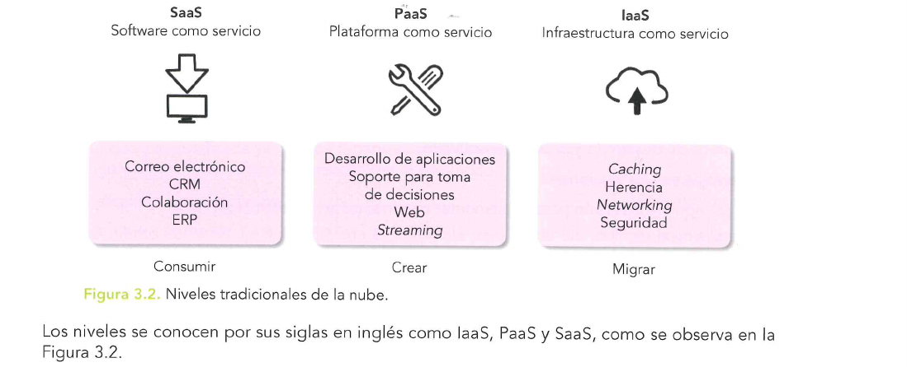
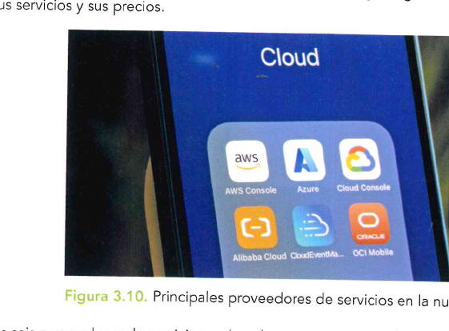
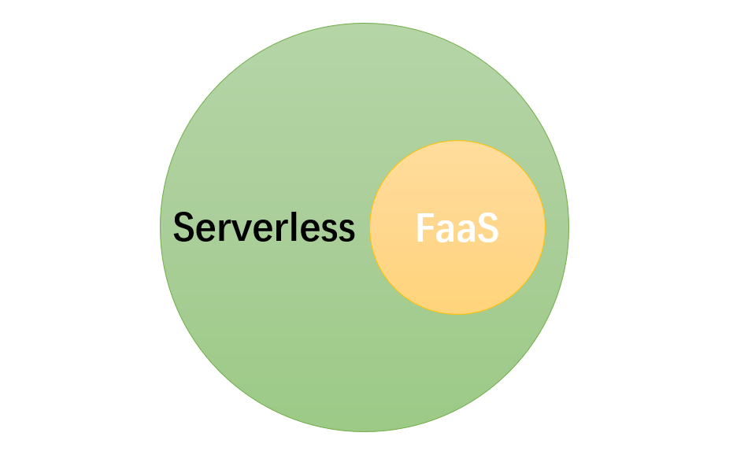
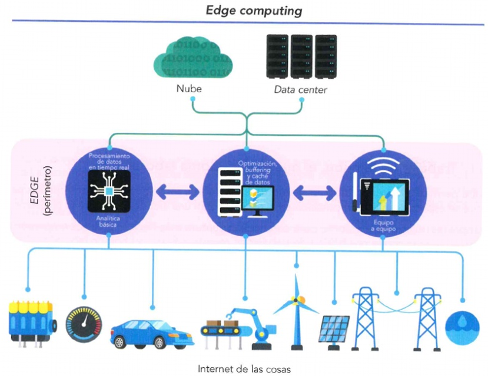
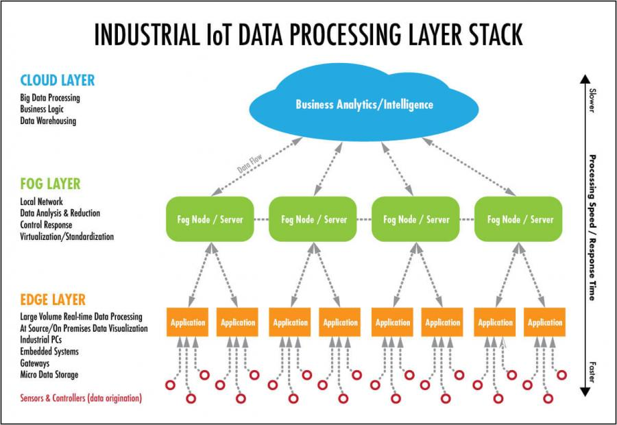
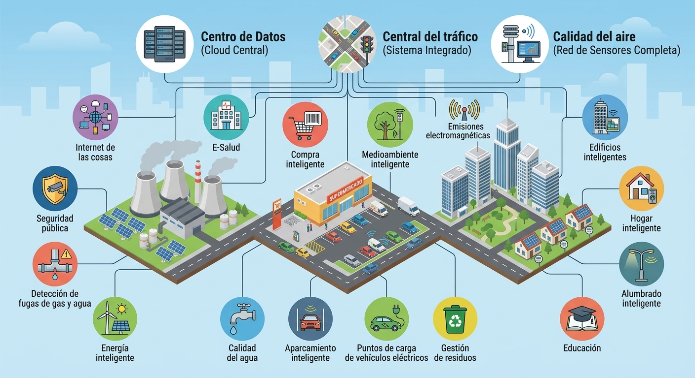
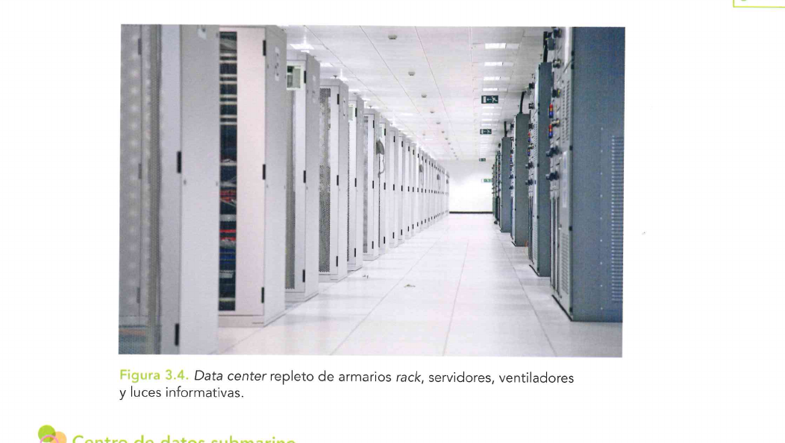
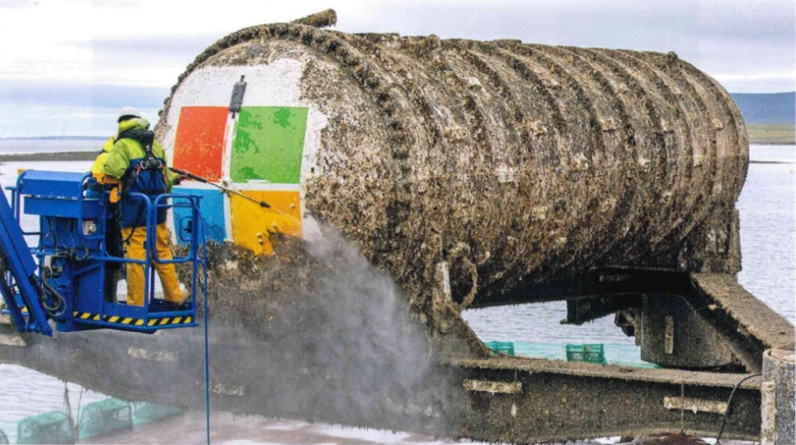

# UT3 – Cloud computing

## De qué va esta unidad

La nube se usa a diario, aunque no siempre resulte evidente: al subir una foto a Google
Fotos, ver una serie en streaming, editar un documento colaborativamente a distancia o
jugar en Xbox Cloud Gaming sin disponer de una consola potente, hay un centro de datos en
alguna parte del mundo realizando el trabajo pesado. Esta unidad explica **qué es
exactamente esa "nube"**, cómo se organiza en niveles de servicio, y por qué las empresas
—no solo los particulares— han apostado tan fuerte por ella.

Pero la nube no vive sola. Cuando los datos deben procesarse en milisegundos (un coche
autónomo frenando, un robot industrial evitando una colisión), enviarlos a un centro de
datos lejano y esperar respuesta ya no vale. Por eso han surgido modelos "más cerca de
casa": **edge, fog y mist computing**, que acercan el procesamiento al lugar donde nacen
los datos. Esta unidad se centra en identificar los sistemas basados en cloud/nube y su
influencia en el desarrollo de los sistemas digitales. También se analiza el lado económico (¿de verdad compensa pagar por uso en vez
de comprar servidores?), el lado ambiental (la nube también puede ser sostenible, o no) y
el lado más delicado: qué puede salir mal en la nube y cómo evitarlo.

## Qué se espera saber hacer al terminar

Al finalizar esta unidad se debe ser capaz de:

- **Identificar los diferentes niveles de la nube** (IaaS, PaaS, SaaS) y distinguir qué
  gestiona el proveedor y qué gestiona el usuario en cada uno.
- **Reconocer las principales funciones de la nube**: procesar datos, almacenar
  información, ejecutar aplicaciones, intercambiar información entre dispositivos y
  personas, entre otras.
- **Describir qué es el edge computing** y cómo se relaciona con la nube (no la sustituye,
  la complementa).
- **Definir fog y mist computing** y saber en qué zona de una arquitectura distribuida se
  aplica cada uno.
- **Valorar las ventajas** que aporta usar la nube en sistemas conectados: escalabilidad,
  ahorro, disponibilidad, acceso a tecnología avanzada, entre otras — sin perder de vista
  también sus riesgos y limitaciones.

---

## 1. Nube, definición y niveles. Cloud computing

**La nube (cloud)** es un modelo de prestación de servicios tecnológicos a través de
Internet: en lugar de ejecutar programas o guardar archivos en un ordenador propio, se
accede a recursos informáticos (procesamiento, almacenamiento, bases de datos, redes,
software) que están físicamente en centros de datos de un proveedor externo. No es
necesario saber dónde está ese centro de datos ni cómo está montado por dentro: basta con
conectarse y usarlo.

El término tiene un origen curioso: viene de los diagramas de redes de los años 70-80, donde
se dibujaba literalmente una nube para representar "todo ese sistema complejo cuya
infraestructura interna no importa al usuario". La idea maduró con el *time-sharing* de los
años 60 (varios usuarios compartiendo un mismo ordenador central) y la virtualización de los
90, hasta que en **2006 Amazon lanzó AWS y su servicio EC2**, que popularizó el término
"cloud computing" tal y como se entiende hoy. Aunque, en realidad, la puesta en práctica
del modelo ya había empezado antes: **Salesforce**, en 1999, fue de los primeros en ofrecer
software como servicio a través de Internet.

**Características principales** de cualquier servicio en la nube:

- **Acceso bajo demanda:** se consumen recursos cuando se necesitan, no antes.
- **Elasticidad:** el sistema añade o quita recursos automáticamente según la carga de
  trabajo (ver el recuadro de escalabilidad más abajo).
- **Pago por uso:** solo se paga por lo que realmente se consume, como ocurre con la
  factura de la luz.
- **Acceso ubicuo:** desde cualquier dispositivo con conexión a Internet.
- **Mantenimiento externalizado:** las actualizaciones y los parches los gestiona el
  proveedor, no el cliente.

> **Escalabilidad y elasticidad, sin confundirlas.** La *escalabilidad* es la capacidad de un
> sistema de crecer para soportar más carga de trabajo. Puede ser **vertical** (*scale up*:
> dar más potencia a la misma máquina, por ejemplo pasar de 8 a 32 GB de RAM) u
> **horizontal** (*scale out*: añadir más máquinas o instancias, repartiendo el trabajo con
> un **balanceador de carga**, un sistema que distribuye las peticiones entre varios
> servidores para que ninguno se sature). La *elasticidad* es más concreta: es la capacidad
> de ajustar esos recursos **de forma automática y dinámica**, subiendo cuando hay
> demanda y bajando cuando no la hay, para no pagar de más. Un ejemplo típico: una tienda
> online añade servidores automáticamente durante el Black Friday y los retira cuando el
> tráfico vuelve a la normalidad.

### Los tres niveles de servicio

Los servicios cloud se organizan en tres niveles, según cuánto control tiene el usuario y
cuánto asume el proveedor. Es lo que en los apuntes de la unidad se llama el "modelo de
responsabilidad compartida", y conviene visualizarlo como capas de un pastel: cuantas más
capas gestiona el proveedor, menos debe ocuparse el usuario, aunque también dispone de
menos control.

| Nivel | Qué entrega el proveedor | Qué gestiona el usuario | Ejemplos |
| --- | --- | --- | --- |
| **IaaS** (Infraestructura como Servicio) | Máquinas virtuales, almacenamiento en red, redes virtuales, firewalls | Sistema operativo y todas las aplicaciones | Amazon EC2, Azure Virtual Machines, Google Compute Engine |
| **PaaS** (Plataforma como Servicio) | Todo lo de IaaS + sistema operativo, bases de datos, servidores web, herramientas de despliegue | Solo los datos propios y el desarrollo de las aplicaciones | Google App Engine, Heroku, Azure App Services |
| **SaaS** (Software como Servicio) | La pila completa, incluida la propia aplicación | Nada de infraestructura: solo se usa el software | Google Workspace, Microsoft 365, Salesforce, Dropbox |

*Figura: los tres niveles de servicio, de menor a mayor control por parte del usuario:
SaaS (solo consumes), PaaS (creas aplicaciones) e IaaS (migras y administras
infraestructura). Origen: apuntes propios "UT 3 Cloud Computing".*

Además de los niveles, la nube también se clasifica según **cómo se despliega**:

- **Nube pública:** infraestructura de un proveedor externo, compartida entre muchos
  clientes (multitenencia). Coste inicial muy bajo y muy escalable, pero menos control.
- **Nube privada:** dedicada en exclusiva a una organización. Más control y seguridad, pero
  más cara y necesita personal especializado.
- **Nube híbrida:** combina ambas. Por ejemplo, una empresa procesa datos sensibles en su
  nube privada y delega los picos de trabajo a la nube pública (a esto se le llama *cloud
  bursting*).
- **Nube comunitaria:** compartida por organizaciones con necesidades parecidas (sanidad,
  educación, administración pública).

Los grandes proveedores globales son **AWS** (líder en IaaS), **Microsoft Azure** (fuerte
en entornos empresariales), **Google Cloud Platform** (destacado en IA y datos), **Oracle
Cloud** e **IBM Cloud**. Casi todos ofrecen los tres niveles combinados.

*Figura: las apps de gestión de los proveedores de nube más usados hoy —AWS, Azure,
Google Cloud, Alibaba Cloud y Oracle— conviven en el móvil de cualquier administrador de
sistemas. Origen: apuntes propios "UT 3 Cloud Computing".*

> **Ejemplo actual — El 98 % de las consultoras ya está en la nube.** Según datos
> recientes del sector, en torno al 98 % de las empresas de consultoría había migrado ya a
> la nube, y un 74 % la usa activamente para ganar agilidad operativa. Esto no es un dato
> anecdótico: significa que, salvo excepciones muy reguladas, tener infraestructura propia
> se ha convertido en la opción minoritaria, no en la norma.

### Ideas clave de esta sección
- La nube separa "dónde están físicamente los datos" de "quién y cómo los usa": se accede
  por Internet sin necesidad de ocuparse de la infraestructura.
- IaaS, PaaS y SaaS reparten de forma creciente la responsabilidad hacia el proveedor.
- Escalabilidad (crecer) y elasticidad (ajustarse automáticamente arriba y abajo) son
  conceptos relacionados pero no idénticos.
- Pública, privada, híbrida y comunitaria son los modelos de despliegue; cada uno encaja
  con un tipo distinto de necesidad (coste, control, regulación).

## 2. Posibilidades de trabajo en la nube

Más allá de "guardar archivos", la nube ofrece un abanico de funciones que han cambiado
cómo trabajan empresas y particulares. Los apuntes de la unidad las agrupan así:

**Procesamiento y almacenamiento de datos.** La nube permite ejecutar tareas pesadas
—análisis de big data, renderizado, entrenamiento de modelos de IA— sin depender de la
potencia de un equipo local; el trabajo real ocurre en máquinas virtuales y contenedores del
proveedor, que escalan automáticamente. El almacenamiento en la nube añade
**redundancia** (copias de los mismos datos en varios servidores o regiones, para que un
fallo de uno no suponga perder nada) y permite desplegar bases de datos SQL (MySQL,
PostgreSQL) o NoSQL (MongoDB, DynamoDB) con copias de seguridad automáticas y alta
disponibilidad.

> **Alta disponibilidad vs. tolerancia a fallos.** No son lo mismo, aunque se confunden a
> menudo. La **alta disponibilidad** busca que el sistema esté operativo casi siempre (se
> mide en "nueves": 99,9 %, 99,999 %...), aceptando que pueda haber una interrupción muy
> breve mientras el sistema conmuta al componente de respaldo. La **tolerancia a fallos**
> es más exigente: el componente secundario ya está funcionando en paralelo, así que si el
> primario falla, el usuario no nota absolutamente nada. Esta última se reserva para
> sistemas de misión crítica —control de tráfico aéreo, transacciones bancarias en tiempo
> real— porque es mucho más cara de mantener.

**Ejecución de aplicaciones y servicios.** La nube permite alojar webs y aplicaciones
completas (Azure Web Apps, AWS Elastic Beanstalk), y ha impulsado el uso de
**contenedores** —paquetes ligeros con una aplicación y sus dependencias, sin necesidad
de llevar un sistema operativo completo como haría una máquina virtual— gestionados con
**Docker** y orquestados con **Kubernetes**. También ha popularizado el modelo
**serverless**, del que forma parte el **FaaS (Function as a Service)**: se sube una función
de código que la nube ejecuta solo cuando ocurre un evento concreto, y solo se paga por ese
instante de ejecución. Serverless es el concepto amplio (incluye bases de datos y
almacenamiento "sin servidor"); FaaS es la pieza que ejecuta funciones puntuales.

*Figura: FaaS es un subconjunto de Serverless. Serverless incluye también bases de
datos y almacenamiento gestionados sin servidor; FaaS se centra en ejecutar funciones
puntuales disparadas por eventos. Origen: apuntes propios "UT 3 Cloud Computing".*

**Intercambio de información.** La nube sincroniza datos entre dispositivos (las fotos
aparecen igual en el móvil y en el portátil), permite trabajo colaborativo en tiempo real
(Google Docs, Microsoft 365, Figma) y facilita que distintas aplicaciones se comuniquen
entre sí mediante **API** (interfaces que permiten a dos programas compartir datos o
funciones), por ejemplo para geolocalización, pagos o mensajería.

**Otras funciones relevantes:** inteligencia artificial como servicio o **AIaaS** (modelos ya
entrenados para reconocimiento de voz, análisis de imágenes o chatbots, como Google
Vertex AI o AWS SageMaker), gestión de dispositivos **IoT** a gran escala, y automatización
de **DevOps** (integración y despliegue continuos).

> **En las noticias — videojuegos sin consola.** Servicios como Xbox Cloud Gaming o
> NVIDIA GeForce NOW han seguido creciendo en los últimos años, permitiendo jugar a
> títulos exigentes desde un móvil o una tablet modesta porque el renderizado ocurre en
> servidores remotos. Es un ejemplo muy visual de cómo la nube traslada la potencia de
> cálculo fuera del dispositivo del usuario.

### Ideas clave de esta sección
- La nube no es solo almacenamiento: procesa, ejecuta aplicaciones, sincroniza y conecta
  servicios mediante API.
- Contenedores (Docker) + orquestación (Kubernetes) son la base técnica de muchas
  aplicaciones cloud modernas.
- Serverless/FaaS lleva el "pago por uso" a su extremo: solo se paga por segundos de
  ejecución real.

## 3. Edge computing y su relación con la nube

El aumento de dispositivos conectados (IoT), la necesidad de respuestas en tiempo real y la
saturación de las redes han impulsado un modelo distinto: procesar los datos **cerca de
donde se generan**, en el "borde" (*edge*) de la red, en lugar de enviarlos siempre a un
centro de datos remoto.

El **edge computing** consiste precisamente en eso: sensores, gateways IoT, routers
inteligentes o pequeños servidores locales ejecutan tareas como análisis preliminar,
filtrado de información, detección de eventos o algoritmos de respuesta inmediata, sin
esperar a que los datos viajen hasta la nube y vuelva la respuesta.

**¿Por qué surge?** Por varias razones combinadas:

- **Reducción de latencia:** en sistemas críticos —vehículos autónomos, robots
  industriales, telemedicina— los milisegundos cuentan, y procesar en local evita el
  retraso del viaje de ida y vuelta a un centro de datos lejano.
- **Ahorro de ancho de banda:** enviar continuamente datos en bruto genera un tráfico
  enorme; el edge filtra y envía solo lo relevante.
- **Resiliencia:** si falla la conexión con la nube, el edge puede seguir funcionando de
  forma autónoma.
- **Privacidad:** los datos sensibles no tienen por qué salir del entorno local.

*Figura: el edge computing organiza el procesamiento en capas: la capa inferior recoge
datos de sensores IoT (vehículos, robots, energía), el perímetro los analiza y filtra en
tiempo real, y solo lo necesario llega a la nube o al data center. Origen: apuntes propios
"UT 3 Cloud Computing".*

**Es importante entender que el edge no sustituye a la nube, la complementa.** El flujo
típico es: los sensores generan datos, el edge hace un análisis rápido (detección de
anomalías, control de procesos, activación de actuadores) y la nube se encarga de lo que
requiere más potencia y menos urgencia: almacenamiento a largo plazo, análisis profundo,
entrenamiento de modelos de IA con históricos completos.

Un ejemplo aplicado: un dron agrícola analiza en el propio dron (edge) qué parches de un
cultivo tienen baja humedad mientras vuela; después, la nube recibe las imágenes
seleccionadas, entrena modelos predictivos con datos de muchas campañas y planifica el
riego de la semana.

Otros casos de uso habituales: vehículos autónomos, robots industriales y sistemas SCADA,
videovigilancia con análisis directamente en la cámara, semaforización en smart cities,
domótica en hubs domésticos y monitorización continua en sanidad conectada.

### Ideas clave de esta sección
- El edge procesa donde se generan los datos; la nube procesa en profundidad y a largo
  plazo. Son complementarios, no rivales.
- Las razones para usar edge son latencia, ancho de banda, resiliencia y privacidad.
- Es clave en aplicaciones de tiempo real: vehículos autónomos, robótica industrial,
  smart cities.

## 4. Fog y Mist. Relación con la nube

Entre el edge (muy cerca del sensor) y la nube (muy lejos, en un centro de datos remoto)
aparecen dos capas intermedias que organizan el flujo de datos de forma más eficiente:
**fog computing** y **mist computing**.

**Fog computing** ("computación en niebla", un término impulsado originalmente por Cisco)
es una capa intermedia que se ejecuta en microcentros de datos locales —routers
avanzados, switches potentes, servidores locales o nodos de borde industriales—
normalmente dentro de la misma red o edificio. Su objetivo es reducir la carga que llega a
la nube, tomar decisiones casi en tiempo real y coordinar redes IoT de gran tamaño.
Ejemplos: sistemas de tráfico inteligente que controlan semáforos, o una planta industrial
donde varios robots envían datos a un servidor local (*fog node*) antes de que se
sincronicen con la nube.

**Mist computing** ("neblina", más ligera que la niebla) va un paso más allá: se ejecuta
directamente dentro de microcontroladores, sensores y dispositivos de muy baja potencia,
lo más cerca posible de donde se origina el dato. Permite tareas mínimas —filtrado básico,
detección de valores anómalos, activación de un actuador— reduciendo aún más la latencia
y el ancho de banda necesario. Ejemplo clásico: un sensor de temperatura en un
invernadero que detecta internamente si se supera un umbral, activa un ventilador por sí
solo y solo envía a la nube un resumen o una alerta, no un flujo continuo de datos.

> La diferencia de nombre no es casual: en meteorología, la **niebla** (fog) es más densa y
> reduce la visibilidad a menos de 1 km, mientras que la **neblina** (mist) es más ligera y deja
> ver más lejos. La metáfora encaja: el fog computing tiene más capacidad de cómputo que
> el mist, que es la capa más mínima y descentralizada de todas.

La arquitectura completa se puede pensar como capas ordenadas por cercanía al dato:

**Mist → Edge → Fog → Cloud**

| Capa | Dónde vive | Función principal |
| --- | --- | --- |
| **Mist** | Sensores, actuadores, microchips | Reacción inmediata muy básica |
| **Edge** | Gateways IoT, cámaras, robots | Respuesta en tiempo real local |
| **Fog** | Routers, microservidores | Preprocesamiento y coordinación |
| **Cloud** | Centros de datos remotos | Análisis masivo, IA, almacenamiento a largo plazo |

*Figura: en un entorno de IoT industrial, la capa cloud hace analítica de negocio y
almacenamiento masivo (más lenta), la capa fog analiza y reduce datos en nodos locales,
y la capa edge procesa en tiempo real junto a los sensores (más rápida). Origen: "Guía
Estratégica sobre Sistemas en la Nube".*

Este esquema de capas es precisamente el que hace posible las **smart cities**: sensores
de calidad del aire, alumbrado inteligente, gestión de residuos, aparcamiento inteligente o
puntos de carga de vehículos eléctricos generan datos constantemente, y sin fog ni mist
sería inviable procesar todo ese volumen enviándolo entero a la nube.

*Figura: una smart city combina decenas de sistemas conectados —alumbrado, residuos,
aparcamiento, calidad del agua, seguridad pública— que dependen de arquitecturas
edge/fog/mist para funcionar en tiempo real sin saturar la red. Origen: apuntes propios
"UT 3 Cloud Computing".*

### Ideas clave de esta sección
- Fog está a nivel de red local (routers, microservidores); mist está dentro del propio
  sensor o microcontrolador.
- El flujo de datos típico va de mist a edge, de edge a fog, y de fog a la nube, filtrando en
  cada paso.
- Las smart cities son el ejemplo de aplicación conjunta más citado para esta arquitectura.

## 5. Ventajas y desventajas del uso de recursos en la nube

Como cualquier tecnología, la nube tiene fortalezas claras, pero no es una solución mágica
sin coste ni riesgo. Conviene conocer ambos lados para tomar decisiones informadas.

**Ventajas principales:**

- **Escalabilidad inmediata:** subir o bajar recursos según la demanda (una tienda online
  ampliando servidores en Black Friday).
- **Reducción de costes iniciales:** no hace falta comprar hardware, montar salas de
  servidores ni pagar climatización; se paga por uso o por suscripción.
- **Alta disponibilidad y redundancia:** acuerdos de servicio del 99,9 % al 99,999 %,
  gracias a servidores distribuidos geográficamente y copias automáticas.
- **Actualizaciones automáticas:** parches de seguridad y mejoras gestionados por el
  proveedor.
- **Mayor seguridad, si se configura bien:** cifrado, detección de intrusiones,
  autenticación multifactor, gestión de identidades — pero (aviso importante) solo si la
  empresa configura correctamente los permisos.
- **Acceso a tecnologías avanzadas** que serían muy caras de montar en local: IA,
  machine learning, análisis masivo de datos.
- **Agilidad e innovación:** probar ideas y prototipos rápido, sin grandes inversiones,
  reduciendo el *time to market*.

**Desventajas y riesgos:**

- **Dependencia del proveedor (vendor lock-in):** migrar de proveedor puede ser difícil, y
  los precios o servicios pueden cambiar de forma unilateral.
- **Necesidad de conexión a Internet:** sin ella, no hay acceso a nada de lo que está en la
  nube.
- **Costes variables y difíciles de prever:** dejar un servidor de pruebas encendido por
  error puede traducirse en una factura inesperada a fin de mes.
- **Riesgos de seguridad:** sobre todo por configuraciones incorrectas o mala gestión de
  contraseñas (más detalle en el punto 8).
- **Menor control sobre la infraestructura física**, algo delicado en sectores muy
  regulados (banca, sanidad).
- **Latencia:** para aplicaciones que necesitan respuesta en milisegundos, un centro de
  datos lejano puede no ser suficiente — de ahí la combinación con edge computing.

*Figura: el interior de un data center, con hileras de armarios rack llenos de servidores.
Detrás de cada ventaja "invisible" de la nube (escalabilidad, disponibilidad) hay una
infraestructura física real que el proveedor mantiene. Origen: apuntes propios "UT 3
Cloud Computing".*

### Ideas clave de esta sección
- Ninguna ventaja de la nube es gratis: cada una tiene su contrapartida (más
  disponibilidad = dependencia del proveedor; menos coste inicial = coste variable difícil
  de prever).
- La seguridad "avanzada" de la nube solo funciona si se configura correctamente; el
  proveedor no puede compensar errores humanos de configuración.
- La latencia sigue siendo el punto débil de la nube pura, resuelto en parte con edge/fog.

## 6. Uso de la nube y la rentabilidad de la empresa

Adoptar la nube no es solo una decisión técnica: tiene un impacto económico directo y, para
muchas empresas, es el motivo real de la migración.

**De CAPEX a OPEX.** Tradicionalmente, montar infraestructura propia exigía una gran
inversión inicial (**CAPEX**, gasto de capital): servidores, sistemas de refrigeración,
licencias, personal especializado, salas acondicionadas, medidas antiincendios... Con la
nube, ese desembolso se convierte en un **gasto operativo (OPEX)**: se paga solo por lo que
se usa, mes a mes, sin comprar nada físico. Una empresa que antes invertía, por ejemplo,
20.000 € en servidores cada cuatro años, puede migrar a la nube y pagar únicamente el
tiempo de ejecución y el almacenamiento que realmente necesita.

**Optimización de recursos.** El escalado automático evita tanto la infrautilización
(servidores pagados que no se usan) como la saturación (no dar abasto en un pico de
demanda), ajustando el gasto a la actividad real.

**Productividad del personal.** Al externalizar la infraestructura, los equipos técnicos
dejan de dedicar tiempo al mantenimiento repetitivo y pueden centrarse en tareas
estratégicas, acelerando el desarrollo con prácticas DevOps.

**Nuevos modelos de negocio.** La nube ha hecho posible que startups lancen servicios
web globales sin comprar un solo servidor, que pequeños negocios vendan a clientes
internacionales, o que empresas basen parte de su negocio en el análisis de datos en la
nube.

**Competitividad para pymes.** Quizá el efecto más significativo a nivel social: una
pyme puede acceder a la misma infraestructura de clase mundial que una multinacional,
pagando solo una fracción del coste que supondría montarla por su cuenta. Esto reduce
mucho la barrera de entrada tecnológica para negocios pequeños.

> **Ejemplo actual — El coste real de "olvidar apagar" la nube.** Un caso muy citado en
> el sector: una empresa deja encendido, por error, un entorno de pruebas en la nube
> durante un fin de semana y recibe una factura mucho mayor de lo previsto. Es el reverso
> del pago por uso: tan fácil como es escalar hacia arriba automáticamente, hay que vigilar
> también que no se disparen los costes por recursos olvidados.

### Ideas clave de esta sección
- El cambio de CAPEX a OPEX es el argumento económico central de la nube: se pasa de
  invertir a gastar según el uso.
- El ahorro no es solo en hardware: también en personal, tiempo de lanzamiento y
  oportunidad de negocio.
- La nube nivela el terreno de juego entre grandes empresas y pymes en acceso a
  tecnología.

## 7. Cloud computing como tecnología que impulsa la sostenibilidad

Centralizar el procesamiento en grandes centros de datos optimizados no solo beneficia a
la cuenta de resultados: también reduce el impacto ambiental global, si se compara con que
cada empresa tuviera sus propios servidores infrautilizados.

**Eficiencia energética.** Los proveedores invierten en sistemas de refrigeración
avanzados, aprovechan climas fríos para reducir el gasto en enfriar servidores, y usan
inteligencia artificial para ajustar en tiempo real la ventilación y la temperatura. Un caso
conocido: Google Cloud ha usado IA para ajustar la refrigeración de sus centros de datos,
reduciendo hasta un 30 % el consumo asociado a ese proceso.

**Energías renovables.** AWS, Microsoft y Google operan una parte significativa de sus
centros de datos con energía renovable, y avanzan hacia centros de datos
"carbono-neutrales".

**Menos residuos electrónicos.** Si cada empresa no necesita comprar su propio hardware,
hay menos equipos físicos instalados, menos residuos por obsolescencia y ciclos de vida
del hardware más largos gracias a un mantenimiento profesionalizado a gran escala.

**Multitenencia = uso eficiente de recursos.** Compartir servidores entre miles de clientes
(*multitenancy*) evita que cada organización tenga infraestructura sobredimensionada e
infrautilizada, lo que reduce el número total de servidores fabricados en el mundo y su
impacto ambiental asociado.

**Monitorización ambiental.** Paradójicamente, la propia nube permite desplegar sistemas
de monitorización a gran escala (sensores de temperatura, emisiones, calidad del aire)
aplicados en smart cities, redes eléctricas inteligentes o agricultura de precisión.

*Figura: el Proyecto Natick de Microsoft sumergió un data center completo en el
océano para aprovechar el agua fría como sistema de refrigeración natural y eliminar así
el coste energético del enfriamiento. Origen: "Guía Estratégica sobre Sistemas en la
Nube".*

> **En las noticias — el objetivo de las cero emisiones netas.** Según análisis recientes
> del sector, la computación en la nube tiene el potencial de contribuir a reducir del orden
> de 32 gigatoneladas de CO₂ de aquí a 2050, una cifra próxima a la mitad del objetivo total
> estimado en unas 65 gigatoneladas necesarias para alcanzar las cero emisiones netas a
> nivel mundial. Conviene tomar la cifra como una estimación de la industria, no como un
> dato verificado de forma independiente, pero sí sirve para entender la magnitud del papel
> que se le atribuye a la nube en la transición energética.

### Ideas clave de esta sección
- La nube reduce impacto ambiental sobre todo por economía de escala: menos hardware
  duplicado, centros de datos más eficientes que los de una empresa media.
- Grandes proveedores ya usan IA y ubicaciones estratégicas (frío natural, incluso agua de
  mar) para reducir el gasto energético en refrigeración.
- La sostenibilidad de la nube depende de decisiones activas del proveedor (energía
  renovable, eficiencia), no es automática por el simple hecho de "estar en la nube".

## 8. Incidentes de ciberseguridad

Aunque los proveedores de nube cuentan con medidas de seguridad muy avanzadas, los
incidentes siguen ocurriendo. Y un dato importante que repiten todas las fuentes de esta
unidad: **la mayoría de los incidentes no se deben a un fallo técnico del proveedor, sino a
errores humanos o configuraciones incorrectas** por parte del cliente.

**Amenazas y riesgos más comunes:**

- **Configuraciones incorrectas:** bases de datos sin contraseña, buckets de
  almacenamiento accesibles desde Internet, permisos demasiado abiertos. Es de los
  incidentes más habituales y puede provocar exposición masiva de datos.
- **Accesos no autorizados:** por contraseñas débiles, ausencia de autenticación
  multifactor, phishing o credenciales filtradas.
- **Ataques de denegación de servicio (DDoS):** tráfico masivo para saturar un servicio;
  los proveedores suelen mitigarlo, pero puede generar costes adicionales por el consumo
  de recursos que provoca.
- **Amenazas internas:** un empleado con permisos elevados que, por error o de forma
  deliberada, borra máquinas virtuales o cambia configuraciones críticas.
- **Robo o pérdida de datos:** por copias de seguridad mal gestionadas, errores de
  sincronización o borrado accidental.
- **Vulnerabilidades en software:** actualizaciones incompletas que dejan brechas
  abiertas, incluso con el proveedor parcheando constantemente su parte.

**Buenas prácticas para prevenir incidentes**, según los materiales de la unidad:
autenticación multifactor (MFA), gestión adecuada de identidades con el **principio de
mínimo privilegio** (dar solo el acceso estrictamente necesario), cifrado en tránsito y en
reposo, auditoría y monitorización continua, revisiones periódicas de configuración, y
planes de recuperación ante desastres (**DRP**) con copias en regiones distintas.

> **Ejemplo actual — errores humanos que cuestan caro.** Dos casos muy citados en los
> materiales de la unidad ilustran que el riesgo no siempre es "hacker sofisticado": un
> empleado de Apple perdió un prototipo de iPhone en un bar antes de su lanzamiento
> oficial, y un funcionario perdió un USB con datos de 500.000 ciudadanos tras una noche
> de fiesta. Son ejemplos del llamado **error humano**, la causa más frecuente detrás de la
> pérdida de datos, muy por delante de los fallos de hardware o los ataques externos.

> **En las noticias — filtración de Microsoft en 2019.** Según se informó en su momento,
> Microsoft sufrió una filtración de aproximadamente 250 millones de registros de soporte
> al cliente. Es un ejemplo particularmente útil para esta unidad porque el origen no fue un
> fallo de la infraestructura de la nube en sí, sino **una configuración incorrecta de un
> servidor** por parte del propio equipo de gestión — exactamente el patrón que señalan los
> materiales como la causa más habitual de los incidentes cloud.

Casos reales resumidos en los apuntes: un bucket de almacenamiento mal configurado
expuso datos de clientes sin ninguna restricción; un desarrollador publicó por error una
clave de acceso en un repositorio público, y atacantes la usaron para desplegar cientos de
servidores dedicados a minar criptomonedas, generando una factura de miles de euros; y
un empleado con acceso elevado borró por error recursos críticos, provocando horas de
interrupción del servicio.

**La conclusión que atraviesa toda la unidad:** la seguridad en la nube funciona bajo un
**modelo de responsabilidad compartida**. El proveedor protege la infraestructura física y
la plataforma; el cliente es responsable de configurar bien los accesos, proteger las
credenciales y vigilar los permisos. La nube no es insegura por sí misma: lo peligroso es
usarla sin las precauciones adecuadas.

### Ideas clave de esta sección
- La causa más frecuente de incidentes en la nube es el error humano y la mala
  configuración, no un fallo técnico del proveedor.
- MFA, mínimo privilegio, cifrado y auditoría continua son las defensas básicas
  recomendadas.
- La seguridad en la nube es una responsabilidad compartida entre proveedor y cliente.

---

## Glosario rápido

| Término | En una frase |
| --- | --- |
| **IaaS / PaaS / SaaS** | Los tres niveles de servicio cloud, de menor a mayor gestión por parte del proveedor. |
| **Escalabilidad vertical / horizontal** | Crecer dando más potencia a una máquina (vertical) o añadiendo más máquinas (horizontal). |
| **Elasticidad** | Ajuste automático de recursos arriba y abajo según la demanda real. |
| **Balanceador de carga** | Sistema que reparte las peticiones entre varios servidores para que ninguno se sature. |
| **Contenedor (Docker)** | Paquete ligero con una aplicación y sus dependencias, sin sistema operativo propio. |
| **Kubernetes** | Herramienta que orquesta (gestiona y escala) muchos contenedores a la vez. |
| **Serverless / FaaS** | Modelo donde el proveedor gestiona toda la infraestructura; FaaS ejecuta funciones puntuales por eventos. |
| **Edge computing** | Procesar los datos cerca de donde se generan, en el "borde" de la red. |
| **Fog computing** | Capa intermedia en microcentros locales (routers, servidores) entre el edge y la nube. |
| **Mist computing** | Procesamiento mínimo directamente en sensores y microcontroladores. |
| **CAPEX / OPEX** | Inversión inicial en hardware propio frente a gasto operativo por uso, típico de la nube. |
| **Vendor lock-in** | Dependencia de un proveedor que dificulta migrar a otro. |
| **MFA (autenticación multifactor)** | Añadir una segunda comprobación de identidad, más allá de la contraseña. |
| **Multitenencia** | Varios clientes comparten la misma infraestructura física del proveedor. |

## Repaso: preguntas de autoevaluación

1. ¿Qué diferencia hay entre IaaS, PaaS y SaaS en cuanto a quién gestiona el sistema
   operativo?
2. ¿Es lo mismo escalabilidad que elasticidad? Explica la diferencia con un ejemplo.
3. ¿Qué es un balanceador de carga y qué problema resuelve?
4. ¿Por qué el edge computing no sustituye a la nube, sino que la complementa?
5. Ordena de más cercano a más lejano del sensor: nube, fog, edge, mist.
6. Cita dos ventajas y dos desventajas del uso de la nube en una empresa.
7. ¿Qué significa pasar de CAPEX a OPEX al migrar a la nube?
8. ¿Cómo contribuye la nube a la sostenibilidad ambiental? Cita al menos dos formas.
9. Según los materiales de la unidad, ¿cuál es la causa más frecuente de los incidentes de
   ciberseguridad en la nube?
10. ¿Qué es el "modelo de responsabilidad compartida" en seguridad cloud?

Respuestas (por sección)

1. Sección 1 — en IaaS lo gestiona el usuario; en PaaS y SaaS lo gestiona el proveedor.
2. Sección 1 — escalabilidad es la capacidad de crecer; elasticidad es que ese ajuste sea
   automático y en ambas direcciones (subir y bajar).
3. Sección 1 — reparte las peticiones entre varios servidores para evitar que uno se sature.
4. Sección 3 — el edge hace el análisis rápido en tiempo real; la nube hace el análisis
   profundo y el almacenamiento a largo plazo.
5. Sección 4 — mist, edge, fog, cloud.
6. Sección 5 — por ejemplo: escalabilidad inmediata y alta disponibilidad (ventajas);
   vendor lock-in y costes variables difíciles de prever (desventajas).
7. Sección 6 — de una gran inversión inicial en hardware propio a un gasto recurrente
   proporcional al uso real.
8. Sección 7 — centros de datos más eficientes energéticamente, uso de energías
   renovables y reducción de residuos electrónicos por menos hardware duplicado.
9. Sección 8 — el error humano y las configuraciones incorrectas, más que los fallos
   técnicos del proveedor.
10. Sección 8 — el proveedor protege la infraestructura física y la plataforma; el cliente es
    responsable de configurar bien accesos, credenciales y permisos.

