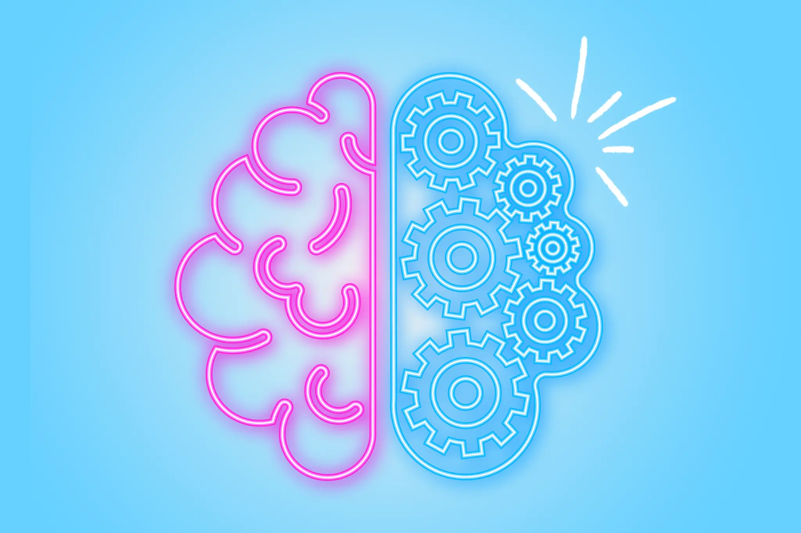
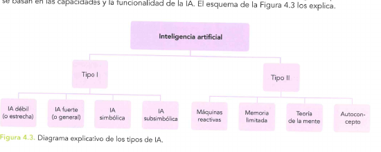
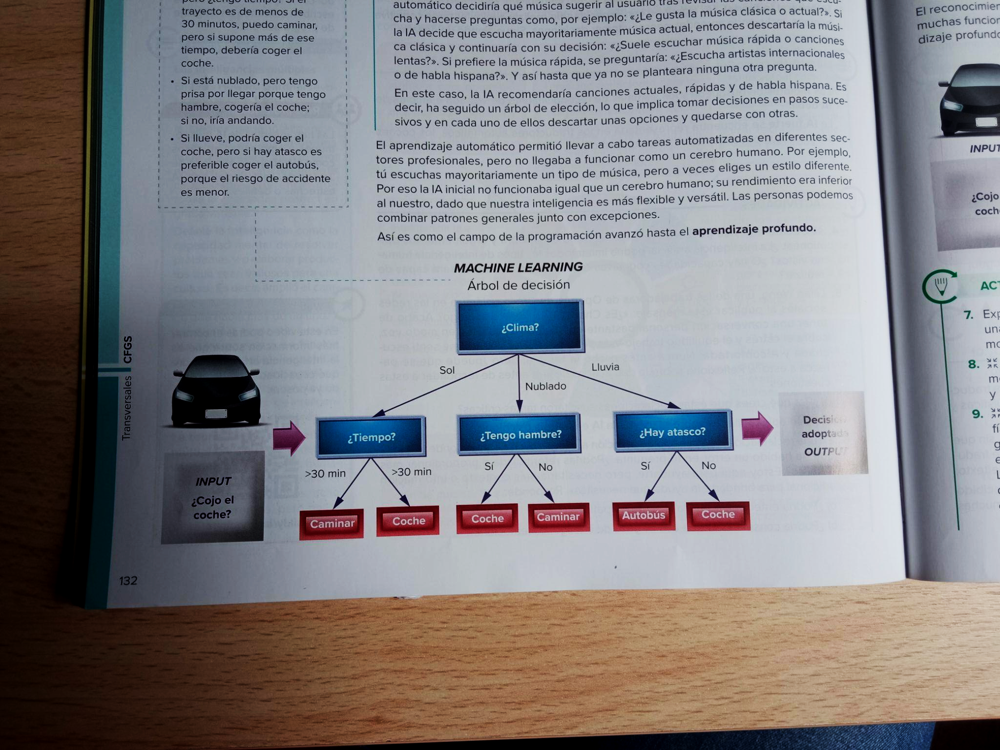
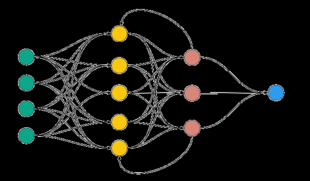
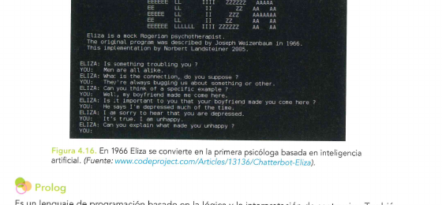
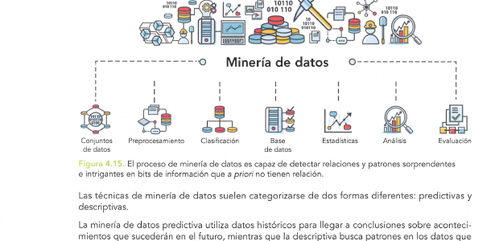
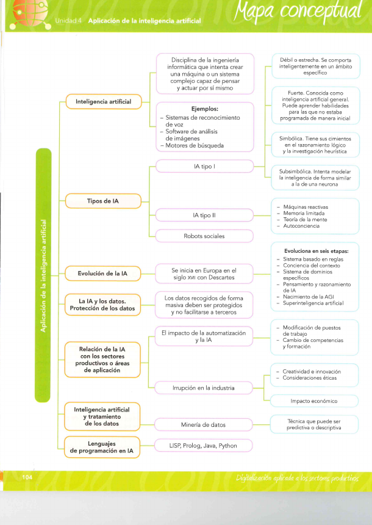

# UT4 — Inteligencia Artificial

## De qué va esta unidad

Todos los días interactuamos con inteligencia artificial (IA) sin apenas darnos cuenta:
cuando el móvil sugiere la siguiente palabra al escribir, cuando Netflix recomienda una
serie, cuando el banco bloquea una compra "rara" con la tarjeta o cuando le pedimos a
ChatGPT o a Copilot que nos ayude a programar. Esta unidad, ligada al **RA4**, explica qué
hay detrás de esa palabra tan usada —y tan mal usada— que es "inteligencia artificial":
qué es realmente, de qué tipos existe, cómo "aprende" una máquina, por qué necesita datos
para funcionar, en qué sectores productivos se está implantando con más fuerza, cómo se
"extrae" conocimiento útil de los datos (minería de datos) y cómo la IA está potenciando
al resto de tecnologías habilitadoras digitales (THD) ya tratadas en la UT2.

El hilo conductor es sencillo: **la IA no es magia, es matemáticas aplicadas a muchos
datos**. Cuantos más datos de calidad tenga un sistema y mejor entrenado esté, mejor
predice, clasifica o genera contenido. Para el perfil de técnico en desarrollo de
aplicaciones multiplataforma, no se trata de "inventar" IA desde cero, sino de
**integrar servicios de IA en las aplicaciones** que se desarrollen (APIs, modelos ya
entrenados, asistentes de código); de ahí que entender sus tipos, sus límites y sus
riesgos éticos y legales (protección de datos) forme parte de ese perfil profesional.

## Qué se espera saber hacer al terminar la unidad (resultados de aprendizaje)

Esta unidad desarrolla el **RA4**: *identificar aplicaciones de la IA en entornos del
sector donde está enmarcado el título, describiendo las mejoras implícitas en su
implementación*. En resumen, al terminar la unidad se debe ser capaz de:

- **Explicar** por qué la IA va más allá de la automatización clásica basada en reglas fijas
  y cómo ayuda a optimizar procesos.
- **Relacionar** la IA con la recogida masiva de datos (Big Data) y su análisis, y explicar
  cómo eso se traduce en rentabilidad para una empresa.
- **Valorar** la importancia presente y futura de la IA, con argumentos y no solo con
  opiniones.
- **Identificar** los sectores productivos donde la IA está más implantada y por qué.
- **Nombrar** los principales lenguajes de programación que se usan para desarrollar
  sistemas de IA.
- **Describir** cómo influye la IA concretamente en el sector de la programación y el
  desarrollo de aplicaciones.

---

## 1. Inteligencia artificial (IA)

La **inteligencia artificial (IA)** se puede definir, de forma sencilla, como el campo de
la informática que desarrolla sistemas y algoritmos capaces de realizar tareas que
normalmente requieren inteligencia humana: razonar, aprender, resolver problemas, tomar
decisiones, reconocer patrones o interpretar información. Otra forma de decirlo, más
propia del libro de referencia de la unidad: la IA es la disciplina de la ingeniería
informática que intenta crear una máquina o un sistema complejo capaz de **pensar y actuar
por sí mismo**, probando si un ordenador bien programado puede imitar el comportamiento
humano en tareas como el razonamiento, la planificación y la percepción.

Para lograrlo, la IA se apoya en varias técnicas que iremos viendo con detalle en esta
unidad:

- **Machine Learning (aprendizaje automático):** la rama de la IA que permite a un sistema
  aprender y mejorar a partir de la experiencia y los datos, sin que un programador escriba
  explícitamente todas las reglas.
- **Redes neuronales:** modelos matemáticos inspirados en el cerebro humano, con "neuronas"
  artificiales organizadas en capas, que se usan sobre todo en aprendizaje profundo (*deep
  learning*).
- **Procesamiento del Lenguaje Natural (PLN):** permite a un ordenador entender, interpretar
  y generar lenguaje humano; es la base de los chatbots, la traducción automática y el
  análisis de sentimientos.

Ejemplos ya cotidianos de aplicación de la IA son los sistemas de reconocimiento de voz y
rostro (usados incluso como doble verificación en operaciones bancarias), el software de
análisis de imágenes (muy usado en sanidad, para radiología) y los propios motores de
búsqueda, que generan respuestas cada vez más elaboradas simulando una conversación con un
experto.

*Figura: la IA se inspira en la inteligencia humana pero funciona de una forma completamente distinta: no "piensa", calcula. Origen: imagen de apoyo de los apuntes «Inteligencia Artificial.pdf» (Unidad 7 de los apuntes propios de la unidad).*

### 1.1 Un poco de historia: de Descartes al ChatGPT

Aunque parezca una tecnología de moda, la IA lleva gestándose siglos. El filósofo **René
Descartes** ya se preguntó en el siglo XVII si una máquina hecha de engranajes y poleas
podría, en principio, imitar el proceso del pensamiento. El salto decisivo llega en 1950,
cuando el matemático británico **Alan Turing** publica *Computing Machinery and
Intelligence* y plantea la pregunta "¿pueden pensar las máquinas?", proponiendo el famoso
**test de Turing**: si una persona conversando a ciegas con una máquina y con otra persona
no puede distinguir cuál es cuál, se podría decir que la máquina "piensa". En esa misma
época surgen programas pioneros como el *Logic Theorist* (1956) y el *General Problem
Solver* (1957).

En 1956 se celebra la histórica **conferencia de Dartmouth**, organizada por el joven
profesor **John McCarthy** (con Marvin Minsky, Claude Shannon y Ray Solomonoff entre los
asistentes), donde se acuña por primera vez el término "inteligencia artificial". McCarthy
crearía además **LISP**, el primer lenguaje de programación pensado para IA. Los años 60 y
70 vivieron un primer optimismo desmedido —se pensaba que la IA resolvería cualquier
problema mediante reglas— que chocó con las limitaciones de cómputo de la época y provocó
el llamado **primer "invierno de la IA"** (caída del interés y la financiación).

En los años 80 resurge el interés con los **sistemas expertos**, programas que imitaban la
toma de decisiones de especialistas (por ejemplo, en medicina), y empieza a tomar fuerza el
concepto de *machine learning*. Con el aumento de potencia de cálculo y de datos
disponibles (Big Data) en los años 2000-2010, el **aprendizaje profundo (deep learning)**
protagoniza un renacimiento de la IA, con hitos como estos:

| Año | Hito |
| --- | --- |
| 1997 | *Deep Blue* (IBM) vence al campeón mundial de ajedrez Gary Kaspárov. |
| 2016 | *AlphaGo* (DeepMind) vence al campeón mundial de Go, Lee Sedol. |
| 2017 | Google presenta la arquitectura **Transformer**, base de los modelos de lenguaje actuales. |
| 2018 | Google lanza **BERT**, mejorando la comprensión del lenguaje natural. |
| 2020 | OpenAI lanza **GPT-3**, con 175 000 millones de parámetros. |
| 2022 | OpenAI lanza **ChatGPT**, que populariza los chatbots conversacionales avanzados. |
| 2023 | OpenAI presenta **GPT-4**, con capacidades mejoradas de razonamiento, creatividad y comprensión de imágenes. |
| 2024 | Modelos más eficientes y primeros **agentes de IA** más autónomos. |

*Figura: la partida entre Deep Blue y Gary Kaspárov (1997) fue uno de los primeros grandes hitos populares de la IA. Origen: `UD4.pdf` (Fig. 4.10).*

El libro de texto de referencia de la unidad propone otra forma de fraccionar esta misma
evolución, en **seis etapas**: (1) sistemas basados en reglas (la más antigua, capaces de
resolver una única tarea, como un programa que juega a las cartas sabiendo de antemano
todas las reglas); (2) sistemas con conciencia del contexto y de retención, algo más
evolucionados, que aprenden de la experiencia (los asistentes de los *smartphones* o
ChatGPT); (3) sistemas de dominios específicos, que apoyan a la ingeniería mediante
modelos (como IBM Watson); (4) sistemas de pensamiento y razonamiento de la IA, que imitan
la capacidad humana de razonar (usan *machine learning* y *deep learning*); (5) el
nacimiento de la **inteligencia artificial general (AGI)**, un sistema que conseguiría
poseer conciencia y razonar como una persona (un término que, según el libro, se atribuye a
Shane Legg); y (6) la **superinteligencia artificial**, la etapa final e hipotética en la
que una máquina superaría en todo al ser humano, lo que podría derivar en problemas
éticos serios.

> **Ejemplo actual — Los Nobel reconocen a la IA.** En 2024, el Premio Nobel de Física
> reconoció a John Hopfield y Geoffrey Hinton por sus trabajos fundacionales en redes
> neuronales, y el de Química a Demis Hassabis y John Jumper (junto con David Baker) por
> AlphaFold, el sistema de IA de Google DeepMind capaz de predecir la estructura 3D de las
> proteínas. Es un buen ejemplo de que la IA ya no es solo "tecnología", sino ciencia básica
> reconocida al máximo nivel.

> **En las noticias — La carrera de los modelos de razonamiento.** A principios de 2025 la
> empresa china DeepSeek presentó su modelo R1, un modelo de razonamiento de código abierto
> que, según se informó, ofrecía resultados comparables a los modelos punteros de OpenAI con
> un coste de entrenamiento mucho menor. La noticia generó un fuerte movimiento en las
> bolsas tecnológicas y reabrió el debate sobre cuánto cuesta realmente entrenar una IA y
> quién puede permitírselo.

### Ideas clave de esta sección

- La IA es un campo de la informática que busca que las máquinas hagan tareas propias de la
  inteligencia humana (razonar, aprender, decidir, reconocer patrones).
- Se apoya en el machine learning, las redes neuronales y el PLN.
- No es nueva: tiene raíces en los años 50 (Turing, Dartmouth, McCarthy) y ha vivido "veranos"
  y "inviernos" de interés hasta el boom actual del deep learning.

---

## 2. Tipos de IA

No existe "una" IA, sino muchos tipos, según el criterio que usemos para clasificarla. Los
materiales de la unidad manejan tres formas de clasificarla, complementarias entre sí.

### 2.1 Por arquitectura: simbólica vs. basada en datos

Es la clasificación más técnica, la que explica *cómo* funciona el sistema por dentro:

- **IA simbólica (basada en reglas).** Son sistemas que "nacen aprendidos": funcionan con
  una base de conocimiento de reglas lógicas del tipo "si ocurre X, entonces haz Y",
  extraídas de expertos humanos. No aprenden solos ni mejoran con la experiencia; si hace
  falta que sepan algo nuevo, alguien tiene que reprogramar las reglas a mano. Fue el
  enfoque dominante en las primeras décadas de la IA. Ejemplo típico: un sistema experto de
  diagnóstico médico basado en reglas.
- **IA basada en datos (Machine Learning general).** Aquí el sistema no recibe reglas
  explícitas, sino datos, y es él quien extrae los patrones. Se divide en dos grandes
  familias:
  - **Machine Learning clásico** (matemática estadística y geométrica): regresión,
    clasificación, *clustering* (agrupamiento) y reducción de dimensiones (los veremos en
    detalle en el punto 3).
  - **Redes neuronales / Deep Learning** (matemática de capas y conexiones): redes
    convolucionales (CNN), redes recurrentes (RNN/LSTM, hoy en desuso), *Transformers*
    (la arquitectura detrás de GPT, Claude o Gemini) y modelos de difusión (los que generan
    imágenes, como Midjourney o DALL·E).

En la práctica, ambos enfoques se combinan: por ejemplo, un modelo de machine learning
puede detectar un posible fraude y, después, un sistema de reglas (simbólico) decide qué
hacer según la normativa interna de la empresa.

### 2.2 Por capacidad y funcionalidad: Tipo I y Tipo II

Otra clasificación, la que usa el libro de texto de referencia, compara la IA con la
capacidad humana:

*Figura: diagrama de los tipos de IA. Origen: `UD4.pdf` (Fig. 4.3).*

**Tipo I** (según su nivel de autonomía y aprendizaje):

- **IA débil o estrecha (*Narrow AI*):** solo tiene un comportamiento inteligente en un
  ámbito muy concreto (jugar al ajedrez, reconocer voz). Es, con diferencia, la más común
  hoy: Siri, Alexa, los motores de recomendación o los chatbots son IA débil, aunque parezcan
  muy avanzados.
- **IA fuerte o general (*AGI*, *Artificial General Intelligence*):** un sistema capaz de
  realizar cualquier tarea intelectual humana, aprender habilidades nuevas sin haber sido
  programado para ellas y, en teoría, desarrollar objetivos propios. **Hoy no existe ningún
  sistema de este tipo**; es un objetivo de investigación, no una realidad.
- **IA simbólica:** la ya explicada en el punto 2.1, basada en lógica y reglas.
- **IA subsimbólica:** intenta modelar la inteligencia a un nivel más parecido a una
  neurona real, usando redes neuronales; es la base del reconocimiento de voz, el PLN y el
  reconocimiento de imágenes.

**Tipo II** (según su funcionamiento cognitivo, una clasificación clásica de la IA que
comparten tanto el libro de texto como los apuntes de ampliación):

- **Máquinas reactivas:** no tienen memoria ni aprenden de la experiencia pasada; solo
  reaccionan al presente con la mejor acción posible. *Deep Blue* y *AlphaGo* son ejemplos.
- **Memoria limitada:** almacenan experiencias pasadas durante un tiempo corto para tomar
  mejores decisiones. Los coches autónomos son el ejemplo típico: guardan la velocidad de
  los vehículos cercanos, las distancias, etc., durante un periodo breve.
- **Teoría de la mente:** una IA (aún en investigación) capaz de entender emociones y
  estados mentales humanos, respondiendo de forma más "empática" y comunicativa.
- **Autoconciencia (o "autoconcepto"):** la etapa final, todavía teórica, en la que la
  máquina tendría conciencia de sí misma. Es terreno de la ciencia ficción por ahora.

A esto se suman los llamados **robots sociales**: sistemas de IA orientados a mejorar la
interacción humana, como el algoritmo que usó la empresa Humana Pharmacy en sus centros de
llamadas para analizar el tono de voz de los agentes y ayudarles a ser más empáticos con
los clientes.

### 2.3 Por función: la clasificación "moderna"

Con la explosión de los grandes modelos de lenguaje, se ha popularizado una tercera forma
de clasificar la IA según *para qué* se usa, recogida en el glosario de terminología de la
unidad:

| Tipo | Qué hace | Ejemplo |
| --- | --- | --- |
| **IA generativa** | Crea contenido nuevo (texto, imagen, audio, código) prediciendo el elemento más probable siguiente. | ChatGPT (texto), DALL·E (imágenes). |
| **IA discriminativa** | No crea, clasifica o distingue entre categorías. | Detectar si un correo es spam o no. |
| **IA predictiva** | Analiza datos históricos para anticipar el futuro. | Sistemas de recomendación, mantenimiento predictivo. |
| **IA agéntica** | No solo responde: razona, planifica y ejecuta tareas completas de forma autónoma usando herramientas. | Un asistente que programa, prueba y corrige código solo. |
| **IA de razonamiento** | Antes de responder, "piensa" varios pasos internamente. | Modelos como o1/o3 de OpenAI. |
| **IA multimodal** | Combina texto, imagen, audio y vídeo en un mismo modelo. | GPT-4o, Gemini. |

Esta clasificación funcional es clave para entender el apartado de programación agéntica
que veremos en el punto 5, muy relacionado con el perfil profesional de DAM.

> **Ejemplo actual — Toda la IA de hoy sigue siendo "débil".** Aunque ChatGPT, Copilot o
> Gemini parezcan asombrosamente capaces, técnicamente se consideran IA débil: cada uno está
> especializado (generar texto, código o imágenes) y ninguno "entiende" el mundo como una
> persona ni puede aprender de forma totalmente autónoma cualquier tarea nueva sin
> reentrenamiento. La carrera actual entre OpenAI, Google DeepMind y Anthropic por lograr
> modelos de "razonamiento" cada vez más generales se puede entender como un intento de
> acercarse (que no llegar) a la IA general.

### Ideas clave de esta sección

- Por arquitectura: IA simbólica (reglas) vs. IA basada en datos (machine learning clásico o
  redes neuronales/deep learning).
- Por capacidad: Tipo I (débil, fuerte, simbólica, subsimbólica) y Tipo II (reactivas,
  memoria limitada, teoría de la mente, autoconciencia).
- Por función (clasificación actual): generativa, discriminativa, predictiva, agéntica, de
  razonamiento, multimodal.
- La AGI (IA fuerte) y la ASI (superinteligencia) son, hoy, terreno teórico: ningún sistema
  actual las alcanza.

---

## 3. Cómo aprende una IA

La IA basada en datos "aprende" siguiendo un proceso parecido al de cualquier aprendizaje:
se le muestran ejemplos, se equivoca, se corrige y mejora. Vamos a verlo por partes.

### 3.1 Los tres tipos de aprendizaje

- **Aprendizaje supervisado.** Se entrena al modelo con datos ya etiquetados: cada ejemplo
  incluye la entrada y la respuesta correcta. El modelo aprende la relación entre ambas para
  predecir sobre datos nuevos. Ejemplos: clasificar un correo como spam o no spam, o predecir
  el precio de una vivienda a partir de sus metros cuadrados y ubicación.
- **Aprendizaje no supervisado.** El modelo recibe datos sin etiquetas y tiene que encontrar
  por sí solo patrones, agrupaciones o relaciones ocultas. Ejemplo clásico: una marca de
  ropa que descubre que sus clientes se agrupan en tres perfiles ("compradores impulsivos",
  "buscadores de ofertas", "clientes premium") sin haber definido esos grupos de antemano
  (esto se llama *clustering* o agrupamiento).
- **Aprendizaje por refuerzo.** Un "agente" aprende interactuando con un entorno: recibe
  recompensas por acciones correctas y penalizaciones por las incorrectas, y ajusta su
  estrategia por ensayo y error para maximizar la recompensa a largo plazo. Ejemplos: un
  robot que aprende a caminar sin caerse, o una IA que aprende a jugar al ajedrez o a un
  videojuego.

Una variante moderna del aprendizaje por refuerzo es el **RLHF** (*Reinforcement Learning
from Human Feedback*), en el que las recompensas no vienen del entorno sino de valoraciones
humanas: es la técnica que se usa para que modelos como ChatGPT o Claude respondan de forma
más alineada con lo que preferimos las personas.

### 3.2 Machine Learning clásico: cuatro formas de aprender de los datos

Dentro del machine learning "clásico" (el que no usa redes neuronales profundas), hay
cuatro grandes familias de algoritmos:

1. **Regresión — el "adivino" de números.** No busca etiquetas, busca un valor numérico
   continuo. Ejemplo: predecir cuántos euros costará una casa según sus metros cuadrados y
   su ubicación. Resultado: un número (p. ej., "350 500 €").
2. **Clasificación — el "clasificador" de etiquetas.** Asigna cada dato a una categoría
   concreta a partir de ejemplos ya etiquetados. Ejemplo: decidir si un correo es "spam" o
   "no spam". Resultado: una etiqueta.
3. **Agrupamiento (*clustering*) — el "organizador" de patrones.** No hay etiquetas
   previas (es aprendizaje no supervisado): el sistema agrupa los datos por similitud, como
   quien separa piezas de Lego por color sin que nadie le diga qué es cada pieza.
4. **Reducción de dimensiones — el "resumidor" de complejidad.** Cuando hay demasiadas
   variables para procesar o visualizar, esta técnica simplifica los datos manteniendo la
   información más importante (como resumir un libro conservando la trama principal).

Un ejemplo muy visual de cómo razona un algoritmo de machine learning clásico es el
**árbol de decisión**: una estructura en la que cada nodo es una pregunta y cada rama, una
posible respuesta, hasta llegar a una decisión final.

*Figura: ejemplo de árbol de decisión aplicado a una situación cotidiana (elegir cómo desplazarse). Origen: `UD4.pdf` (esquema "Machine Learning: árbol de decisión").*

### 3.3 Redes neuronales y aprendizaje profundo (deep learning)

Las **redes neuronales** son un modelo matemático inspirado en el cerebro humano: se
componen de neuronas artificiales (nodos) organizadas en capas, conectadas entre sí. Cada
conexión tiene un "peso" que se ajusta durante el entrenamiento; si la señal que recibe una
neurona es suficientemente fuerte, se "activa" y pasa la información a la siguiente capa.
Toda red tiene, como mínimo, tres tipos de capas:

- **Capa de entrada:** recibe los datos (por ejemplo, los píxeles de una imagen).
- **Capas ocultas:** son las que hacen los cálculos intermedios; cuantas más capas y
  neuronas, más complejo (y "profundo") es el modelo.
- **Capa de salida:** da el resultado final (una etiqueta, un número, una probabilidad).

*Figura: esquema simplificado de una red neuronal con capas de entrada, ocultas y de salida. Origen: imagen de apoyo de «Inteligencia Artificial.pdf» (Unidad 7 de los apuntes propios).*

El **deep learning (aprendizaje profundo)** es, sencillamente, el uso de redes neuronales
con muchas capas ocultas (de ahí lo de "profundo"): mientras una red simple tiene 2 o 3
capas, el deep learning usa arquitecturas con decenas o cientos de capas, capaces de
aprender patrones muy abstractos. Hoy los términos "deep learning" y "red neuronal" se usan
casi como sinónimos, porque las redes actuales usan muchísimas capas. El proceso completo
de entrenamiento de una red profunda sigue, a grandes rasgos, estas fases: recolección y
preparación de datos → diseño de la arquitectura (cuántas capas y neuronas) →
inicialización de parámetros → **propagación hacia adelante** (la red hace una predicción)
→ cálculo del error (función de pérdida) → **retropropagación** (*backpropagation*: se
reparte el error entre las capas anteriores) → optimización de los pesos → evaluación con
datos nuevos → uso en producción.

Según el tipo de dato, se usan arquitecturas distintas de deep learning:

- **Redes convolucionales (CNN):** especializadas en imágenes (reconocimiento facial,
  diagnóstico por imagen, coches autónomos).
- **Redes recurrentes (RNN/LSTM):** pensadas para secuencias y texto; hoy prácticamente en
  desuso, sustituidas por los Transformers.
- **Transformers:** la arquitectura que "jubiló" a las RNN en el procesamiento del
  lenguaje. En lugar de leer palabra por palabra, procesan toda la secuencia a la vez
  gracias a un mecanismo llamado **atención**, que relaciona unas palabras con otras aunque
  estén lejos en el texto. Es el motor de GPT, Claude y Gemini.
- **Modelos de difusión:** generan imágenes "destruyendo" una imagen con ruido durante el
  entrenamiento y aprendiendo después el camino inverso (reconstruirla desde el ruido).
  Son la base de Midjourney o DALL·E.

Dos técnicas avanzadas relacionadas, muy usadas para no tener que entrenar un modelo desde
cero: el **transfer learning** (reutilizar un modelo ya entrenado en una tarea como punto de
partida para otra) y el ***fine-tuning*** (continuar entrenando un modelo preentrenado con
un conjunto de datos pequeño y específico para adaptarlo a un dominio concreto, como la
documentación legal de una empresa).

> **Ejemplo actual — La IA como ayuda para programar.** Herramientas como GitHub Copilot o
> Cursor son un buen ejemplo de deep learning aplicado al día a día de un desarrollador: son
> modelos tipo Transformer entrenados con enormes cantidades de código público que sugieren
> líneas o bloques completos mientras se programa, a partir del contexto del proyecto en
> curso.

### Ideas clave de esta sección

- Tres formas de aprender: supervisado (con etiquetas), no supervisado (sin etiquetas) y por
  refuerzo (prueba y error con recompensas).
- Machine learning clásico: regresión, clasificación, *clustering* y reducción de
  dimensiones.
- Deep learning = redes neuronales con muchas capas; aprenden mediante propagación hacia
  adelante y retropropagación del error.
- CNN (imágenes), Transformers (lenguaje, hoy dominante) y modelos de difusión (imágenes
  generativas) son las arquitecturas de deep learning más relevantes actualmente.

---

## 4. La IA y los datos

La IA necesita datos para funcionar: cuantos más datos relevantes y de calidad tenga un
sistema, mejor podrá aprender, predecir y optimizar procesos. Por eso la IA está
directamente ligada al **Big Data**, es decir, la gestión y el análisis de grandes
volúmenes de datos que no se pueden tratar con herramientas tradicionales.

### 4.1 Las 5 V del Big Data

El Big Data se caracteriza por cinco rasgos, conocidos como las **5 V**:

- **Volumen:** gran cantidad de datos.
- **Velocidad:** datos generados en tiempo real.
- **Variedad:** datos estructurados (una tabla) y no estructurados (una imagen, un audio,
  un texto libre).
- **Veracidad:** calidad y fiabilidad de esos datos.
- **Valor:** capacidad real de generar beneficio a partir de ellos.

En el mundo digital, prácticamente cada interacción genera datos: clics, búsquedas,
compras, tiempo de permanencia en una página, ubicación...

### 4.2 De los datos a las decisiones (y al dinero)

La relación entre Big Data e IA se puede resumir así: **el Big Data recoge y almacena la
información; la IA la analiza y la convierte en decisiones inteligentes.** Sin datos no hay
aprendizaje automático; sin análisis, los datos no generan valor. Cuando una empresa aplica
IA sobre sus datos puede predecir la demanda de productos, personalizar ofertas, reducir
costes operativos, detectar fraudes o errores y optimizar inventarios y logística.

Los apuntes de la unidad recogen varios casos reales muy ilustrativos de cómo el Big Data
alimenta a la IA y esta genera valor:

| Empresa | Qué hace la IA | De dónde salen los datos |
| --- | --- | --- |
| **Amazon** | Recomienda productos, predice compras, ajusta precios dinámicamente. | Historial de compras, búsquedas, productos vistos de millones de usuarios. |
| **Netflix** | Sugiere series/películas, predice el abandono de suscripción. | Qué ves, cuánto tiempo, en qué minuto paras, dispositivo usado. |
| **Mastercard** | Detecta transacciones sospechosas en milisegundos. | Historial global de transacciones, ubicación, tipo de comercio. |
| **Tesla** | Reconoce señales y peatones, conduce de forma autónoma. | Millones de kilómetros grabados por toda la flota, cámaras y sensores. |
| **Google** | Ordena resultados de búsqueda, personaliza anuncios. | Billones de consultas, navegación, historial de clics. |
| **IBM Watson Health** | Analiza imágenes médicas y sugiere tratamientos. | Registros médicos, imágenes diagnósticas, estudios clínicos. |
| **Zara** | Ajusta producción e inventario, predice tendencias. | Ventas globales, tiendas físicas e interacciones online. |
| **Spotify** | Genera listas personalizadas, detecta gustos musicales. | Millones de reproducciones diarias, saltos de canción, datos acústicos. |

En todos los casos se repite la misma idea: **sin ese volumen de datos de comportamiento,
el sistema no podría aprender patrones fiables.**

### 4.3 La otra cara de la moneda: proteger esos datos

Recoger datos masivamente obliga, por ley, a protegerlos. El **Reglamento General de
Protección de Datos (RGPD)** es la normativa europea que regula y garantiza que las leyes
de privacidad sean uniformes en toda la Unión Europea. A nivel español, esa regulación se
concreta en la **Ley Orgánica de Protección de Datos Personales y Garantía de los Derechos
Digitales (LOPDGDD) 3/2018**, que clasifica los datos en:

- **Datos personales:** localización, direcciones IP, identidad cultural o social, etc.
- **Seudonimización y anonimización:** técnicas para que, mediante un seudónimo, no se
  pueda identificar directamente a la persona sin información adicional.
- **Categorías especiales de datos:** origen étnico o racial, opiniones políticas, datos
  biométricos que identifiquen a una persona de forma unívoca, salud u orientación sexual.

*Figura: características principales del RGPD. Origen: `UD4.pdf` (Fig. 4.11).*

No cumplir el RGPD tiene consecuencias serias: de manera legal, una empresa que no lo
cumpla puede ser sancionada con multas de hasta el 4 % de su facturación anual y no podrá
ejercer su actividad económica con normalidad en la UE. Cuando un sistema de IA maneja
datos de personas físicas —desde un modelo publicitario hasta el inicio de sesión de un
usuario—, la IA puede jugar dos papeles distintos: **ayudar** en la toma de decisiones, o
**tomar y ejecutar** la decisión de forma automatizada (lo segundo exige más garantías). Es
lo que en el propio material se llama **ética digital**: proteger valores como la dignidad,
la libertad, la democracia, la igualdad, la autonomía del individuo y la justicia frente al
gobierno de un razonamiento máquina.

A nivel europeo, el glosario de terminología de la unidad recoge además el **EU AI Act**
(Reglamento Europeo de Inteligencia Artificial), aprobado en 2024 y de aplicación
progresiva hasta 2026, que clasifica los sistemas de IA según su nivel de riesgo: desde
**riesgo inaceptable** (prohibido, como la puntuación social ciudadana), pasando por
**riesgo alto** (obligaciones estrictas: IA en contratación, crédito, justicia, educación,
sanidad) y **riesgo limitado** (obligaciones de transparencia, como que un chatbot deba
identificarse como IA), hasta el **riesgo mínimo** (la mayoría de aplicaciones, como los
filtros de spam).

> **Ejemplo actual — Multas millonarias por mal uso de datos e IA.** En los últimos años,
> varias autoridades europeas de protección de datos han sancionado a grandes tecnológicas
> por tratar datos personales sin base legal suficiente (por ejemplo, en el ámbito de la
> publicidad personalizada o el reconocimiento facial). Según se ha informado en distintos
> medios, estas sanciones se cuentan entre las más altas jamás impuestas a una empresa
> tecnológica, lo que demuestra que el RGPD no es "letra pequeña", sino una norma con dientes
> reales.

### Ideas clave de esta sección

- Big Data = Volumen + Velocidad + Variedad + Veracidad + Valor.
- Big Data recoge y almacena; la IA analiza y convierte en decisiones.
- Grandes empresas (Amazon, Netflix, Mastercard, Tesla, Google, IBM, Zara, Spotify) basan su
  ventaja competitiva en esta combinación.
- El RGPD (UE) y la LOPDGDD (España) obligan a proteger los datos personales, con multas de
  hasta el 4 % de la facturación en caso de incumplimiento.

---

## 5. Relación de la IA con los sectores productivos

### 5.1 ¿Dónde se nota más la IA?

La IA se está implantando de forma transversal en casi todos los sectores, pero hay
algunos donde su impacto es especialmente relevante, por el volumen de datos disponible y
la necesidad de optimizar procesos complejos:

- **Sector tecnológico y digital:** el más avanzado en IA. Sistemas de recomendación,
  motores de búsqueda inteligentes, ciberseguridad basada en detección de anomalías,
  generación automática de contenidos.
- **Sector financiero:** detección de fraude en tiempo real, *scoring* crediticio,
  chatbots de atención al cliente, predicción de mercados. Es uno de los sectores que más
  invierte en IA.
- **Comercio electrónico y marketing digital:** personalización de recomendaciones,
  segmentación automática de clientes, publicidad programática.
- **Industria 4.0:** mantenimiento predictivo, control de calidad automatizado,
  optimización de cadenas de producción, robótica inteligente (combinando sensores, IoT y
  análisis de datos).
- **Sanidad:** diagnóstico asistido, análisis de imágenes médicas, predicción de
  enfermedades, gestión de recursos hospitalarios.
- **Educación:** plataformas de aprendizaje adaptativo, recomendación de contenidos,
  análisis del rendimiento del alumnado.
- Otros sectores donde también se aplica con fuerza: **agricultura** (predicción de
  cosechas, detección de plagas por visión artificial), **recursos humanos** (análisis de
  currículums) y el **ámbito legal** (revisión de documentos y contratos).

### 5.2 La "taxonomía" de la IA: dominios *core* y transversales

Para ordenar tanta aplicación distinta, el material de referencia recoge una tabla (con
fuente en *AI Watch*, de la Comisión Europea) que divide los dominios de la IA en **core**
(núcleo, los usos principales) y **transversales** (secundarios, pero igual de
importantes):

| Tipo | Dominio | Subdominio (ejemplos) |
| --- | --- | --- |
| Core | Razonamiento | Representación del conocimiento, razonamiento automatizado |
| Core | Planificación | Planificación y programación, búsqueda, optimización |
| Core | Aprendizaje | Aprendizaje máquina |
| Core | Comunicación | Procesamiento natural del lenguaje |
| Core | Percepción | Visión por computadora, procesamiento de audio |
| Transversal | Integración e interacción | Sistemas multiagente, robótica, vehículos automatizados |
| Transversal | Ética y filosofía | Servicios de IA, ética IA, filosofía IA |
| Transversal | Servicios | Servicios de IA |

### 5.3 El impacto de la automatización y la IA en el trabajo

La automatización y la IA aumentan la productividad y la eficiencia, pero también plantean
retos que conviene conocer:

- **Transformación de puestos de trabajo:** los puestos más rutinarios y repetitivos
  (fabricación en cadena, entrada de datos) son los más vulnerables; a la vez, surgen
  empleos nuevos que requieren programación y análisis de datos.
- **Cambio de competencias y formación:** hace falta formación continua para seguir siendo
  competitivo en un entorno que cambia rápido.
- **Disrupción de la industria:** sectores como el transporte, la fabricación, el comercio
  minorista o la agricultura pueden verse obligados a replantear su modelo de negocio.
- **Impacto económico:** la automatización puede impulsar el crecimiento económico, pero
  también agravar la desigualdad laboral si no se gestiona bien (por ejemplo, si solo
  quedan tareas de menor valor salarial para las personas).

Esta transformación no es solo una previsión abstracta: según recogen los apuntes de la
unidad citando al *World Economic Forum*, para 2025 se esperaba que las máquinas realizasen
más del 50 % de las tareas laborales, pero que esa misma transición crease más de 97
millones de nuevos puestos de trabajo relacionados con la tecnología, los datos y los
cuidados personales. Casos reales citados como ejemplo son Inditex (gestión de stock y
predicción de tendencias de consumo) o Amazon (automatización logística con robots, que a
la vez incrementa la demanda de técnicos de mantenimiento robótico y analistas de datos).

### 5.4 IA en el sector de desarrollo de aplicaciones: la programación agéntica

Aquí es donde esta unidad conecta directamente con el perfil de DAM. Todo apunta a que la
IA transformará la programación tradicional hacia lo que se conoce como **programación
agéntica**: un sistema donde la IA funciona como un desarrollador autónomo que razona,
decide y ejecuta tareas completas, no solo sugiere código. Para entenderlo, conviene
conocer sus piezas:

- **Ventana de contexto** (la "memoria de trabajo" del agente): la cantidad máxima de
  texto que puede "ver" a la vez (historial de mensajes, archivos leídos, resultados de
  herramientas). Si se llena, los mensajes más antiguos se comprimen o se descartan; si el
  proyecto tiene miles de archivos, no caben todos a la vez.
- **Tokens** (el "presupuesto"): la unidad de medida de lo que el agente lee o escribe.
  Cada token cuesta dinero, y en flujos con muchos pasos el gasto puede subir rápido.
- **RAG** (*Retrieval-Augmented Generation*): en vez de intentar memorizar todo el código
  de una empresa, el agente busca y trae solo el fragmento relevante en el momento exacto,
  ahorrando tokens y manteniendo despejada la ventana de contexto.
- **Skills:** paquetes de instrucciones, ejemplos y recursos sobre cómo realizar una tarea
  concreta (p. ej., "cómo testear una API en Python"), que evitan explicarlo todo desde
  cero en cada mensaje.
- **Tools** (herramientas): las acciones que el agente puede ejecutar de verdad, como leer
  un archivo, ejecutar un comando o hacer un *commit* en Git.
- **MCP** (*Model Context Protocol*): un estándar abierto que permite conectar el agente con
  cualquier base de datos, API o software externo de forma uniforme, sin tener que programar
  una integración distinta para cada herramienta.

Este cambio también transforma los propios perfiles profesionales técnicos: el **técnico
superior** tiende a convertirse en un "operador de agentes" (configura MCP y herramientas,
mantiene actualizada la documentación que consulta el agente, ajusta instrucciones cuando
algo falla, valida la calidad del resultado), mientras que el **ingeniero informático** se
desplaza hacia el diseño de la arquitectura del sistema agéntico, la definición de esas
"skills" o reglas de negocio, la gestión del coste de tokens y la responsabilidad última
sobre la seguridad, la ética y el cumplimiento normativo del sistema. En el desarrollo web
(DAW), la IA ya se usa en chatbots, recomendación en *e-commerce* y personalización de
contenidos; en el desarrollo multiplataforma (DAM), en reconocimiento de imagen,
procesamiento de voz, sistemas predictivos integrados en apps y, sobre todo, en el consumo
de APIs de IA alojadas en la nube, lo que convierte al desarrollador en un **integrador de
servicios inteligentes**.

### 5.5 Lenguajes de programación en IA

La IA no depende de un único lenguaje, pero algunos se han consolidado como estándar:

*Figura: Eliza (1966), programa que simulaba ser una psicóloga y que se considera el primer chatbot de la historia; se desarrolló con LISP. Origen: `UD4.pdf` (Fig. 4.16).*

- **LISP:** considerado el primer lenguaje de programación orientado a IA (su nombre viene
  de *list processing*, "procesamiento de listas"). Se creó en el MIT para probar teoremas
  matemáticos y resolver problemas de teoría de juegos; con él se desarrolló Eliza (1966),
  el primer chatbot de la historia.
- **Prolog:** lenguaje declarativo, basado en la lógica y en hechos y reglas (se centra en
  el "qué", no en el "cómo", al contrario que Java o C). Se usa en demostración de teoremas,
  planificación automatizada y procesamiento del lenguaje natural.
- **Python:** hoy el lenguaje dominante en IA y machine learning, gracias a su sintaxis
  sencilla y a su enorme ecosistema de librerías: **TensorFlow** y **PyTorch** (deep
  learning), **Scikit-learn** (machine learning clásico), **Pandas** y **NumPy**
  (tratamiento de datos) y **Keras** (redes neuronales de alto nivel). Lo habitual en el
  entorno profesional —y muy en concreto en DAW/DAM— es entrenar el modelo en Python y
  luego integrarlo en aplicaciones web o móviles mediante APIs.
- **Java:** lenguaje orientado a objetos y multiplataforma, con multitud de bibliotecas de
  machine learning; muy usado en aplicaciones de IA de nivel empresarial.
- **Otros lenguajes relevantes:** **R** (análisis estadístico y ciencia de datos), **C++**
  (aplicaciones de alto rendimiento) y **Julia** (entornos científicos avanzados).

### 5.6 Nuevas capacidades: IA empática y creativa

Más allá de las tareas analíticas, la IA está entrando en terrenos que parecían
exclusivamente humanos. La **IA empática** intenta reconocer emociones y adaptar sus
respuestas (por ejemplo, la tecnología de "computación afectiva" de la empresa Affectiva,
que analiza expresiones faciales y tono de voz en atención al cliente). La **IA creativa**
colabora con artistas: el retrato *Edmond de Belamy*, generado con un algoritmo entrenado
con miles de retratos clásicos, fue subastado por Christie's en 2018; y en 2023 The Beatles
publicaron "Now and Then", una canción que combina grabaciones originales con IA para
mejorar la calidad del audio.

> **Ejemplo actual — Robots humanoides en la fábrica.** En 2024-2025, varias empresas
> tecnológicas (entre ellas Tesla, con su robot Optimus, o la startup Figure) han mostrado
> avances en robots humanoides que usan IA para realizar tareas industriales sencillas.
> Todavía están lejos de sustituir a una persona en tareas complejas, pero ilustran hacia
> dónde apunta la combinación de IA y robótica en la Industria 4.0 que se menciona en esta
> misma sección.

### Ideas clave de esta sección

- La IA se implanta con más fuerza en tecnología, finanzas, comercio electrónico, industria
  4.0, sanidad y educación.
- Los dominios "core" de la IA son razonamiento, planificación, aprendizaje, comunicación y
  percepción; los transversales, integración, ética y servicios.
- La automatización transforma puestos de trabajo: destruye algunos rutinarios y crea otros
  ligados a datos y programación.
- En el sector del desarrollo de aplicaciones, la IA avanza hacia la programación agéntica (ventana de contexto,
  tokens, RAG, skills, tools, MCP), que cambia el papel del técnico y del ingeniero.
- Python es el lenguaje dominante en IA; LISP y Prolog fueron pioneros; Java, R, C++ y Julia
  tienen usos más específicos.

---

## 6. Minería de datos y la IA

Este contenido no tenía un apartado propio en los apuntes originales de la unidad —se
trataba de forma indirecta al hablar de la relación entre IA y análisis de datos— así que
se ha completado con una nota de ampliación específica del docente, apoyada en el libro de
texto de referencia y en los apuntes de la UT5.

### 6.1 ¿Qué es la minería de datos?

La **minería de datos** (*data mining*) es el proceso técnico o método que se emplea para
**identificar anomalías, patrones y correlaciones en grandes conjuntos de datos con el
objetivo de prever resultados**. Con esas técnicas se puede aumentar ingresos, reducir
costes, fortalecer la relación con los clientes y mitigar riesgos. Se apoya en tres campos:

1. **Estadística:** estudio numérico de las relaciones entre datos.
2. **Inteligencia artificial:** sistemas que imitan la inteligencia humana.
3. **Machine learning:** algoritmos que aprenden de los datos para hacer predicciones.

La minería de datos es la **fase central** de un proceso más amplio llamado **KDD**
(*Knowledge Discovery in Databases*, descubrimiento de conocimiento en bases de datos), que
recorre el camino completo desde los datos en bruto hasta el conocimiento útil, en cinco
etapas: **selección** de los datos relevantes, **preprocesamiento/limpieza** (valores
nulos, errores, duplicados), **transformación** a un formato adecuado, **minería de
datos** propiamente dicha (aplicación de los algoritmos: clasificación, regresión,
*clustering*, reglas de asociación...) y, por último, **interpretación y evaluación** de
los patrones obtenidos.

*Figura: el proceso de minería de datos detecta relaciones y patrones que a priori no parecían tener relación entre sí. Origen: `UD4.pdf` (Fig. 4.15).*

Las técnicas de minería de datos se agrupan en dos grandes tipos: **predictivas** (usan
datos históricos para llegar a conclusiones sobre lo que sucederá) y **descriptivas**
(buscan patrones que expliquen el contenido de los datos). Una aplicación muy conocida es
la **minería web**, que usan motores de búsqueda como Google para extraer las páginas
relacionadas con la consulta de un usuario.

### 6.2 Big Data, análisis de datos y minería de datos: tres cosas distintas

Aunque se usan casi como sinónimos, no son lo mismo:

| Concepto | Qué aporta |
| --- | --- |
| **Big Data** | La materia prima y la capacidad de cálculo: infraestructura para almacenar y procesar volúmenes de datos que no caben en herramientas tradicionales (véanse las 5 V del punto 4). |
| **Análisis de datos** | La interpretación orientada a negocio: examina los datos para obtener conclusiones que respondan preguntas concretas de la empresa. |
| **Minería de datos** | El descubrimiento automático de patrones ocultos que un analista humano no encontraría solo "mirando" los datos, mediante técnicas algorítmicas (muchas de machine learning). |

En resumen: el Big Data pone los datos y la potencia, el análisis de datos hace las
preguntas y comunica las respuestas, y la minería de datos aplica los algoritmos que
encuentran los patrones. Es, por tanto, una de las técnicas dentro del análisis de datos, y
se apoya en la infraestructura de Big Data cuando el volumen es muy grande.

### 6.3 El proceso CRISP-DM

Un proyecto de minería de datos no se improvisa: sigue una metodología. El estándar más
usado en la industria es **CRISP-DM** (*Cross-Industry Standard Process for Data Mining*),
un marco cíclico de **6 fases** (que se estudia con más detalle en la UT5, dentro de
Ciencia de datos):

1. **Comprensión del negocio:** definir los objetivos y el problema desde la perspectiva de
   la empresa.
2. **Comprensión de los datos:** recolectar, explorar y detectar problemas de calidad.
3. **Preparación de los datos:** limpiar y transformar los datos brutos; suele ser la fase
   que más tiempo consume.
4. **Modelado:** aplicar las técnicas de minería de datos o machine learning.
5. **Evaluación:** comprobar si los resultados cumplen los objetivos de negocio, no solo si
   el modelo es matemáticamente preciso.
6. **Despliegue:** poner el modelo en producción, con seguimiento y mantenimiento.

El proceso **no es lineal**: es normal volver a fases anteriores si aparecen problemas (por
ejemplo, volver a preparar los datos si el modelo no funciona bien).

### 6.4 Técnicas más habituales y ejemplos por sector

- **Clasificación:** asigna cada registro a una categoría conocida (p. ej., clasificar una
  solicitud de crédito como "riesgo alto" o "riesgo bajo").
- **Regresión:** predice un valor numérico (p. ej., ventas del próximo mes).
- **Agrupamiento (*clustering*):** agrupa registros por similitud sin etiquetas previas.
- **Reglas de asociación** (*market basket analysis*): detecta productos o eventos que
  suelen aparecer juntos ("quien compra X también compra Y").
- **Detección de anomalías:** identifica registros que se salen del patrón normal (por
  ejemplo, una operación con tarjeta que no encaja con el comportamiento habitual del
  titular).
- **Minería de texto:** extrae información de texto no estructurado (reseñas, tickets,
  redes sociales).

Aplicada a sectores concretos, la minería de datos está detrás del **mantenimiento
predictivo** en la Industria 4.0 (minar datos de sensores de máquinas para anticipar una
avería), de la **recomendación y segmentación** en comercio electrónico, de la **detección
de fraude** en banca (el caso de Mastercard que vimos en el punto 4) y del **apoyo al
diagnóstico** en sanidad (como IBM Watson Health).

### 6.5 Riesgos y consideraciones éticas

Trabajar con información masiva, muchas veces personal, obliga a vigilar varios riesgos: los
**sesgos** (si los datos históricos contienen discriminación, el modelo la aprende y la
repite), la **privacidad** (hay que cumplir el RGPD y la LOPDGDD vistos en el punto 4,
anonimizando cuando sea posible), la **calidad del dato** ("basura entra, basura sale"), la
confusión entre **correlación y causalidad**, y la falta de **transparencia** de algunos
modelos de deep learning, que funcionan como "caja negra" y en decisiones sensibles
(crédito, salud, empleo) exigen poder explicar por qué deciden lo que deciden (lo que se
conoce como IA explicable o XAI).

> **En las noticias — Sesgos algorítmicos reales.** En los últimos años se han conocido
> varios casos, especialmente en Estados Unidos, de sistemas de *scoring* o de contratación
> automatizada que, según se informó, penalizaban de forma desproporcionada a determinados
> grupos por estar entrenados con datos históricos ya sesgados. Son la prueba de que la
> minería de datos "encuentra" lo que hay en los datos, para bien y para mal.

### Ideas clave de esta sección

- La minería de datos identifica patrones y correlaciones en grandes volúmenes de datos; es
  la fase central del proceso KDD (selección → preprocesamiento → transformación → minería →
  interpretación).
- No es lo mismo que Big Data (infraestructura) ni que análisis de datos (interpretación de
  negocio).
- Se organiza con la metodología CRISP-DM, de 6 fases y carácter iterativo.
- Sus técnicas (clasificación, regresión, *clustering*, reglas de asociación, detección de
  anomalías, minería de texto) tienen aplicaciones muy concretas por sector.
- Conlleva riesgos éticos: sesgos, privacidad, calidad del dato y falta de transparencia.

---

## 7. Contribución de la IA a las THD

En la UT2 estudiaste las **Tecnologías Habilitadoras Digitales (THD)**. La IA no es solo
una THD más: es, además, una tecnología "multiplicadora" que potencia a casi todas las
demás. Los apuntes de la unidad recogen ejemplos muy concretos, muchos de ellos con
empresas españolas, de cómo la IA se combina con otras THD:

- **Robótica.** La IA ha permitido desarrollar robots cognitivos capaces de interactuar con
  su entorno y aprender de él. Ejemplos citados: "Maggie", robot de servicio del Robotics
  Lab de la Universidad Carlos III de Madrid, capaz de reconocer emociones y realizar
  tareas como dar noticias; o "BEAR", un robot de rescate capaz de levantar hasta 135 kg y
  transportar personas en emergencias.
- **Impresión 3D.** La IA mejora la personalización y eficiencia de la producción: en el
  sector alimentario, impresoras como Foodini o ChefJet la usan para crear alimentos
  personalizados; en arqueología y paleontología, ayuda a reconstruir con precisión fósiles
  y artefactos mediante escaneo y modelado 3D.
- **Biometría.** La IA ha mejorado la precisión y velocidad de los sistemas biométricos.
  BBVA implementó un sistema de pago facial en su sede de Madrid para que sus empleados
  pagaran en la cafetería con el rostro; en España se han probado sistemas de embarque por
  reconocimiento facial en aeropuertos, como en la terminal de Menorca.
- **Realidad aumentada y realidad virtual.** La IA adapta los entornos inmersivos en
  tiempo real. La Universitat Politècnica de València lidera un proyecto que usa realidad
  virtual para tratar fobias, estrés postraumático y adicciones, con exposición controlada a
  estímulos.
- **Internet de las Cosas (IoT).** La combinación de IA e IoT (a veces llamada **AIoT**)
  permite sistemas que recopilan y analizan datos en tiempo real para decidir de forma
  autónoma: semáforos que ajustan su funcionamiento según el tráfico, contenedores que
  avisan cuando están llenos, o el termostato Nest, que aprende los hábitos del usuario
  para optimizar el consumo energético.
- **Blockchain.** Samsung ha desarrollado Knox Matrix, un sistema que usa IA para gestionar
  y proteger dispositivos conectados en el hogar, compartiendo credenciales de forma segura.
  Coca-Cola ha implementado blockchain (protocolo Baseline sobre Ethereum) para sincronizar
  procesos de su cadena de suministro con privacidad.
- **La nube.** La IA en la nube permite procesar grandes volúmenes de datos sin
  infraestructura local propia. Global Omnium, junto con Telefónica Tech y Google Cloud, usa
  IA para optimizar la gestión del agua, incluyendo un proyecto de vigilancia submarina que
  analiza vídeo para detectar amenazas a la posidonia en el Mediterráneo.

*Figura: mapa conceptual resumen de la unidad (según la numeración del libro de referencia, que agrupa los contenidos de forma algo distinta a como se han presentado aquí, pero cubre las mismas ideas). Origen: `UD4.pdf`.*

> **En las noticias — La nube y la IA generativa siguen avanzando.** A finales de 2024,
> OpenAI puso a disposición del público general su herramienta de generación de vídeo Sora,
> ampliando la lista de THD que la IA generativa transforma directamente (en este caso, el
> contenido audiovisual en la nube). Es un ejemplo más reciente de cómo la frontera entre
> "IA" y "resto de THD" cada vez se difumina más.

### Ideas clave de esta sección

- La IA no sustituye a las demás THD, las **potencia**: robótica, impresión 3D, biometría,
  RA/RV, IoT (AIoT), blockchain y la nube ya incorporan IA de forma habitual.
- Varios de los ejemplos son de empresas y organismos españoles (BBVA, Universitat
  Politècnica de València, Global Omnium, aeropuerto de Menorca), lo que demuestra que no es
  un fenómeno solo de las grandes tecnológicas americanas.
- La combinación IA + IoT se conoce como AIoT.

---

## Glosario rápido

| Término | En una frase |
| --- | --- |
| **Inteligencia artificial (IA)** | Campo de la informática que crea sistemas capaces de razonar, aprender y decidir como lo haría (en tareas concretas) una persona. |
| **Machine Learning** | Rama de la IA en la que el sistema aprende patrones a partir de datos, sin reglas programadas explícitamente. |
| **Deep Learning** | Machine learning basado en redes neuronales con muchas capas ocultas. |
| **Red neuronal artificial** | Modelo matemático inspirado en el cerebro, con neuronas organizadas en capas de entrada, ocultas y salida. |
| **Transformer** | Arquitectura de red neuronal basada en el mecanismo de "atención"; motor de los grandes modelos de lenguaje actuales (GPT, Claude, Gemini). |
| **Big Data** | Gestión y análisis de volúmenes de datos tan grandes, rápidos o variados que no caben en herramientas tradicionales (5 V). |
| **RGPD / LOPDGDD** | Normativa europea (RGPD) y española (LOPDGDD) que regula la protección de datos personales. |
| **Minería de datos (data mining)** | Proceso para identificar patrones, anomalías y correlaciones útiles en grandes conjuntos de datos. |
| **KDD** | Proceso completo de descubrimiento de conocimiento en bases de datos, del que la minería de datos es la fase central. |
| **CRISP-DM** | Metodología estándar de 6 fases para desarrollar un proyecto de minería de datos o ciencia de datos. |
| **AGI (IA fuerte)** | IA hipotética capaz de igualar la inteligencia humana en cualquier tarea; hoy no existe. |
| **RAG** | Técnica que combina un modelo de IA con una base de datos externa para responder con información concreta y actualizada. |
| **Token / ventana de contexto** | Unidad de procesamiento de un modelo de lenguaje / cantidad máxima de texto que puede "recordar" a la vez. |
| **THD** | Tecnologías Habilitadoras Digitales: el conjunto de tecnologías (IoT, robótica, Big Data, cloud, IA...) que impulsan la digitalización de una empresa. |

## Repaso: 10 preguntas de autoevaluación

1. ¿Qué diferencia a la IA simbólica de la IA basada en datos?
2. ¿Qué son las máquinas reactivas y qué las diferencia de los sistemas con memoria
   limitada?
3. ¿Cuáles son los tres tipos de aprendizaje de una IA basada en datos y en qué se
   diferencian?
4. ¿Qué es el *backpropagation* (retropropagación) y en qué fase del entrenamiento de una
   red neuronal aparece?
5. ¿Cuáles son las 5 V del Big Data?
6. ¿Qué diferencia hay entre el RGPD y la LOPDGDD?
7. ¿En qué sectores productivos está más implantada la IA, según los materiales de la
   unidad?
8. ¿Qué papel juega el RAG en la programación agéntica y por qué ahorra tokens?
9. ¿Cuáles son las 6 fases del proceso CRISP-DM en un proyecto de minería de datos?
10. Pon dos ejemplos de cómo la IA potencia a otras THD (además de la robótica).

Ver dónde encontrar las respuestas

1. Sección 2.1. 2. Sección 2.2. 3. Sección 3.1. 4. Sección 3.3. 5. Sección 4.1.
6. Sección 4.3. 7. Sección 5.1. 8. Sección 5.4. 9. Sección 6.3. 10. Sección 7.

