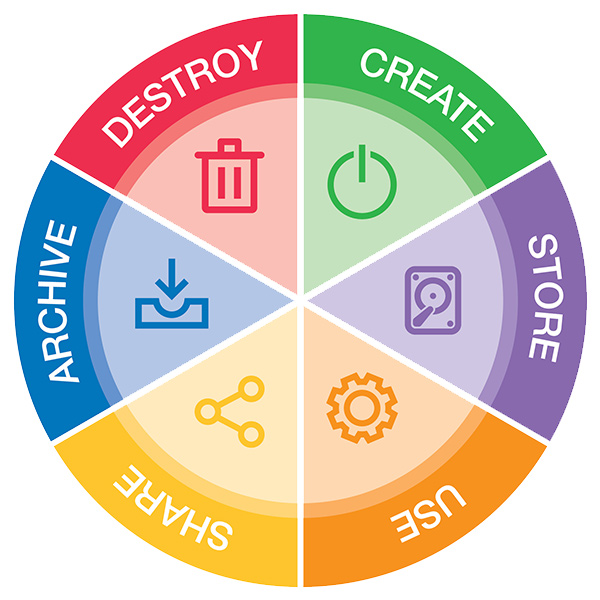
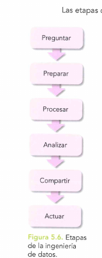
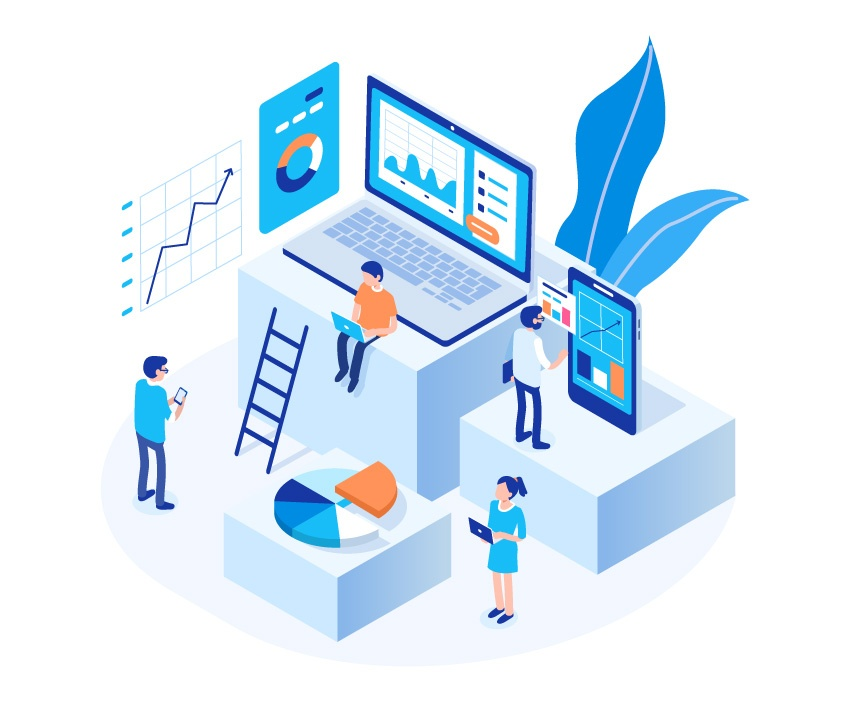
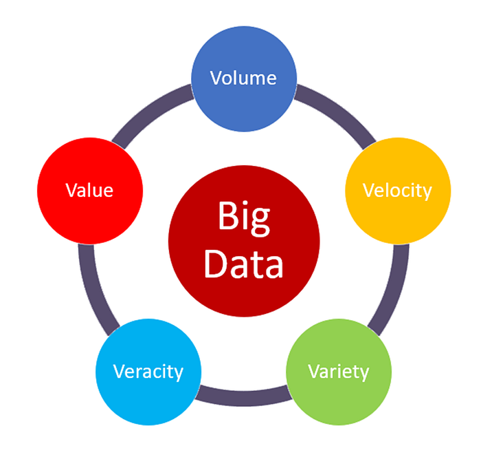
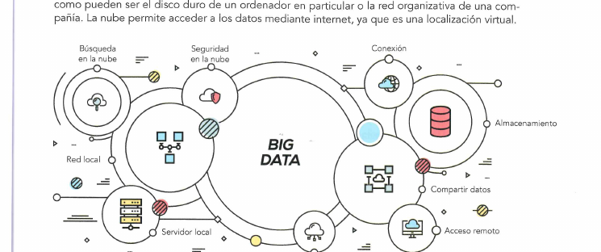
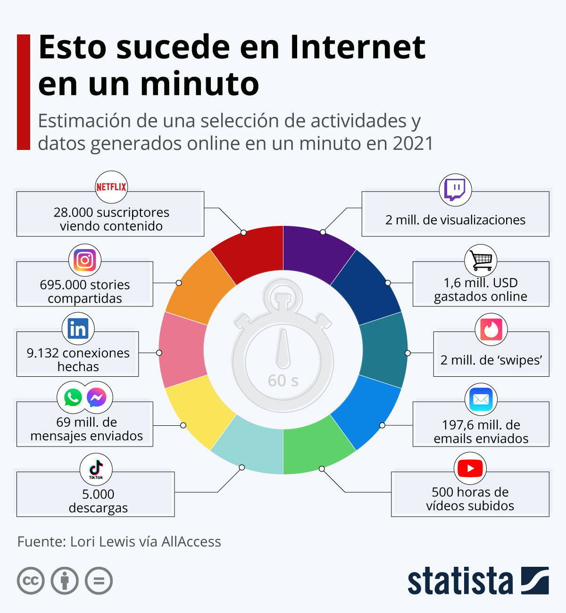
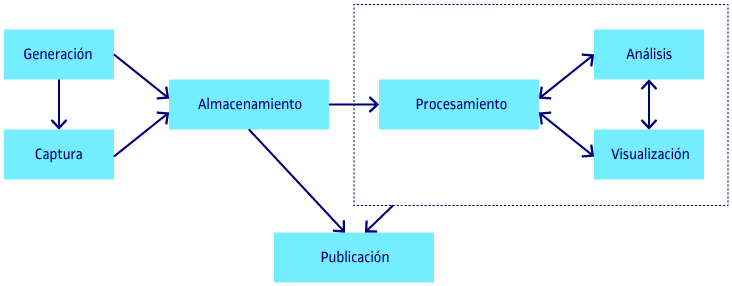

# UT5 — Datos y ciberseguridad

## De qué va esta unidad

Cada persona genera datos a diario sin ser consciente de ello: cada búsqueda en el móvil, cada compra online, cada sensor de una máquina en una fábrica. Esta unidad sigue el viaje completo de esos datos en una empresa digital: qué son en realidad, por qué unos pocos números sueltos no valen nada hasta que se convierten en información útil, cómo se gestionan cuando su volumen se dispara (el fenómeno *Big Data*), qué herramientas existen para analizarlos y sacarles partido, y —muy importante— cómo se protegen, porque cuanto más valor tiene un dato, más interesa a quien quiere robarlo o dañarlo.

La segunda mitad de la unidad se centra en la ciberseguridad aplicada al día a día: contraseñas, autenticación en dos pasos, cifrado, copias de seguridad y hábitos seguros en el puesto de trabajo. Es el RA5 de la programación del módulo: *evaluar la importancia de los datos, así como su protección en una economía digital globalizada, definiendo sistemas de seguridad y ciberseguridad tanto a nivel de equipo/sistema como globales*. Para el alumnado de DAM, además de resultar relevantes desde la perspectiva de usuario, estos conceptos son especialmente importantes porque cualquier aplicación que se desarrolle en el futuro manejará datos de personas reales y deberá guardarlos, transmitirlos y protegerlos correctamente.

## Qué se espera saber hacer al terminar (resultados de aprendizaje)

Al finalizar esta unidad, el alumnado debe ser capaz de:

- Explicar la diferencia entre un **dato** y la **información** que se obtiene al procesarlo.
- Describir las **etapas del ciclo de vida** de un dato, desde que se crea hasta que se elimina.
- Relacionar **Big Data**, **análisis de datos**, **machine/deep learning** e **inteligencia artificial** como piezas de un mismo proceso.
- Enumerar las características que definen el **Big Data** (las famosas "5 V").
- Describir las etapas típicas de la **ciencia de datos** y cómo encajan entre sí.
- Explicar cómo y dónde se **almacenan los datos** en la nube y por qué se usa el *cloud computing*.
- Valorar la importancia del **cloud computing** para la empresa.
- Identificar los **objetivos de la ciencia de datos** en distintas empresas y sectores.
- Valorar la importancia de la **seguridad de los datos** y su regulación (protección de datos personales).
- Aplicar buenas prácticas de **contraseñas, autenticación y protección del puesto de trabajo**.

---

## 1. Datos vs Información y conocimiento

Imagina que una empresa tiene almacenados millones de números, pero no sabe qué significan. ¿Tiene algo valioso… o solo ruido? Para responder hace falta distinguir tres niveles que se suelen confundir en el lenguaje corriente:

- **Dato**: una representación simbólica de un hecho, sin contexto ni interpretación. Puede ser numérico, textual, visual… No aporta valor por sí solo. Ejemplos: `24`, `"Tenerife"`, `08:30`.
- **Información**: el resultado de procesar y contextualizar los datos. Tiene significado y permite responder preguntas. Ejemplo: *"la temperatura en Tenerife es de 24 ºC a las 08:30"*.
- **Conocimiento**: la interpretación de la información que permite tomar decisiones. Ejemplo: *"no necesito abrigo hoy"*.

La relación entre los tres se resume así: **Dato → Información → Conocimiento → Decisión**. En una empresa, los datos son el recurso en bruto, la información es el producto que se obtiene al procesarlos y el conocimiento es la ventaja competitiva que permite decidir mejor que la competencia.

Para llegar de un dato a información con significado, el dato pasa por varios procesos: **contextualización** (situarlo en un marco comprensible), **categorización** (agruparlo en clases), **cálculo** (aplicar operaciones matemáticas o estadísticas) y **condensado** (sintetizar lo relevante).

> 📎 **Un matiz entre las fuentes.** Los apuntes propios de la unidad se quedan en el nivel de "conocimiento" como techo del proceso. Otros dos materiales de la carpeta (un documento de ampliación sobre análisis de datos y el documento de contenidos oficiales) añaden un cuarto nivel superior, la **sabiduría**: la capacidad de tomar decisiones complejas y éticas a largo plazo, más allá de resolver un problema puntual. Por ejemplo, usar los datos de la edad media de la plantilla no solo para cubrir una baja, sino para diseñar con años de antelación un plan de jubilaciones. No es una contradicción grave, sino un nivel adicional (el modelo se conoce en la disciplina como pirámide **DIKW**: *Data-Information-Knowledge-Wisdom*) que conviene conocer aunque no todos los materiales lo desarrollen igual de a fondo.

Un **dato aislado** puede llevar a errores si se usa sin procesar: falta de claridad, sesgos, sobrecarga de información, dificultad para ver patrones o incluso conclusiones contradictorias. Por eso las empresas no "tienen datos", sino que invierten en convertirlos en información y conocimiento útil.

> **Ejemplo actual — Spotify Wrapped.** Cada diciembre, Spotify convierte miles de datos sueltos (qué canción se ha escuchado, cuántas veces, a qué hora) en un resumen personalizado con el artista y el género favorito de cada usuario en el año. Es un caso muy visual de cómo datos en bruto se transforman en información —y hasta en una pequeña "sabiduría" sobre los propios gustos— que además la empresa usa para fidelizar usuarios.

### Ideas clave de esta sección
- Dato = hecho en bruto sin contexto; información = dato procesado con significado; conocimiento = información aplicada a decisiones.
- El paso de dato a información pasa por contextualizar, categorizar, calcular y condensar.
- Algunas fuentes añaden un cuarto nivel, la sabiduría, para decisiones estratégicas y éticas a largo plazo.

## 2. Ciclo de vida del dato

Un dato no aparece y desaparece sin más: se crea, se transforma, se comparte y, en algún momento, deja de ser útil. El **ciclo de vida del dato** (en inglés, *Data Lifecycle Management*, DLM) describe justo ese recorrido, desde que nace hasta que se elimina. No es un proceso estrictamente lineal: los datos pueden volver a fases anteriores, y según el sistema el orden puede variar (por ejemplo, procesarse antes de almacenarse).

En la literatura existen propuestas distintas —habitualmente entre 5 y 8 etapas—, porque unos autores agrupan fases y otros las desglosan más. En esta unidad se trabaja con un **modelo simplificado de 6 etapas**, pensado para el enfoque de digitalización (no para ingeniería de datos, donde se distinguen más fases como procesamiento, análisis o visualización por separado). Lo importante no es memorizar el número exacto de etapas, sino entender que en todas ellas el dato debe gestionarse y protegerse:

1. **Generación**: los datos se crean a partir de fuentes diversas (sensores, formularios, redes sociales…).
2. **Almacenamiento**: se guardan en bases de datos, servidores o la nube, garantizando accesibilidad y seguridad.
3. **Uso**: se procesan, analizan y visualizan para obtener información útil (limpieza, transformación, análisis, representación).
4. **Compartición**: se comparten con otros sistemas o usuarios, respetando privacidad y seguridad.
5. **Archivado**: los datos que ya no se usan con frecuencia se conservan a largo plazo.
6. **Eliminación**: se eliminan de forma segura cuando dejan de ser necesarios, cumpliendo la normativa vigente.

*Figura: rueda del ciclo de vida del dato (Data Lifecycle Management). Origen: "UT 5 Gestión y protección de datos.pdf".*

Esta gestión es importante porque garantiza la calidad del dato, permite cumplir normativas (como el Reglamento General de Protección de Datos, RGPD) y evita pérdidas o usos indebidos.

> 📎 **Variante de 7 etapas.** Otros dos materiales de la carpeta describen un ciclo muy parecido pero con 7 fases, porque distinguen "Procesamiento" de "Análisis y Uso" como pasos separados (en vez de agruparlos en un único paso de "Uso"). Uno de ellos (el documento de contenidos oficiales) añade además una **Planificación** previa —definir tipo, origen y arquitectura del dato antes de capturarlo— dentro de la misma primera fase que la Creación o Captura. No es una contradicción de fondo: ambos modelos describen el mismo recorrido del dato, solo que uno agrupa más las fases (el que usamos como referencia principal, explícitamente pensado para esta unidad) y el otro las desglosa más.

> **Ejemplo actual — Derecho al olvido (RGPD).** Cuando alguien pide a Google que retire un enlace con datos personales suyos, la empresa activa la fase de "eliminación" del ciclo de vida del dato: debe borrarlo también de copias de seguridad y sistemas relacionados, cumpliendo el RGPD europeo.

### Ideas clave de esta sección
- El ciclo de vida del dato describe su recorrido completo, desde que se crea hasta que se destruye.
- El modelo de referencia de esta unidad tiene 6 etapas: generación, almacenamiento, uso, compartición, archivado y eliminación.
- Gestionarlo bien evita pérdidas, cumple normativas como el RGPD y reduce riesgos de seguridad.

## 3. Ciencia de datos

### 3.1 Cómo se relacionan Big Data, Machine Learning, Deep Learning e IA

Muchas veces se habla de inteligencia artificial como si fuera magia, pero en realidad todo empieza con datos. La relación entre estos cuatro conceptos se puede resumir así:

**Big Data → alimenta → Machine Learning → evoluciona a → Deep Learning → forma parte de → Inteligencia Artificial**

- El **Big Data** proporciona los grandes volúmenes de información que sirven de base.
- A partir de esos datos, el ***Machine Learning*** (aprendizaje automático) permite a los sistemas aprender patrones y realizar predicciones.
- El ***Deep Learning*** (aprendizaje profundo), como evolución del anterior, usa modelos más complejos —redes neuronales— capaces de detectar relaciones más profundas, especialmente útiles con datos no estructurados (imágenes, texto, audio).
- Ambos forman parte de la **Inteligencia Artificial (IA)**, el conjunto de técnicas para crear sistemas capaces de tomar decisiones o realizar tareas propias de la inteligencia humana.

En resumen: los datos son el punto de partida, el aprendizaje es el proceso y la inteligencia artificial es el sistema resultante que aplica ese aprendizaje.

### 3.2 La disciplina de la ciencia de datos y su metodología

La **ciencia de datos** (*data science*) es la disciplina que permite extraer valor de los datos. Es un campo interdisciplinar que combina estadística, matemáticas, programación, *machine learning* y visualización de datos para transformar datos en conocimiento que sirva para tomar decisiones, resolver problemas y generar valor en sectores tan distintos como el negocio, la salud o la educación.

La metodología de referencia para proyectos de ciencia de datos es **CRISP-DM** (*Cross-Industry Standard Process for Data Mining*, proceso estándar intersectorial para la minería de datos). Ofrece un marco cíclico —no lineal, se puede volver a fases anteriores— de **6 fases**:

1. **Comprensión del negocio**: definir objetivos, requisitos y el problema desde la perspectiva empresarial.
2. **Comprensión de los datos**: recolectar, explorar y describir los datos iniciales, detectando problemas de calidad.
3. **Preparación de los datos**: seleccionar, limpiar y transformar los datos brutos para el modelado.
4. **Modelado**: aplicar minería de datos o algoritmos de *machine learning*, ajustando parámetros.
5. **Evaluación**: comprobar si los resultados cumplen los objetivos de negocio definidos en la primera fase.
6. **Despliegue**: implementar el modelo en la operación diaria, con seguimiento y mantenimiento.

Los perfiles profesionales típicos de este campo son el **Data Analyst**, el **Data Scientist** y el **Data Engineer**. Aplicada a la empresa, la ciencia de datos permite reducir costes, mejorar decisiones, automatizar procesos y ofrecer servicios personalizados.

> 📎 **Un flujo alternativo más sencillo.** Otros materiales de la carpeta describen la ciencia de datos con un proceso de **5 pasos** más genérico (definición del problema, recolección y preparación de los datos, exploración y análisis, modelado, evaluación y despliegue) y mencionan que, en un contexto empresarial, a veces se resume en **6 etapas de ingeniería de datos**: *preguntar, preparar, procesar, analizar, compartir y actuar*. La idea de fondo es la misma que CRISP-DM (entender el problema, preparar los datos, modelar, evaluar y desplegar); CRISP-DM es la referencia formal más detallada y con nombre propio, mientras que el flujo de 5-6 pasos es una versión simplificada muy usada para explicarlo a nivel de negocio.

*Figura: flujo simplificado de 6 etapas (preguntar → preparar → procesar → analizar → compartir → actuar). Origen: "UD5.pdf" (Paraninfo, Unidad 5 "Evaluación de datos"), figura 5.6.*

Es importante no confundir estas etapas del **análisis/ingeniería de datos** con las del **ciclo de vida del dato** (sección 2): son procesos distintos que se pueden aplicar a la vez sobre los mismos datos.

Conviene también distinguir dos profesiones que se confunden con frecuencia: el **científico de datos** (*data scientist*) crea nuevas formas de modelar y entender lo desconocido a partir de datos sin procesar, formulando preguntas nuevas; el **analista de datos** (*data analyst*) responde a preguntas ya existentes y genera información útil a partir de fuentes de datos disponibles.

> **En las noticias — IA generativa y ciencia de datos.** En los últimos años, empresas como OpenAI, Google o Meta han contratado masivamente a científicos e ingenieros de datos para entrenar modelos de IA generativa (como ChatGPT o Gemini), que necesitan enormes volúmenes de datos limpios y bien etiquetados: un ejemplo directo de las fases de "comprensión y preparación de los datos" de CRISP-DM aplicadas a gran escala.

### Ideas clave de esta sección
- Big Data alimenta al Machine Learning, que evoluciona hacia el Deep Learning; ambos forman parte de la Inteligencia Artificial.
- La ciencia de datos combina estadística, programación y machine learning para convertir datos en valor.
- CRISP-DM es la metodología de referencia: 6 fases cíclicas, de la comprensión del negocio al despliegue.
- Existe una versión simplificada de 5-6 pasos (preguntar-preparar-procesar-analizar-compartir-actuar) con la misma lógica de fondo.
- Data Scientist y Data Analyst no son lo mismo: uno formula preguntas nuevas, el otro responde preguntas existentes.

## 4. Análisis de datos

El **análisis de datos** consiste en examinar datos para obtener conclusiones útiles: apoya la toma de decisiones, reduce la incertidumbre y mejora la eficiencia empresarial. Según el tipo de pregunta que responde, se distinguen varios tipos de análisis:

1. **Descriptivo**: ¿qué ha pasado? (ejemplo: ventas mensuales).
2. **Diagnóstico**: ¿por qué ha pasado? (ejemplo: caída de ventas por baja demanda).
3. **Predictivo**: ¿qué pasará? (ejemplo: previsión de ventas).
4. **Prescriptivo**: ¿qué debemos hacer? (ejemplo: ajustar precios).

> 📎 El material de ampliación sobre análisis de datos y el documento de contenidos oficiales solo distinguen tres tipos (descriptivo, predictivo y prescriptivo), sin mencionar el diagnóstico como categoría independiente. Se mantiene aquí como cuarto tipo porque aparece explícitamente en los apuntes propios de la unidad, y porque distinguir "qué pasó" de "por qué pasó" es una matización útil y habitual en analítica de negocio.

*Figura: el análisis de datos convierte gráficos y paneles en decisiones de negocio. Origen: "Análisis de datos UT5.pdf".*

### 4.1 Herramientas para analizar los datos

En el análisis de datos se emplean fundamentalmente tres tipos de herramientas:

- **Hojas de cálculo** (Microsoft Excel, Google Sheets): organizan datos en tablas y permiten operaciones matemáticas y estadísticas, desde sumas sencillas hasta correlaciones o desviaciones.
- **Lenguajes de consulta**, principalmente **SQL**: permiten lanzar preguntas a bases de datos relacionales (formadas por tablas con atributos) para extraer, insertar o eliminar información concreta.
- **Herramientas de visualización** (Tableau, Looker Studio): representan la información con gráficos, mapas y paneles interactivos (*dashboards*), porque la mayoría de las personas procesamos mejor una imagen que una tabla de números.

> **Ejemplo actual — Dashboards en la nube.** Muchas pymes usan hoy Looker Studio (de Google) o Power BI (de Microsoft) para conectar sus datos de ventas online directamente a un panel que se actualiza solo, sin tener que exportar Excel a mano cada semana.

### Ideas clave de esta sección
- Los cuatro tipos de análisis de datos responden a preguntas distintas: qué pasó, por qué pasó, qué pasará y qué hacer.
- Excel/Sheets, SQL y herramientas de visualización (Tableau, Looker Studio) son los tres tipos de herramientas básicas de análisis.

## 5. Almacenamiento de Big data

**Big Data** se refiere al conjunto de tecnologías, procesos y métodos necesarios para gestionar y analizar grandes volúmenes de datos que, por su tamaño, velocidad y diversidad, no pueden tratarse con herramientas tradicionales. Se caracteriza por las llamadas **5 V**:

- **Volumen**: la ingente cantidad de datos generados (de terabytes a petabytes: 1 petabyte = 10¹⁵ bytes, es decir, entre 1000 y 1 millón de TB).
- **Velocidad**: la rapidez con la que se generan, procesan y analizan los datos, a menudo en tiempo real.
- **Variedad**: los distintos formatos —texto, imagen, vídeo, redes sociales, sensores— que hay que combinar.
- **Veracidad**: la calidad y fiabilidad de los datos; es, según los materiales, el factor más importante de las 5 V, porque datos contaminados llevan a decisiones erróneas.
- **Valor**: la capacidad de extraer información útil; no basta con tener muchos datos, lo importante es sacarles partido.

*Figura: las 5 V que caracterizan el Big Data. Origen: "Análisis de datos UT5.pdf".*

Además del volumen, velocidad, variedad, veracidad y valor, el Big Data implica gestionar la **arquitectura de datos** (dónde están), el **procesamiento** (qué se hace con ellos), la **seguridad** (cómo se protegen) y la **gobernanza del dato** (quién puede usarlos y cómo, por ejemplo bajo el RGPD).

### 5.1 Dónde se almacena el dato: de la base de datos al data lake

Antes de la nube existían solo las **bases de datos**, con estructura rígida (tablas) pensada para el día a día operativo, pero no para análisis masivo. Con el crecimiento del volumen de datos aparecieron otras dos soluciones:

| | Base de datos | Data Warehouse | Data Lake |
|---|---|---|---|
| **Estructura** | Datos estructurados para gestión y uso operativo | Datos estructurados, organizados y limpios | Datos sin procesar (*raw*), en cualquier formato |
| **Uso** | Operar día a día | Analizar y tomar decisiones | Almacenamiento masivo y análisis avanzado con IA |

Para gestionar la diversidad de estos datos surgieron entornos y bases de datos especializados: **Hadoop** (entorno de código abierto para manejar volúmenes masivos de datos) y las bases de datos **NoSQL** (pensadas para datos no estructurados, como correos, imágenes o publicaciones en redes sociales, que no encajan en tablas relacionales clásicas).

### 5.2 Cloud computing: por qué se usa la nube

El **cloud computing** (computación en la nube) se define como un modelo que permite un acceso de red cómodo y bajo demanda a un conjunto compartido de recursos configurables (servidores, almacenamiento, aplicaciones), con un mínimo esfuerzo de administración. Sus características principales son:

- **Autoservicio bajo demanda**: acceso a los servicios en cualquier momento, 365 días al año.
- **Amplio acceso a la red**: acceso desde cualquier lugar con conexión a internet.
- **Agrupación de recursos**: varios clientes comparten el mismo equipo físico (modelo multiusuario), lo que abarata costes.
- **Rápida elasticidad**: los recursos aumentan o disminuyen según la demanda (por ejemplo, al inicio y al final de la época de rebajas).
- **Servicio medido/a medida**: solo se paga por lo que realmente se usa.

*Figura: ecosistema formado por Big Data y la cloud computing. Origen: "UD5.pdf" (Paraninfo), figura 5.5.*

Las ventajas del cloud computing para la empresa son: **escalabilidad** (ajustar recursos según necesidad), **disponibilidad** (acceso desde cualquier lugar), **coste** (pago por uso, sin grandes infraestructuras propias), **seguridad** (proveedores con altos niveles de protección) y **flexibilidad** (facilita desarrollar y desplegar aplicaciones).

Una de las fuentes de la unidad incluye una infografía que ilustra muy bien esta magnitud: según esa estimación (datos de 2021), cada minuto en internet se suben 500 horas de vídeo a YouTube, se envían más de 197 millones de correos electrónicos y se comparten 695 000 historias en Instagram. Es un buen ejemplo de por qué el almacenamiento tradicional en discos locales dejó paso al Big Data y la nube.

*Figura: estimación de actividad y datos generados en un minuto en internet (2021), fuente original Lori Lewis vía AllAccess/Statista, recogida en "Análisis de datos UT5.pdf".*

### Ideas clave de esta sección
- Big Data se define por las 5V: volumen, velocidad, variedad, veracidad y valor.
- Bases de datos → data warehouse → data lake son tres soluciones de almacenamiento con distinto grado de estructura.
- El cloud computing ofrece autoservicio bajo demanda, amplio acceso, agrupación de recursos, elasticidad y pago por uso.

## 6. Aplicaciones de Big data en las empresas

El Big Data se aplica de forma distinta según el sector. Algunos ejemplos recogidos en los materiales:

- **Salud**: predicción y diagnóstico a partir de datos médicos e históricos de pacientes; medicina personalizada; gestión de recursos hospitalarios; monitorización en tiempo real con dispositivos *wearables*.
- **Finanzas**: detección de fraudes analizando patrones de transacciones; análisis de riesgos de inversión; optimización de carteras; segmentación de clientes.
- **Retail y comercio**: análisis del comportamiento del consumidor; recomendaciones personalizadas; gestión de inventarios; optimización dinámica de precios.
- **Transporte y logística**: optimización de rutas; gestión de flotas en tiempo real; monitorización del tráfico; previsión de demanda en la cadena de suministro.
- **Energía**: predicción de la demanda eléctrica; monitorización de infraestructuras; integración de energías renovables.
- **Agricultura**: agricultura de precisión (sensores de suelo, clima y plantas); predicción de cosechas; detección temprana de plagas con drones e imágenes satelitales.
- **Seguridad**: análisis de patrones de criminalidad; monitorización con cámaras y sensores; gestión de emergencias.
- **Telecomunicaciones, educación, turismo y gobierno**: optimización de redes y detección de fraude; personalización del aprendizaje y predicción de abandono escolar; gestión de precios y ocupación turística; mejora de servicios públicos.

En general, estas aplicaciones siguen el mismo patrón: pasar de una gestión basada en la intuición a una basada en la evidencia, combinando análisis descriptivo (qué pasó), predictivo (qué pasará) y prescriptivo (qué hacer).

> **Ejemplo actual — Netflix y el algoritmo de recomendación.** Netflix analiza miles de millones de interacciones (qué ves, cuándo paras un capítulo, qué valoras) para decidir qué miniaturas y series recomendar a cada usuario: un caso muy conocido de Big Data aplicado al sector retail/entretenimiento, fácilmente reconocible para el alumnado.

### Ideas clave de esta sección
- El Big Data se aplica de forma transversal, pero con usos muy distintos según el sector (salud, finanzas, retail, transporte, energía, agricultura, seguridad…).
- Casi todas las aplicaciones combinan los tres tipos de análisis: descriptivo, predictivo y prescriptivo.

## 7. Herramientas para analizar los datos

*(Ver también el apartado 4.1, que desarrolla las mismas herramientas dentro del análisis de datos; se recoge aquí como Contenido independiente porque así figura en la programación de la unidad.)*

Las herramientas para analizar datos se agrupan en tres bloques:

- **Hojas de cálculo** (Microsoft Excel, Google Sheets): organizan datos en filas y columnas, permiten fórmulas matemáticas y estadísticas, y son la puerta de entrada más habitual al análisis de datos en una empresa.
- **Lenguajes de consulta (SQL)**: las bases de datos relacionales se organizan en tablas con atributos; SQL es el lenguaje principal para lanzar preguntas ("consultas") sobre esas tablas y obtener, insertar o eliminar información.
- **Herramientas de visualización** (Tableau, Looker Studio): convierten datos en gráficos y paneles interactivos, facilitando que cualquier persona de la organización —tenga o no perfil técnico— entienda de un vistazo los resultados.

> **Ejemplo actual — SQL como habilidad de programación.** Aunque SQL nació en los años setenta, sigue siendo uno de los lenguajes más demandados en las ofertas de empleo de desarrollo de software, justo el perfil de quien estudia DAM: cualquier aplicación que gestione usuarios, pedidos o inventario necesita consultas SQL para leer y escribir en su base de datos.

### Ideas clave de esta sección
- Hojas de cálculo, SQL y herramientas de visualización son los tres pilares del análisis práctico de datos.
- SQL es el lenguaje de consulta de referencia para bases de datos relacionales.

## 8. Seguridad y privacidad de la información

En una economía digital globalizada, los datos son uno de los activos más valiosos de las organizaciones, por lo que su protección no puede depender de una única medida. Como ningún sistema es completamente infalible, se utiliza el modelo de **defensa en profundidad**: la idea de que la seguridad no es un producto, sino un sistema de **capas interrelacionadas**. Cada capa actúa como una barrera adicional, dificultando el acceso no autorizado y mejorando la detección y respuesta ante incidentes. No se trata de evitar todos los ataques, sino de resistirlos, detectarlos y responder eficazmente.

Las capas de la defensa en profundidad, de lo más humano a lo más estructural, son:

- **Capa de usuario**: contraseñas seguras, autenticación multifactor (MFA), prevención del *phishing* y buenas prácticas. Es la capa más vulnerable, por lo que la formación es clave (se desarrolla en la sección 12).
- **Capa de equipo**: antivirus, actualizaciones, configuración segura y cifrado del disco (se desarrolla en la sección 13).
- **Capa de red**: cortafuegos (*firewalls*), sistemas de detección/prevención de intrusiones (IDS/IPS), segmentación y VPN.
- **Capa de aplicación**: control de accesos, validación de entradas, gestión de sesiones y actualizaciones. Aquí se producen muchos ataques (por ejemplo, inyección SQL).
- **Capa de datos**: cifrado, copias de seguridad, control de accesos y políticas de retención. Garantiza confidencialidad, integridad y disponibilidad.
- **Capa de organización y normativa**: políticas de seguridad, protocolos, auditorías y cumplimiento legal, como el Reglamento General de Protección de Datos (RGPD).

En entornos cloud se aplica el **modelo de responsabilidad compartida**: el proveedor asegura la infraestructura, y el cliente gestiona la configuración, los accesos y sus propios datos.

### 8.1 Seguridad en la capa de datos: el cifrado

Dentro de la defensa en profundidad, la capa de datos es la más importante porque protege la información incluso si el sistema ha sido comprometido. Se apoya en tres principios básicos:

- **Confidencialidad**: que solo accedan los autorizados.
- **Integridad**: que los datos no se alteren.
- **Disponibilidad**: que estén accesibles cuando se necesitan.

El principal mecanismo de protección es el **cifrado**: transformar un dato legible en uno ilegible mediante una clave.

- **Ejemplo sencillo — cifrado César**: se desplaza cada letra un número fijo de posiciones. Con clave +3, "HOLA" se convierte en "KROD". Problema: solo hay 25 claves posibles, así que se rompe en segundos.
- **Ejemplo real — AES (*Advanced Encryption Standard*)**: usa claves de 128, 192 o 256 bits (2¹²⁸ combinaciones posibles, un número enorme) y mezcla los datos en múltiples rondas; resulta imposible de romper en la práctica sin la clave.

*Figura: disco de cifrado por sustitución (tipo cifrado César), usado para desplazar letras según una clave. Origen: "UT 5 Gestión y protección de datos.pdf".*

Una idea clave del cifrado moderno es el **principio de Kerckhoffs**: el algoritmo es público, la clave es secreta. Se distingue también entre protección **en reposo** (datos almacenados: discos, bases de datos) y **en tránsito** (datos en movimiento: web, redes). Y lo más importante de todo, según los apuntes: si la clave se filtra, el sistema deja de ser seguro; por eso hay que proteger la clave, controlar quién la usa y renovarla periódicamente.

Normativas como el **Reglamento General de Protección de Datos (RGPD)** obligan a proteger los datos personales en todas estas fases.

> **Ejemplo actual — Filtraciones masivas de contraseñas.** Cada cierto tiempo salta la noticia de que una gran plataforma (redes sociales, foros, tiendas online) ha sufrido una filtración de millones de credenciales. Cuando esas contraseñas estaban solo "cifradas de forma reversible" en lugar de protegidas con las técnicas que se explican en la sección 12, el daño para las personas usuarias es mucho mayor.

### Ideas clave de esta sección
- La defensa en profundidad protege con varias capas: usuario, equipo, red, aplicación, datos, organización y normativa.
- La capa de datos es la más crítica: se apoya en confidencialidad, integridad y disponibilidad, y su herramienta principal es el cifrado.
- El principio de Kerckhoffs resume la idea central de la criptografía moderna: el algoritmo puede ser público, la clave nunca.

## 9. Tratamiento de la información

El tratamiento de la información es el proceso de recopilar, organizar y procesar datos brutos para transformarlos en información significativa y conocimiento útil para la toma de decisiones. Es crítico porque los datos, por sí solos, carecen de significado y pueden generar incertidumbre o conclusiones erróneas si no se procesan bien.

Para que el tratamiento sea efectivo, los datos pasan por los mismos procesos ya vistos en la sección 1: **contextualización**, **categorización**, **cálculo** y **condensado**. A nivel más técnico, dentro de la ingeniería de datos, el tratamiento se desglosa en:

- **Limpieza y preparación**: eliminar duplicados y corregir errores, para que la información esté completa y lista para usarse.
- **Procesamiento y estructuración**: organizar y transformar los datos para que puedan analizarse eficientemente.
- **Análisis**: extraer el valor real, identificando patrones y tendencias para resolver problemas.

*Figura: esquema general del recorrido de un dato desde su generación hasta su publicación, pasando por el procesamiento, el análisis y la visualización. Origen: "Análisis de datos UT5.pdf".*

El tratamiento también se clasifica según el objetivo perseguido, en los mismos niveles vistos en la sección 4: descriptivo, predictivo y prescriptivo. Durante todo el proceso deben aplicarse políticas estrictas de privacidad y seguridad, asegurando el cumplimiento de normativas legales como el RGPD.

### Ideas clave de esta sección
- Tratar la información significa limpiarla, estructurarla y analizarla para que deje de ser un dato en bruto.
- Los mismos cuatro procesos (contextualizar, categorizar, calcular, condensar) explican tanto el paso de dato a información como el tratamiento técnico posterior.

## 10. Almacenamiento de la información

El almacenamiento constituye la segunda fase del ciclo de vida del dato (ver sección 2), justo después de la creación o captura. Su propósito es garantizar la accesibilidad de la información y su protección contra pérdidas o daños. Los datos se guardan en distintos entornos:

- **Bases de datos**, especialmente para datos estructurados organizados en tablas relacionales.
- **Servidores locales**, infraestructura propia de la organización.
- **La nube**, que permite acceso remoto y flexible (ver sección 5.2 sobre cloud computing).

El almacenamiento no es estático: cambia según la frecuencia de uso de la información. Cuando los datos ya no se consultan habitualmente, pero deben conservarse por razones legales, de seguridad o históricas, se trasladan a sistemas de **archivo**; cuando ya no son necesarios en absoluto, se procede a su **eliminación o depuración** de forma segura, cumpliendo normativas como el RGPD.

Es en esta fase donde se eligen e implementan las herramientas de protección (cifrado, copias de seguridad, control de accesos) que se han visto en la sección 8, especialmente relevantes ante el manejo de volúmenes masivos de datos propios del Big Data.

### Ideas clave de esta sección
- El almacenamiento busca accesibilidad y protección, y puede hacerse en bases de datos, servidores locales o la nube.
- Archivado y eliminación son las dos salidas posibles cuando los datos dejan de usarse con frecuencia.

## 11. Principales amenazas

Los materiales de la unidad no dedican un apartado único titulado "principales amenazas", pero sí describen, repartidas por distintos apartados, las amenazas más relevantes contra los datos y el puesto de trabajo:

- **Fuerza bruta**: probar todas las combinaciones posibles de una contraseña. Se combate con contraseñas largas (más entropía), *hash* lento con sal, bloqueo por intentos fallidos y autenticación multifactor (MFA).
- **Ataques de diccionario**: probar listas de palabras y contraseñas comunes o filtradas y sus variantes. Se combate con listas de contraseñas prohibidas y frases de paso aleatorias.
- **Credential stuffing**: reutilizar combinaciones de usuario y contraseña filtradas de otro servicio. Se combate no reutilizando contraseñas y activando MFA.
- **Phishing**: correos o webs falsas que imitan a un servicio real para robar credenciales. Se combate con formación, verificación del dominio y, sobre todo, con llaves de seguridad físicas o *passkeys* (resistentes al phishing).
- **Keylogging**: *malware* que registra las pulsaciones del teclado para robar contraseñas. Se combate con antivirus/**EDR** (*Endpoint Detection and Response*, una evolución del antivirus clásico que también vigila el comportamiento y permite responder a incidentes) actualizado y evitando equipos públicos para cuentas sensibles.
- **Shoulder surfing**: mirar por encima del hombro mientras alguien teclea una contraseña. Se combate con discreción y filtros de privacidad de pantalla.
- **Ataques a bases de *hashes***: robar una base de datos de contraseñas y intentar "romperlas" (*crackearlas*) sin conexión. Se combate con funciones de derivación lentas como Argon2 o bcrypt, con sal.
- **Malware por USB**: dispositivos extraíbles infectados que ejecutan código malicioso al conectarlos (caso célebre: *Stuxnet*, que se propagó de esta forma), o que se usan para sacar información de la empresa sin permiso (exfiltración de datos).

> **En las noticias — Ciberataques a hospitales y empresas.** En los últimos años se han sucedido ataques de *ransomware* contra hospitales, ayuntamientos y grandes empresas en España y Europa, que cifran los sistemas y piden un rescate. Muchos de estos ataques comienzan con un simple correo de *phishing* abierto por una persona empleada, lo que confirma que la "capa de usuario" es, tal y como dicen los apuntes, la más vulnerable de todas.

### Ideas clave de esta sección
- Las amenazas más citadas en los materiales combinan ataques a la contraseña (fuerza bruta, diccionario, credential stuffing) con ataques al usuario o al equipo (phishing, keylogging, malware por USB).
- Casi todas las contramedidas recurren a las mismas ideas: contraseñas robustas, MFA, cifrado con sal y formación de las personas usuarias.

## 12. Contraseñas

La contraseña es la **primera línea de defensa** para garantizar que solo personas autorizadas accedan a bases de datos, servidores o la nube: forma parte de la capa de usuario de la defensa en profundidad (sección 8), la más vulnerable, por lo que la formación es clave.

### 12.1 Qué hace robusta a una contraseña

La fortaleza de una contraseña se mide por lo difícil que resulta adivinarla o calcularla por fuerza bruta, y esa dificultad se expresa con el concepto de **entropía** (número de combinaciones posibles que un atacante tendría que probar; cada bit de entropía duplica ese número).

| Contraseña | Entropía aproximada | Valoración |
|---|---|---|
| `verano` (6 minúsculas) | ~28 bits | Se rompe en segundos |
| `Verano2024!` (11 caracteres, patrón predecible) | ~72 bits, pero predecible | Débil frente a ataques de diccionario |
| `caballo-grapa-batería-correcta` (4 palabras al azar) | ~77 bits | Fuerte y memorizable |
| 16 caracteres aleatorios de un gestor | ~105 bits | Muy fuerte |

Una contraseña **larga y sencilla de recordar** suele ser mejor que una **corta y enrevesada**: añadir un carácter aporta más entropía que sustituir una letra por un símbolo. La recomendación actual (norma NIST SP 800-63B, del instituto estadounidense de estándares) es un mínimo de 8 caracteres, y 12-16 o más para cuentas importantes.

Una alternativa muy práctica son las **frases de paso** (*passphrases*): varias palabras elegidas al azar (por ejemplo, mediante el método *diceware*, con tiradas de dados sobre una lista de palabras), que dan mucha longitud —y por tanto mucha entropía— con poco esfuerzo de memoria.

**Qué NO hacer**: reutilizar la misma contraseña en varios servicios, usar patrones de teclado (`qwerty`, `123456`), usar datos personales deducibles de redes sociales, hacer sustituciones triviales (`P@ssw0rd`) o apuntar la contraseña en un pósit.

### 12.2 Política de contraseñas en una organización

Una empresa suele fijar reglas como: longitud mínima (8 caracteres en general, 12-15 para cuentas de administración), comprobación contra listas de contraseñas filtradas o comunes en lugar de exigir símbolos raros, bloqueo tras varios intentos fallidos, cambio obligatorio solo ante sospecha de filtración (la caducidad forzada cada 30-90 días ya no se recomienda, porque genera contraseñas más débiles y predecibles) y autenticación multifactor obligatoria en correo, VPN y accesos remotos.

### 12.3 Cómo se almacenan las contraseñas: hash con sal

Un sistema bien diseñado nunca guarda las contraseñas en texto legible. Tampoco basta con cifrarlas de forma reversible: si alguien roba el servidor, roba también la clave para descifrarlas. La solución es el **hash con sal**:

1. **Función hash**: transforma la contraseña en una cadena de longitud fija de la que no se puede volver atrás; el sistema compara el hash de lo que tecleas con el hash guardado.
2. **Sal (*salt*)**: un valor aleatorio distinto por usuario, que evita que dos contraseñas iguales generen el mismo hash.
3. **Función de derivación lenta**: Argon2, bcrypt o scrypt son deliberadamente lentas, para que probar millones de combinaciones por segundo sea inviable.

### 12.4 Gestores de contraseñas y autenticación multifactor (MFA)

Un **gestor de contraseñas** (KeePassXC, Bitwarden, 1Password…) genera, guarda y rellena contraseñas únicas y largas para cada servicio, protegidas por una única contraseña maestra.

La **autenticación multifactor** exige dos o más pruebas de identidad de categorías distintas: algo que sabes (contraseña), algo que tienes (móvil, llave física) o algo que eres (huella, rostro). De más a menos robusto: llaves físicas FIDO2/passkeys (resistentes al phishing), apps TOTP (código de 6 dígitos), notificación *push* y, como opción más débil, SMS (vulnerable al *SIM swapping*).

> **Ejemplo actual — Passkeys en Google y Apple.** Desde 2023, servicios como Google, Apple o WhatsApp han empezado a ofrecer *passkeys*: en lugar de una contraseña, usas la huella o el rostro del móvil para iniciar sesión, sin nada que teclear ni que puedan robarte por phishing.

### Ideas clave de esta sección
- La fortaleza de una contraseña depende sobre todo de su longitud y aleatoriedad (entropía), no de usar símbolos raros.
- Las contraseñas nunca deben guardarse en claro: la técnica correcta es el hash con sal y una función de derivación lenta (Argon2, bcrypt).
- Un gestor de contraseñas más la autenticación multifactor son, juntos, la medida más eficaz contra el robo de credenciales.

## 13. Protección del puesto de trabajo

La protección del puesto de trabajo —el ordenador, la sesión abierta, el USB que alguien presta— es la capa de equipo de la defensa en profundidad (sección 8), cuyo objetivo es proteger el dispositivo físico y lo que hay en él.

Medidas principales recogidas en los materiales:

- **Bloqueo de sesión**: bloquear siempre la sesión al levantarse del puesto (`Win+L` en Windows) y activar el bloqueo automático por inactividad (5-10 minutos en oficina).
- **Escritorio y pantalla limpios (*clean desk*)**: no dejar documentos con datos personales ni contraseñas en pósits a la vista; usar filtros de privacidad en pantallas de cara al público.
- **Control de dispositivos USB**: deshabilitar el autoarranque, permitir solo dispositivos autorizados y cifrar cualquier USB corporativo, ya que son una vía habitual de entrada de *malware* (ver sección 11) o de fuga de información.
- **Navegación y descargas seguras**: comprobar que la web usa HTTPS y que el dominio es correcto antes de introducir credenciales; descargar solo de fuentes oficiales.
- **Correo electrónico seguro**: no abrir adjuntos inesperados ni habilitar macros en documentos de Office sin verificar el origen; no pulsar enlaces sospechosos.
- **Cifrado de disco completo** (BitLocker, FileVault, LUKS…): protege los datos "en reposo" frente al robo o pérdida física del equipo.
- **Actualizaciones y parcheo**: mantener al día el sistema operativo y las aplicaciones, porque la mayoría de ataques explotan vulnerabilidades ya corregidas.
- **Antivirus/EDR, cortafuegos del equipo y mínimo privilegio**: trabajar con una cuenta de usuario estándar, no de administrador, para limitar el daño si un malware se ejecuta en la sesión del usuario.
- **Copias de seguridad y regla 3-2-1**: 3 copias de los datos, en 2 soportes distintos, con 1 copia fuera de las instalaciones; probar la restauración periódicamente.
- **VPN en redes no confiables**: en wifis públicas (hotel, aeropuerto, cafetería), una VPN cifra todo el tráfico del equipo frente a quien intercepte esa red.

> **Ejemplo actual — Teletrabajo y VPN corporativa.** Desde la generalización del teletrabajo, muchas empresas exigen conectarse mediante VPN corporativa con autenticación multifactor antes de acceder a aplicaciones internas, precisamente para aplicar la capa de red y la capa de usuario de la defensa en profundidad fuera de la oficina.

### Ideas clave de esta sección
- La protección del puesto de trabajo desarrolla la "capa de equipo": bloqueo de sesión, cifrado de disco, actualizaciones, antivirus/EDR y copias de seguridad.
- Las contraseñas (capa de usuario) y la protección del puesto (capa de equipo) son las dos primeras y más cercanas al usuario de las seis capas de la defensa en profundidad.
- La regla 3-2-1 resume cómo organizar copias de seguridad fiables frente a pérdidas o ransomware.

---

## Glosario rápido

| Término | En una frase |
| --- | --- |
| Dato | Hecho en bruto sin contexto ni interpretación. |
| Información | Dato procesado y contextualizado que tiene significado. |
| Conocimiento | Información interpretada que permite tomar decisiones. |
| Ciclo de vida del dato (DLM) | Etapas por las que pasa un dato desde que se crea hasta que se elimina. |
| Big Data | Conjunto de tecnologías y métodos para gestionar datos que, por volumen, velocidad o variedad, no caben en herramientas tradicionales. |
| Las 5 V | Volumen, velocidad, variedad, veracidad y valor: características que definen el Big Data. |
| CRISP-DM | Metodología estándar de 6 fases para proyectos de ciencia de datos. |
| Data Warehouse | Almacén de datos estructurados y limpios, pensado para análisis. |
| Data Lake | Almacén de datos en bruto, en cualquier formato, para análisis avanzado. |
| Cloud computing | Modelo de acceso bajo demanda a recursos informáticos compartidos en la nube. |
| Defensa en profundidad | Estrategia de seguridad basada en varias capas de protección superpuestas. |
| Cifrado | Transformar un dato legible en ilegible mediante una clave. |
| Hash con sal | Técnica para almacenar contraseñas sin guardarlas nunca en claro. |
| MFA (autenticación multifactor) | Exigir dos o más pruebas de identidad distintas para acceder a una cuenta. |
| RGPD | Reglamento General de Protección de Datos, normativa europea sobre datos personales. |

## Repaso: preguntas de autoevaluación

1. ¿Qué diferencia hay entre un dato y la información, y qué nivel adicional añaden algunas fuentes por encima del conocimiento?
2. ¿Cuáles son las 6 etapas del ciclo de vida del dato que se usan como modelo de referencia en esta unidad?
3. ¿Cómo se relacionan Big Data, Machine Learning, Deep Learning e Inteligencia Artificial?
4. ¿Qué son las 6 fases de la metodología CRISP-DM?
5. ¿Cuáles son los cuatro tipos de análisis de datos y qué pregunta responde cada uno?
6. Explica las 5 V que caracterizan el Big Data.
7. ¿Qué diferencia hay entre una base de datos, un data warehouse y un data lake?
8. ¿Qué capas forman el modelo de defensa en profundidad, de la más humana a la más estructural?
9. ¿Por qué no basta con cifrar las contraseñas de forma reversible? ¿Qué técnica se usa en su lugar?
10. ¿Qué es la entropía de una contraseña y por qué una frase de paso larga suele ser más segura que una contraseña corta y compleja?
11. Cita tres medidas de protección del puesto de trabajo (capa de equipo) distintas de las contraseñas.

Respuestas (ver sección correspondiente)

1. Dato = hecho en bruto; información = dato con contexto; conocimiento = información aplicada a decisiones. Algunas fuentes añaden la "sabiduría" como nivel superior (sección 1).
2. Generación, almacenamiento, uso, compartición, archivado y eliminación (sección 2).
3. Big Data alimenta al Machine Learning, que evoluciona hacia el Deep Learning; ambos forman parte de la Inteligencia Artificial (sección 3.1).
4. Comprensión del negocio, comprensión de los datos, preparación de los datos, modelado, evaluación y despliegue (sección 3.2).
5. Descriptivo (qué pasó), diagnóstico (por qué pasó), predictivo (qué pasará) y prescriptivo (qué hacer) (sección 4).
6. Volumen, velocidad, variedad, veracidad y valor (sección 5).
7. Base de datos: estructura rígida para uso operativo diario. Data warehouse: datos limpios y organizados para análisis. Data lake: datos sin procesar, para análisis avanzado con IA (sección 5).
8. Usuario, equipo, red, aplicación, datos, y organización y normativa (sección 8).
9. Porque si roban el servidor también roban la clave de descifrado; se usa hash con sal y una función de derivación lenta como Argon2 o bcrypt (secciones 8 y 12).
10. La entropía mide el número de combinaciones posibles; una frase larga y aleatoria tiene más entropía que una contraseña corta con símbolos, y además se recuerda mejor (sección 12).
11. Por ejemplo: bloqueo de sesión, cifrado de disco, actualizaciones automáticas, antivirus/EDR, copias de seguridad 3-2-1, VPN en redes públicas (sección 13).

