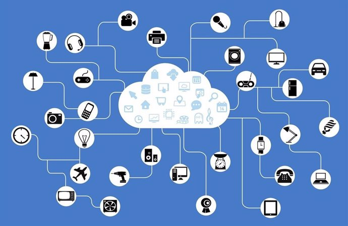
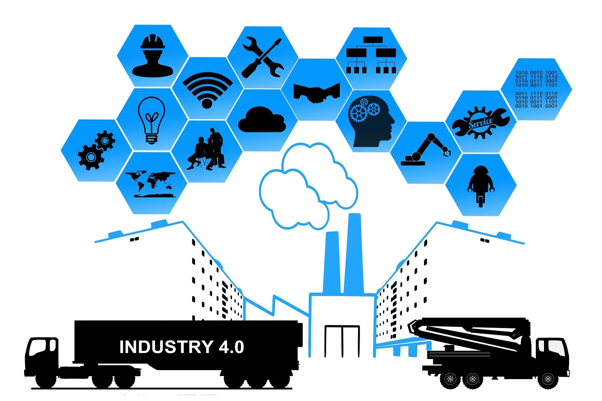
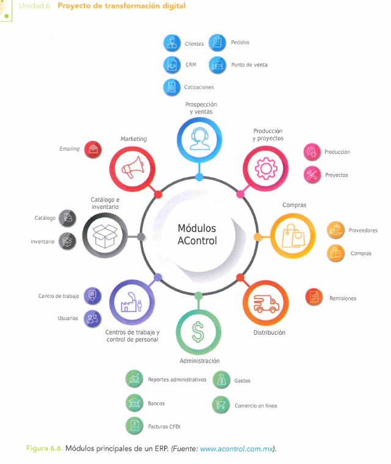
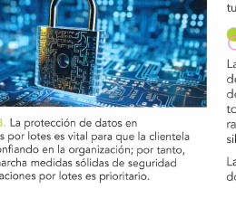
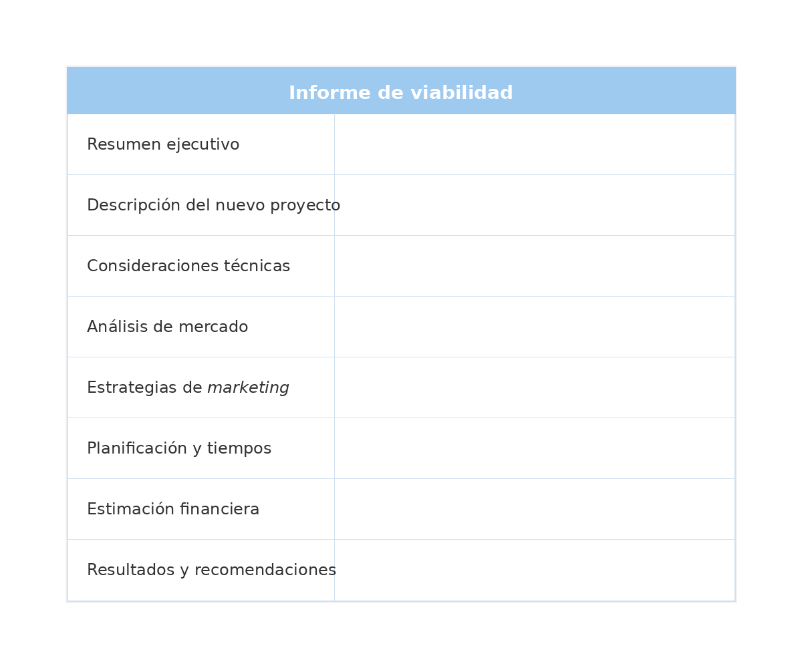

# UT6 – Proyecto de transformación digital

## De qué va esta unidad

Las cinco unidades anteriores han aportado las piezas sueltas: qué es la digitalización, qué
tecnologías la hacen posible (THD), qué es la nube, qué es la inteligencia artificial y cómo se
tratan los datos con seguridad. Esta unidad, la última del módulo, plantea **montar el puzle**:
convertir todo eso en un **proyecto real** que una empresa pueda ejecutar, con un principio, un
final, un presupuesto, unos responsables y un plan para que las personas de la empresa no se
queden fuera del cambio.

No es un ejercicio teórico. En algún momento de la vida profesional —como programador o
programadora de aplicaciones, como responsable de IT o simplemente como empleado de una
empresa que decide digitalizarse— es habitual formar parte de un proyecto así: una pyme que quiere
implantar un ERP en la nube, una fábrica que conecta sus máquinas con sensores IoT, un comercio
que estrena una tienda online. Saber estructurar ese proyecto (qué se hace, por qué, con qué
valor para el negocio, qué puede salir mal y quién responde de cada cosa) marca la diferencia
entre una transformación digital que funciona y otra que se queda a medias.

El objetivo de esta unidad es *«desarrollar un proyecto de
transformación digital de una empresa de un sector relacionado con el título, teniendo en cuenta
los cambios que se deben producir en función de los objetivos de la empresa»*.

## Qué se espera saber hacer al terminar la unidad

Al terminar la unidad se espera ser capaz de:

- Identificar los **objetivos estratégicos** de una empresa y distinguir sus categorías
  (financieros, de crecimiento, de formación, dirigidos a la clientela).
- Identificar las **áreas de negocio y de comunicación** de una empresa y comprobar que están
  **alineadas** entre sí.
- Detectar qué **áreas son susceptibles de digitalizarse** y valorar cómo encajan las que ya
  están digitalizadas con las que todavía no lo están.
- Tener en cuenta las **necesidades presentes y futuras** de la empresa al diseñar el proyecto.
- **Relacionar cada área con la tecnología** que le corresponde implantar (ERP, CRM, cloud, IoT,
  IA…).
- **Analizar las brechas de seguridad** posibles en cada área del proyecto.
- **Definir cómo se tratan y analizan los datos** que genera la empresa.
- Tener en cuenta la **integración** entre datos, aplicaciones y plataformas, evitando islas de
  información.
- **Documentar los cambios** que se van realizando conforme avanza la estrategia.
- Valorar la **idoneidad de los recursos humanos**: qué perfiles hacen falta y cómo se forma al
  personal existente.

---

## 1. Introducción a la idea del proyecto

### Por qué una empresa se transforma digitalmente

Según los apuntes de la unidad, *«la transformación digital se produce en las empresas
básicamente para intentar monetizar sus ingresos y ahorrar en costes»*. Pero el objetivo no es
solo económico: el propio material añade que una de las finalidades del proyecto es *«aumentar
la satisfacción de los empleados»*, porque un mayor compromiso y participación del personal se
traduce en más productividad (UD6, Introducción).

Es importante no idealizar el proceso: *«el proyecto de transformación digital se desarrolla
durante un proceso largo y no libre de obstáculos»* (UD6, Introducción). Esta misma idea aparece
repetida más adelante, al recordar que el cambio *«es tan relevante, con impacto en todas las
áreas del negocio, que no se debe improvisar ningún aspecto por insignificante que pueda
parecer»* (UD6 §6.1.2). Dicho de otro modo: transformar digitalmente una empresa no consiste en
comprar un programa nuevo, sino en **gestionar** un cambio profundo, y de ahí que el resto de
esta unidad (contenidos 4 a 7) se dedique precisamente a cómo gestionarlo.

### Qué implica digitalizar una empresa

Digitalizar consiste en **incorporar nuevas tecnologías en todos los departamentos**; esto
modifica la forma clásica de funcionamiento y optimiza los recursos. A corto plazo la empresa
puede ser más competitiva y ofrecer a la clientela un valor añadido en forma de servicios
mejores y más rápidos (UD6 §6.1). Pero digitalizar implica también **reformar la organización a
nivel cultural**: no se trata solo de implantar sistemas automatizados, sino de un cambio de
mentalidad de toda la plantilla, que exige invertir en formación (UD6 §6.1).

El material recuerda que, desde hace unos años, **la nube es el método operativo empresarial y
laboral más habitual**, y que según las previsiones de grandes consultoras tecnológicas, como
Gartner, el gasto en la nube pública **aumentará un 21 %** en los próximos años, con las
empresas decantándose cada vez más por escritorios virtuales basados en suscripción en lugar del
típico ordenador de sobremesa (UD6 §6.1).

Como telón de fondo de todo esto están las llamadas **tecnologías inteligentes**: sistemas
capaces de simular capacidades cognitivas humanas —razonamiento, aprendizaje, percepción, toma
de decisiones— mediante algoritmos avanzados, inteligencia artificial y procesamiento de datos
(`6-1` §1). Gracias a ellas hoy hablamos de **edificios, hogares, fábricas y ciudades
inteligentes**: por ejemplo, el edificio **The Edge**, en Ámsterdam, usa sensores para controlar
la temperatura, la iluminación y la energía, con un diseño optimizado para reducir el consumo de
recursos y mejorar la comodidad de las personas que trabajan en él (`6-1` §1.1). Otro caso citado
en el material es la **Casa BIQ** de Hamburgo (Alemania), construida para la *International
Building Exhibition* de 2013, cuya fachada de paneles solares biológicos con microalgas aprovecha
la fotosíntesis para generar energía y, a la vez, funciona como aislante térmico (`6-1` §1.1).
Estos ejemplos se completan con fábricas que integran IoT, robótica y analítica de datos para
producir de forma interconectada y en tiempo real (`6-1` §1.1, §1.3). Son ejemplos útiles para
entender **hacia dónde** puede apuntar la idea de un proyecto de transformación digital, aunque
cada empresa deberá acotar su propio alcance.

*Figura: distintos dispositivos del hogar (electrodomésticos, altavoces, cámaras, termostatos)
conectados a través de una nube de Internet de las Cosas (IoT). Origen: `6-1 Transformacion
digital THD.pdf`.*

*Figura: The Edge, en Ámsterdam, uno de los edificios inteligentes más citados como ejemplo de
eficiencia energética y sensorización. Origen: `6-1 Transformacion digital THD.pdf`.*

*Figura: la Casa BIQ, en Hamburgo, con su fachada de paneles biológicos de microalgas que generan
energía mediante fotosíntesis. Origen: `6-1 Transformacion digital THD.pdf`.*

### Qué es un proyecto y su ciclo de vida

Conviene fijar el vocabulario básico antes de avanzar. Un **proyecto** es un esfuerzo
**temporal** (tiene principio y fin) que se lleva a cabo para crear un **producto, servicio o
resultado único**. Un proyecto de transformación digital —implantar un ERP, conectar la planta
con IoT, migrar a la nube— cumple ambas condiciones: termina cuando el nuevo estado de
digitalización está en marcha, y su resultado no existía antes en la empresa. Se distingue así
de las **operaciones**, que son repetitivas y permanentes (fabricar, facturar, atender pedidos):
el proyecto construye la capacidad nueva; las operaciones la explotan después.

Todo proyecto recorre un **ciclo de vida** de cinco fases: **inicio** (se justifica el proyecto y
se nombra a la persona responsable), **planificación** (se detallan alcance, tareas, cronograma
y presupuesto), **ejecución** (se realizan las tareas), **seguimiento y control** (se compara lo
real con lo planificado, en paralelo a la ejecución) y **cierre** (se comprueba que todo está
entregado y se documentan las lecciones aprendidas). Esta secuencia encaja con la
**planificación estratégica en tres etapas** que propone la propia unidad para digitalizar una
empresa (UD6 §6.1.2):

1. **Identificación del estado actual**: evaluar el grado de digitalización actual, recopilando
   información de la operativa de los procesos, la estructura organizativa y la infraestructura,
   mediante entrevistas a directivos, personal, proveedores y clientes.
2. **Diseñar el futuro estado**: una vez conocido el punto de partida, se diseña el escenario
   idóneo de digitalización, calculando costes y beneficios de la implementación, verificando qué
   herramientas se pueden automatizar y quién puede manejarlas, e integrando todos los procesos,
   personas y tecnologías para evitar duplicidad de funciones y cuellos de botella.
3. **Definir la ruta de implantación**: la *«secuencia de decisiones e iniciativas con sus
   respectivos responsables»*, que además *«debe incluir soluciones que pueden ser puestas en
   marcha de manera rápida y sin esfuerzo»* (UD6 §6.1.2).

> **Ejemplo actual — La fábrica de Siemens en Amberg.** Esta planta alemana, muy citada en el
> mundo de la Industria 4.0, produce controladores industriales con un altísimo grado de
> automatización: sensores y máquinas se comunican entre sí y con los sistemas centrales para
> autorregular la producción, similar a los principios de fábrica inteligente descritos en esta
> unidad. Es un ejemplo habitual de cómo una planificación estratégica sostenida en el tiempo
> transforma progresivamente toda una fábrica.

> **En las noticias — El gasto mundial en transformación digital sigue creciendo.** Según se ha
> informado en distintos análisis de consultoras tecnológicas (como IDC o Gartner), el gasto de
> las empresas en proyectos de transformación digital continúa aumentando año tras año, muy por
> encima del billón de dólares a nivel mundial. Esto confirma que no se trata de una moda
> pasajera, sino de una inversión estructural que la mayoría de organizaciones considera
> necesaria para seguir siendo competitivas.

### Ideas clave de esta sección

- La transformación digital busca monetizar ingresos, ahorrar costes y también mejorar la
  satisfacción del personal.
- Es un proceso largo y con obstáculos: no se debe improvisar.
- Un proyecto es temporal y único (a diferencia de las operaciones) y recorre un ciclo de vida de
  cinco fases: inicio, planificación, ejecución, seguimiento y cierre.
- La planificación estratégica de la digitalización tiene tres etapas: identificar el estado
  actual, diseñar el futuro estado y definir la ruta de implantación.

---

## 2. Objetivos del Proyecto

### Tipos de objetivos estratégicos

Todas las empresas se plantean conseguir objetivos específicos y cuantificables para hacer
posible el crecimiento de su negocio. Los **objetivos** son las metas que la organización
plantea alcanzar y que suponen cumplir con unos resultados esperados; normalmente se agrupan en
categorías porque el propósito es obtener múltiples finalidades. La unidad distingue cuatro
categorías (UD6 §6.1.1):

- **Objetivos estratégicos financieros.** Se plantean con un horizonte dirigido a los
  beneficios: miden costes, dan forma a los presupuestos, reevalúan el gasto, analizan la
  tendencia de los ingresos y planifican el crecimiento.
- **Objetivos estratégicos de crecimiento.** Dirigidos a cómo expandir y aumentar la influencia
  de la empresa en el mercado, ayudando a planificar el futuro del negocio a medio y largo
  plazo.
- **Objetivos estratégicos de formación/aprendizaje.** Buscan aumentar el conocimiento y las
  capacidades del personal mediante acciones específicas: invertir en el capital humano,
  modificar la forma de trabajar en las operaciones comerciales o evaluar cómo crear un producto
  de forma más eficiente.
- **Objetivos estratégicos dirigidos a la clientela.** Centrados en la experiencia del cliente:
  crear valor para consumidores fieles a la marca y establecer metas que mejoren un servicio
  hasta convertirlo en excelente, asegurando su fidelidad.

### Objetivos estratégicos habituales de una empresa que se digitaliza

Más allá de esas cuatro categorías generales, la unidad recoge una lista concreta de objetivos
que persiguen las empresas al digitalizarse (UD6 §6.2): **reducción de los costes**,
**integración de un ERP** (*Enterprise Resource Planning*, sistema de planificación de recursos
empresariales), **minimizar los residuos**, **optimizar los procesos de fabricación**,
**satisfacer a los empleados** y **lograr la conciliación laboral**.

### Áreas de la empresa y su alineación

Las principales áreas de una empresa son las mismas que se pueden digitalizar e implantar en
cualquier ERP (UD6 §6.2.1):

| Área | Qué gestiona |
| --- | --- |
| **Finanzas** | Pagos, cobros, procesos financieros periódicos, transacciones bancarias, cuentas de deudores y acreedores. |
| **Producción** | Planificación de la capacidad y de los materiales, generación de nuevos planes de fabricación, seguimiento de la producción. |
| **Inventario** | Cantidad de materiales que necesita la empresa; control eficiente de los almacenes. |
| **Servicios** | Seguimiento de un producto vendido, relación con los clientes, gestión de garantías e incidencias. |
| **Recursos humanos** | Vacaciones, fichaje, nóminas y ausencias de los empleados. |
| **MRP** (*Material Requirements Planning*) | Planificación de los requisitos de materiales que necesita la empresa para atender pedidos. |
| **Compras** | Gestión de las compras, identificación de necesidades, agilización del trabajo del equipo de compras. |
| **CRM** (*Customer Relationship Management*) | Relación con los clientes; distribuye campañas de *marketing* personalizadas por varios canales (SMS, redes sociales, correo, mensajería). |
| **Ventas** | Facturación (presupuestos, pedidos, albaranes, facturas), cobros, tesorería y precios. |

La **alineación de las áreas** consiste en coordinar objetivos, metas y procesos entre ellas,
además de mejorar la comunicación entre los distintos niveles jerárquicos. Cuando la alineación
se produce de manera óptima, todos los trabajadores y trabajadoras trabajan en la misma
dirección y con una finalidad común para lograr los objetivos planteados en sus funciones (UD6
§6.2.1).

> **Ejemplo actual — Inditex y la trazabilidad con RFID.** Zara (grupo Inditex) equipa sus
> prendas con etiquetas RFID que permiten un control de inventario prácticamente en tiempo real
> en sus tiendas físicas. Es un buen ejemplo de objetivo estratégico de reducción de costes y
> optimización de procesos (menos roturas de stock, reposición más rápida) alineando el área de
> producción/inventario con la de ventas.

> **En las noticias — Objetivos de crecimiento apoyados en IA.** Numerosas cadenas de
> distribución y retailers han comunicado en los últimos años planes de digitalización centrados
> en el crecimiento del negocio online y en la personalización de la experiencia del cliente
> mediante recomendaciones basadas en IA, en línea con lo que la programación denomina
> «objetivos dirigidos a la clientela».

### Ideas clave de esta sección

- Los objetivos estratégicos se agrupan en cuatro categorías: financieros, de crecimiento, de
  formación/aprendizaje y dirigidos a la clientela.
- Una empresa que se digitaliza suele perseguir: reducir costes, integrar un ERP, minimizar
  residuos, optimizar la fabricación, satisfacer a los empleados y lograr la conciliación
  laboral.
- Las áreas de la empresa (finanzas, producción, inventario, servicios, RR. HH., MRP, compras,
  CRM, ventas) deben estar **alineadas** para que el proyecto tenga éxito.

---

## 3. El valor del negocio

### ¿Cuándo es digital una empresa?

Se puede considerar que una empresa es digital cuando utiliza tecnologías digitales en todos los
aspectos de sus operaciones —producción, gestión empresarial, finanzas, recursos humanos,
*marketing*, atención al cliente, etc.— con el objetivo de mejorar su eficiencia y
competitividad. La digitalización **no consiste en cambios radicales**, sino en la adopción
**gradual** de diferentes tecnologías según vayan siendo necesarias, ampliando poco a poco el
número de aspectos del funcionamiento de la empresa que cubren (`6-2` §2).

### Crear valor: imagen de marca y tecnología

Antes de implantar una nueva tecnología, las empresas deben estudiar sus infraestructuras y
cargas de trabajo; si quieren integrar la nube, primero deben valorar si les compensa **pagar
por el acceso a las aplicaciones** (más viable que comprar software estándar) o invertir
directamente en actualizaciones (UD6 §6.3). Una de las prioridades de un proyecto de
transformación digital es también **mejorar la imagen de la empresa**: modificar el logotipo,
cambiar la tipografía de los mensajes, añadir un eslogan que transmita credibilidad e informar a
la clientela de las mejoras y novedades (UD6 §6.3.1). Esta imagen no depende solo de lo estético,
sino de una comunicación permanente entre empresa y clientes, con el objetivo de transmitir
confianza, diferenciarse de la competencia y estar en la mente de los consumidores (UD6
§6.3.1).

*Figura: elementos habituales de una fábrica conectada (Industria 4.0): sensores, robots
colaborativos, nube y análisis de datos, integrados en el proceso productivo. Origen: `6-2
Aplicacion THD empresa.pdf`.*

### Software ERP, CRM/BPM: dónde se concentra el valor

El **software ERP** es un tipo de aplicación informática que organiza de manera centralizada los
departamentos de la empresa: es una gran base de datos que mantiene, mediante esquemas, tablas,
atributos y relaciones, los datos que la empresa genera cada día. Interconecta los procesos
empresariales y mejora el flujo de datos, supervisando finanzas, recursos humanos, materiales y
producción; los sistemas se personalizan según el tamaño y las funcionalidades de cada
organización (UD6 §6.4). El acceso a esta base de datos, que tradicionalmente funcionaba de
forma local, se está migrando cada vez más a la nube (**ERP en la nube**).

Las principales aplicaciones ERP de uso mundial recogidas en el material son:

- **SAP** (*Systems Applications and Products in Data Processing*): la más popular históricamente,
  con una plataforma en la nube diseñada para el desarrollo y la expansión de aplicaciones
  empresariales.
- **Oracle ERP**: formado también por módulos (finanzas es el básico); incluye Oracle Cloud, que
  facilita personalizar campañas de *marketing* en línea, fuera de línea y en móviles.
- **Salesforce**: especializado en software como servicio (SaaS) centrado en la gestión de
  relaciones con clientes (CRM), con servicios como Sales Cloud, Service Cloud y Marketing Cloud
  que permiten análisis en tiempo real e integración con IA para predecir el comportamiento de
  los clientes.

*Figura 6.6 del libro de la unidad: módulos principales de un ERP (fuente: www.acontrol.com.mx),
mostrando cómo un mismo sistema conecta prospección y ventas, producción, compras,
distribución, administración, centros de trabajo, catálogo/inventario y marketing.*

### Soluciones cloud: ventajas y proveedores

La nube integra el software ERP y CRM como soluciones, y otorga a las empresas una ventaja
competitiva al proporcionar acceso a las tecnologías más innovadoras sin que la organización
tenga que gestionar la infraestructura subyacente. La unidad recuerda seis características de la
*cloud manufacturing* (UD6 §6.5):

1. **Menor coste**: reduce significativamente la inversión en *hardware* y software.
2. **Escalabilidad**: la nube crece a medida que el cliente lo necesita, y este paga solo por el
   servicio que recibe.
3. **Datos**: se envían a la nube y se almacenan encriptados con un sistema de *backup*
   automático, accesibles en cualquier momento.
4. **Actualizaciones automáticas**: al no depender de servidores propios, se reduce la exposición
   a ataques por falta de actualización.
5. **No obsolescencia**: la actualización de los programas se adapta a la infraestructura
   *hardware*.
6. **Mayor colaboración**: los datos se comparten entre proveedor y cliente, haciendo la
   producción más eficaz.

No obstante, algunas fábricas muy tecnológicas prefieren un **sistema híbrido**, con un programa
local capaz de funcionar de forma autónoma sin depender de la nube; a esto se le llama *edge* o
*fog computing* (UD6 §6.5).

Los principales proveedores mundiales de servicios en la nube, según el material, son: **Amazon
Web Services (AWS)** —el más popular, con más de 165 servicios y más de 40 certificaciones de
cumplimiento—, **Microsoft Azure** —proveedor, por ejemplo, de la nube del Gobierno de EE. UU.,
con 90 certificaciones—, la **nube de IBM** —con integración híbrida entre nube pública, privada
e IaaS/SaaS/PaaS—, **Google Cloud** —disponible en más de 200 países—, **Oracle Cloud** —de
última generación, implementada en 2016— y **Alibaba Cloud** —el mayor proveedor de nube de
China— (UD6 §6.5.1).

### Tratamiento masivo de datos: riesgos que hay que valorar

El tratamiento masivo de datos puede conllevar riesgos de seguridad asociados a la pérdida o
falta de disponibilidad de la información, con cuestiones de gobierno y soberanía de los datos,
aspectos legales y de cumplimiento, y falta de estandarización en la integración e
interoperabilidad de las tecnologías (UD6 §6.6). Los riesgos de seguridad y privacidad más
comunes que identifica la unidad son:

- **Filtración de datos**: partes no autorizadas acceden o capturan datos sensibles, por cifrado
  débil, acceso deficiente o ataques maliciosos.
- **Pérdida de datos**: por fallos de *hardware*, errores de software, problemas de red o errores
  humanos; provoca análisis incompletos e interrupción de operaciones.
- **Fuga de datos**: los datos se exponen o comparten de forma inapropiada o involuntaria (ajustes
  mal configurados, enmascaramiento insuficiente).
- **Manipulación de datos**: se modifican o alteran deliberada o maliciosamente, dando lugar a
  análisis falsos o engañosos.
- **Pérdida de calidad de los datos**: ocurre cuando estos son inexactos, incompletos u obsoletos,
  con el efecto de un análisis deficiente y una toma de decisiones poco fiable (UD6 §6.6.1).

*Figura 6.13: la protección de datos en operaciones por lotes es vital para que la clientela
siga confiando en la organización.*

### Documentos de seguimiento y medidas: el informe de viabilidad y el ROI

El proyecto de transformación digital busca mejorar el bienestar de sus empleados, la
adquisición de talento y un cambio cultural en la organización. La principal medida que se
realiza para comprobarlo es el desarrollo de un **informe de viabilidad**: *«un análisis de los
factores, de los riesgos que pueden influir en la ejecución [del proyecto] y de la capacidad de
la compañía para afrontarlos»*, que *«determina la viabilidad o el riesgo de lanzar el
proyecto»* (UD6 §6.7.1).

*Figura 6.14: plantilla estándar de un informe de viabilidad, con los apartados resumen
ejecutivo, descripción del nuevo proyecto, consideraciones técnicas, análisis de mercado,
estrategias de marketing, planificación y tiempos, estimación financiera y resultados y
recomendaciones. Se pueden añadir más apartados según la naturaleza de la empresa.*

De esos ocho apartados, dos son en realidad salidas directas de la gestión del proyecto (véase
el contenido 4): **«Planificación y tiempos»** es el cronograma resumido con sus hitos, y
**«Estimación financiera»** es el presupuesto. Tras realizar este estudio *«se obtiene una
aproximación realista de los recursos necesarios para ejecutar el proyecto, así como de las
mejoras que se introducirán y las ganancias económicas»* (UD6 §6.7.1): esa comparación entre
coste y ganancia esperada es lo que se conoce como **retorno de la inversión (ROI)** del
proyecto —es decir, el indicador que resume si el «valor del negocio» generado compensa la
inversión realizada.

### ¿Cuánto valen realmente los datos?

Cuando se usan aplicaciones populares que no cobran una cuota directa (redes sociales,
buscadores, apps de mensajería), en realidad su modelo de negocio se basa en la **recopilación y
monetización de los datos personales** de las personas usuarias: sus interacciones, preferencias
y comportamientos se recopilan, analizan y se usan con fines comerciales, como la personalización
de anuncios o la venta de datos a terceros (`6-2` §6). El valor de estos datos no siempre es
fácil de cuantificar, pero es considerable: datos demográficos (edad, género, ubicación) permiten
segmentar el mercado, y datos más específicos (patrones de compra, intereses) permiten afinar
todavía más las estrategias comerciales. Aunque a nivel individual no se paga por esos datos, el
valor colectivo de todos ellos se mide en cifras muy elevadas, porque son fundamentales para la
publicidad, la tecnología y el comercio a nivel mundial (`6-2` §6.1).

### Las THD como generadoras de valor en el producto

Las tecnologías habilitadoras digitales (THD) intervienen en varias partes del proceso
productivo —análisis del cliente, mejora de la experiencia de usuario, prototipado, producción,
optimización de la cadena de suministro, plataformas digitales— y, aplicadas de forma sinérgica y
coordinada, optimizan el resultado empresarial. Según el material, las THD son capaces de:
optimizar los procesos de diseño, fabricación y distribución reduciendo costes y acelerando la
comercialización; mejorar la experiencia del cliente aumentando las ventas y la reputación de la
empresa; tener en cuenta el impacto medioambiental para ser ecosostenibles; impulsar la
innovación y la competitividad en la industria; y permitir un mejor seguimiento y gestión de los
recursos y de la cadena de suministro (`6-2` §3).

### Caso práctico: digitalización de un taller de automoción y aviación

La unidad desarrolla un caso práctico completo de digitalización de una empresa real del sector
del transporte, especializada en reparación y mantenimiento de automóviles y de aviones con
motor de pistón y de turbina, situada en el polígono Cobo Calleja de Fuenlabrada (Madrid), en una
parcela de 20 000 metros cuadrados, que ofrece servicio las 24 horas los 365 días del año y que
repara o revisa de media 40 vehículos diarios (UD6, Caso práctico). El equipo directivo estudia
siete puntos y toma, entre otras, las siguientes decisiones: integrar IoT en las máquinas y
contratar a un/a ingeniero/a de datos para analizar el *big data* generado y anticipar averías;
adquirir máquinas de diagnosis multimarca y formar a dos técnicos en su manejo; incorporar
realidad aumentada (un simulador de mecánica en Meta Quest 2) para el mantenimiento de motores;
incorporar *chatbots* de IA para comunicarse con la clientela; implantar un ERP SAP S/4HANA en
la nube (módulos de finanzas, logística y recursos humanos) junto con un software específico del
sector (Autodata, con base de datos de 43 000 modelos de vehículos, y Airline Suite para las
aeronaves); reforzar el *marketing* online; y ampliar el equipo con una persona experta en IoT y
*big data* y otra en comunicación y redes sociales. Para culminar el proceso contratan además a
una persona experta en ciberseguridad en la nube, dado que las responsabilidades sobre los
incidentes cambian al trabajar con un proveedor de software como servicio (SaaS) (UD6, Caso
práctico).

> **Ejemplo actual — SAP S/4HANA Cloud en pymes industriales.** Igual que en el caso práctico del
> taller de Fuenlabrada, numerosas pymes industriales españolas han migrado su ERP a SAP S/4HANA
> en la nube en los últimos años, atraídas por la posibilidad de pagar por uso y por la
> disponibilidad de consultores SAP, más fácil de encontrar que la de otros fabricantes de ERP.

> **En las noticias — Brechas de seguridad en grandes corporaciones.** En 2023, la empresa
> estadounidense Clorox sufrió un ciberataque que, según se informó, obligó a paralizar buena
> parte de su producción durante semanas y tuvo un impacto económico de decenas de millones de
> dólares. El caso se cita a menudo como recordatorio de que el «valor del negocio» de un
> proyecto de digitalización debe incluir siempre la inversión en ciberseguridad, tal y como
> señala esta unidad al hablar de los riesgos del tratamiento masivo de datos.

### Ideas clave de esta sección

- Una empresa es digital cuando aplica tecnología en todos sus procesos de forma gradual, no de
  golpe.
- El ERP centraliza los datos de la empresa; SAP, Oracle y Salesforce son ejemplos de peso
  mundial, cada uno con su especialización.
- La nube aporta menor coste, escalabilidad, seguridad de los datos, actualizaciones
  automáticas, ausencia de obsolescencia y mayor colaboración; AWS, Azure, IBM, Google, Oracle y
  Alibaba son sus principales proveedores.
- El tratamiento masivo de datos exige vigilar la filtración, pérdida, fuga, manipulación y
  calidad de los datos.
- El **informe de viabilidad** y el **ROI** son las herramientas que traducen el proyecto en
  «valor de negocio» medible.
- Nuestros datos personales tienen un valor comercial considerable, aunque no se nos pague
  directamente por ellos.

---

## 4. Gestión de proyectos

Gestionar el proyecto de transformación digital consiste en aplicar un método que evite la
improvisación: definir qué se va a hacer, en qué orden, con qué recursos, quién responde de cada
tarea y cómo se comprueba que se avanza según lo previsto. Esta gestión formal encaja
directamente con la planificación estratégica en tres etapas vista en el contenido 1: la
identificación del estado actual equivale al diagnóstico inicial, el diseño del futuro estado a
la planificación (fijar objetivos y alcance) y la ruta de implantación al cronograma y a la
ejecución controlada.

### Alcance, objetivos SMART, entregables e hitos

El **alcance** (*scope*) es la frontera del proyecto: la lista de lo que sí se va a hacer y, por
contraste, lo que queda fuera. Un alcance mal cerrado es la causa más habitual de retrasos y
sobrecostes (el llamado *scope creep* o «alcance que se va inflando»).

Los **objetivos SMART** son objetivos medibles que se alinean con el futuro del negocio. La
palabra es un acrónimo:

- **S**pecific (específico): dice exactamente qué se quiere lograr.
- **M**easurable (medible): lleva asociado un número o indicador.
- **A**chievable (alcanzable): es realista con los recursos disponibles.
- **R**elevant (relevante): contribuye a un objetivo estratégico de la empresa (financiero, de
  crecimiento, de formación o dirigido a la clientela).
- **T**ime-bound (acotado en el tiempo): tiene una fecha límite.

Los **entregables** (*deliverables*) son los resultados tangibles y verificables que produce el
proyecto (el ERP configurado, la red OT desplegada, el plan de formación...), y cada uno se
puede «enseñar» y alguien lo acepta formalmente. Los **hitos** (*milestones*) son puntos de
control en el calendario, de duración cero, que marcan que se ha alcanzado algo importante
(«contrato firmado», «arranque en producción»): no consumen tiempo ni recursos, sirven para
comunicar el avance a la dirección.

### Descomposición del trabajo, cronograma y ruta crítica

Antes de poner fechas hay que trocear el proyecto en piezas manejables: la **Estructura de
Descomposición del Trabajo** (EDT, o *Work Breakdown Structure*, WBS) es un árbol que baja del
proyecto completo a paquetes de trabajo y, dentro de ellos, a tareas concretas que una persona
puede estimar y ejecutar. Algunas tareas dependen de otras (dependencia *fin → inicio*); otras
son independientes y pueden solaparse para acortar el proyecto.

El **diagrama de Gantt** es la representación gráfica del cronograma: el eje horizontal es el
tiempo, el eje vertical la lista de tareas, cada tarea es una barra cuya longitud es su duración,
las barras que se solapan verticalmente indican trabajo en paralelo, las flechas representan
dependencias y los rombos marcan los hitos.

La **ruta crítica** es la cadena de tareas dependientes más larga en tiempo: determina la
duración mínima del proyecto. Las tareas de la ruta crítica no tienen holgura (si una se
retrasa, todo el proyecto se retrasa); las que no están en ella sí tienen margen para moverse un
poco.

### Recursos, presupuesto y seguimiento

Para cada paquete de trabajo hay que estimar recursos humanos (perfiles y horas, personal
interno y consultoría externa), recursos materiales y tecnológicos (licencias, servidores,
sensores) y el **presupuesto**, normalmente repartido por fases y con un margen para imprevistos.

El seguimiento se apoya en **indicadores clave de desempeño (KPI) de proyecto**: porcentaje de
avance real frente al planificado, desviación de plazo y de coste, hitos cumplidos, incidencias
abiertas y riesgos materializados. Durante la ejecución surgen casi siempre peticiones de
**cambio**, que se registran, se valoran en su impacto sobre alcance, plazo, coste y riesgos, y
se aprueban o rechazan en un comité de cambios antes de actualizar el cronograma y el
presupuesto.

### Enfoques de gestión: predictivo frente a ágil

No todos los proyectos se gestionan igual:

- **Enfoque predictivo o «en cascada»**: se planifica todo el proyecto al principio y se ejecutan
  las fases en orden (requisitos → diseño → construcción → pruebas → entrega). Funciona bien
  cuando el alcance es estable desde el inicio, por ejemplo en la migración de infraestructura a
  la nube o el despliegue de una red OT/IoT en planta.
- **Enfoque ágil**: el trabajo se divide en iteraciones cortas que entregan algo usable al final
  de cada una, con el alcance priorizándose sobre la marcha. **Scrum** organiza el trabajo en
  *sprints* con roles definidos; **Kanban** visualiza el flujo de tareas en un tablero y limita el
  trabajo en curso. Es habitual en el desarrollo de un portal de cliente, cuadros de mando de
  datos o pilotos de inteligencia artificial.
- **Enfoque híbrido**: las partes de alcance cerrado se llevan en cascada y las exploratorias en
  ágil, bajo un mismo cronograma general con hitos.

> **Ejemplo actual — Metodologías ágiles en banca.** Entidades como BBVA han comunicado
> públicamente en los últimos años la adopción de Scrum y equipos multidisciplinares para
> acelerar el desarrollo de sus aplicaciones móviles y servicios digitales, combinando esta
> agilidad con proyectos más «en cascada» para la infraestructura crítica (enfoque híbrido).

> **En las noticias — Cuando un proyecto de digitalización sale mal.** El escándalo del sistema
> informático Horizon de la empresa postal británica Post Office, que volvió a ser noticia
> mundial en 2024, es un ejemplo (aunque extremo) de las consecuencias de una gestión de
> proyecto deficiente: fallos de software no detectados ni corregidos a tiempo llevaron a acusar
> injustamente a cientos de empleados de fraude. El caso recuerda por qué el seguimiento y
> control —y no solo la puesta en marcha— es una parte crítica de la gestión de cualquier
> proyecto tecnológico.

### Ideas clave de esta sección

- Un proyecto necesita alcance definido, objetivos SMART, entregables e hitos claros.
- La EDT descompone el proyecto en tareas; el Gantt las representa en el tiempo; la ruta crítica
  marca la duración mínima del proyecto.
- El seguimiento se basa en KPIs de proyecto y en una gestión de cambios formal.
- Cascada, ágil (Scrum/Kanban) e híbrido son los tres grandes enfoques de gestión.

---

## 5. Identificación de barreras y obstáculos

### Por qué fracasan los proyectos de transformación digital

La propia unidad avisa de que el proceso *«no es libre de obstáculos»* (UD6, Introducción), y
apunta directamente a una de las causas más repetidas: *«muchas veces no se produce el fenómeno
de transformación digital en las empresas porque los directivos no alcanzan a ver sus
beneficios y paralizan el proyecto»* (UD6 §6.1.2). Conviene distinguir dos términos que se
confunden con frecuencia:

- **Barrera**: condición estructural que dificulta el proyecto de forma permanente mientras no se
  actúe sobre ella (una cultura reacia al cambio, sistemas heredados obsoletos).
- **Obstáculo**: dificultad concreta y puntual que aparece durante la ejecución (un proveedor que
  se retrasa, una integración que falla). Los obstáculos se gestionan como riesgos; las barreras
  exigen además acciones de fondo.

### Tipología de barreras

**Culturales y resistencia al cambio.** Es la barrera más citada: las personas perciben la
digitalización como una amenaza (miedo a perder el puesto, a no saber manejar las herramientas
nuevas, a perder autonomía). La propia unidad reconoce que *«el primer escollo que solventar es
transmitir la confianza de que la tecnología no reemplazará ningún puesto de trabajo»* (UD6
§6.8.2).

**Económicas y de ROI incierto.** La inversión (licencias, nube, sensores, consultoría, horas de
personal) es alta y visible, mientras que el retorno llega más tarde y es difícil de cuantificar;
si la dirección «no alcanza a ver los beneficios», recorta el presupuesto o paraliza el proyecto
(UD6 §6.1.2).

**Técnicas.** Incluyen la falta de estandarización en la integración e interoperabilidad de las
tecnologías, la necesidad de *«integrar todos los procesos, personas y tecnologías evitando la
duplicidad de funciones y los cuellos de botella»* (UD6 §6.1.2), la pérdida de calidad de los
datos y los riesgos de seguridad ya vistos en el contenido 3 (filtración, pérdida, fuga y
manipulación de datos). A esto se suman las **vulnerabilidades tecnológicas** descritas en el
material:

| Amenaza | Descripción | Riesgo |
| --- | --- | --- |
| **Malware y virus** | Software malicioso que se infiltra sin consentimiento y puede robar datos, dañar archivos o tomar el control del sistema. | Pérdida de datos, robo de información financiera, paralización de infraestructuras críticas. |
| **Phishing** | Suplantación de identidad mediante correos, mensajes o enlaces falsos para robar credenciales. | Acceso no autorizado a cuentas, robo de identidad. |
| **Ataques DDoS** | Saturación de un servidor con tráfico falso hasta colapsarlo. | Caída de servicios web, interrupción de operaciones. |
| **Contraseñas débiles y fallos de autenticación** | Uso de contraseñas fáciles de adivinar o falta de autenticación multifactor (MFA). | Acceso no autorizado, robo de cuentas. |
| **Violación de datos** | Acceso no autorizado a bases de datos que expone información confidencial. | Robo de identidad, pérdidas económicas, daño reputacional. |
| **Monitoreo no autorizado** | Tecnologías que recopilan datos sin consentimiento. | Pérdida de privacidad, manipulación de información. |

*(Fuente: `6-2 Aplicacion THD empresa.pdf` §4.2).*

Otro riesgo técnico específico que menciona el material es el del **Internet de los Pagos
(IoP)**: la evolución de los pagos tradicionales hacia un ecosistema donde los propios
dispositivos (un coche, una nevera, un reloj) pueden pagar de forma autónoma. Sus riesgos
incluyen más puntos de entrada para el fraude y la ciberseguridad, dudas sobre quién accede a los
datos de consumo recogidos, dependencia excesiva de la tecnología (si el sistema falla, no se
puede pagar) y un posible riesgo de exclusión financiera para quien no tiene acceso a estos
dispositivos (`6-2` §4.1).

**Legales y regulatorias.** El **RGPD** y la **LOPDGDD** obligan a tratar los datos personales con
base legal, seguridad y respeto a los derechos de las personas interesadas; su incumplimiento
puede acarrear sanciones, y en sectores como el financiero o el sanitario la falta de protección
adecuada puede incluso violar leyes de privacidad de datos (`6-2` §5.2).

**De talento y competencias.** Faltan perfiles (ciencia de datos, ciberseguridad, gestión de
proyectos) y competencias digitales básicas en la plantilla actual, algo que la unidad relaciona
directamente con la necesidad de nuevos perfiles profesionales y de formación (UD6 §6.8, véase el
contenido 7).

**Organizativas.** Departamentos que trabajan de forma aislada («islas de información»), falta de
patrocinio visible de la dirección o falta de un gobierno claro del proyecto: justo lo contrario
de la alineación de áreas que pide el contenido 2 de esta unidad.

### Quién defiende a la empresa de estas amenazas: hackers, ciberdelincuentes y el CISO

Conviene distinguir entre un **hacker** —persona con altos conocimientos de informática y
seguridad digital, capaz de analizar, modificar o vulnerar sistemas— y un **ciberdelincuente**
—persona que comete delitos informáticos con intención de obtener un beneficio ilícito. No todos
los hackers tienen intenciones maliciosas: existen hackers éticos (*white hat*), que trabajan
legalmente para mejorar la seguridad de empresas y gobiernos; hackers grises (*gray hat*), que
encuentran vulnerabilidades sin permiso y las revelan después; y hackers maliciosos (*black
hat*), que sí se consideran ciberdelincuentes (`6-2` §4.3).

Para protegerse de estas amenazas, las empresas implementan cortafuegos, antivirus y cifrado de
datos, forman a sus empleados en buenas prácticas y en el reconocimiento del *phishing*, y
realizan auditorías y simulaciones de ataques (*penetration testing*). Si una empresa no ha
tomado las medidas adecuadas y sufre un ataque, puede enfrentarse a consecuencias legales y
financieras por negligencia (`6-2` §5.2). La figura responsable de coordinar todo esto es el
**CISO** (*Chief Information Security Officer*), un alto ejecutivo que diseña las estrategias de
seguridad, gestiona los riesgos, garantiza el cumplimiento normativo (RGPD, entre otros),
supervisa a los equipos de ciberseguridad, lidera la respuesta ante incidentes, forma a la
plantilla e informa a la dirección sobre el estado de la seguridad de la empresa (`6-2` §5.3).

### Técnicas de mitigación y matriz de riesgos

Cada barrera tiene técnicas de mitigación asociadas: comunicación temprana y usuarios clave como
prescriptores frente a la resistencia cultural; presupuesto por fases y victorias tempranas
(*quick wins*) frente al ROI incierto; pilotos, estándares de integración y un plan de calidad de
datos frente a las barreras técnicas; análisis de requisitos legales desde la fase de
planificación frente a las regulatorias; planes de capacitación frente a la falta de talento; y
patrocinio visible de la dirección junto con un gobierno claro del proyecto (la matriz RACI del
contenido 6) frente a las barreras organizativas.

Estas técnicas se recogen en la práctica en una **matriz de riesgos**: por cada barrera se anotan
los riesgos concretos del proyecto, se valora su **daño** y su **probabilidad** para obtener un
**nivel de riesgo** que permite priorizarlos, y se define para cada uno un plan de respuesta
(evitarlo, reducir su probabilidad o su daño, transferirlo o aceptarlo con un plan de
contingencia).

> **Ejemplo actual — Miedo a la IA en el puesto de trabajo.** Es habitual que, al anunciar la
> incorporación de *chatbots* de IA o de automatización de tareas (como el propio caso práctico
> del taller de Fuenlabrada visto en el contenido 3), parte de la plantilla tema perder su
> empleo. Gestionar bien esta barrera cultural —explicando que la tecnología libera de tareas
> repetitivas en lugar de sustituir personas— suele ser tan importante como la propia tecnología.

> **En las noticias — Ciberataque a Clorox (2023).** Como ya se ha citado en el contenido 3, este
> ataque a la multinacional estadounidense de productos de limpieza paralizó buena parte de su
> producción durante semanas. Es un ejemplo real de cómo una barrera técnica (una vulnerabilidad
> de seguridad no resuelta a tiempo) puede convertirse en un obstáculo que detiene por completo
> un proyecto o incluso la actividad de la empresa.

### Ideas clave de esta sección

- Una barrera es estructural y permanente; un obstáculo es puntual y se gestiona como riesgo.
- Las barreras se agrupan en culturales, económicas, técnicas, legales, de talento y
  organizativas.
- Las vulnerabilidades tecnológicas más comunes son malware, phishing, DDoS, contraseñas
  débiles, violación de datos y monitoreo no autorizado.
- El CISO lidera la estrategia de ciberseguridad de la empresa frente a hackers maliciosos y
  ciberdelincuentes.
- La matriz de riesgos (daño × probabilidad) permite priorizar qué barreras atender primero.

---

## 6. Asignación de responsabilidades

### Qué es la matriz RACI

La **matriz RACI** es una tabla que cruza las **actividades o entregables** de un proyecto
(filas) con los **roles** que participan en él (columnas), indicando para cada cruce qué tipo de
implicación tiene ese rol en esa actividad. Su finalidad es que nadie dude de **quién hace qué,
quién decide y a quién hay que avisar**. Las cuatro letras son:

| Letra | Nombre | Significado |
| --- | --- | --- |
| **R** | *Responsible* (Responsable) | **Ejecuta** el trabajo. Puede haber varios R en una misma actividad. |
| **A** | *Accountable* (Aprobador) | **Responde del resultado** ante la organización y aprueba el trabajo del R. Debe haber **exactamente uno por actividad**. |
| **C** | *Consulted* (Consultado) | Se le pide opinión o información **antes** de decidir; comunicación bidireccional. |
| **I** | *Informed* (Informado) | Se le comunica el resultado o el avance **después**; comunicación unidireccional. |

Regla mnemotécnica: **R** hace, **A** aprueba y da la cara, **C** aporta *antes*, **I** se entera
*después*.

### Reglas de oro

1. **Exactamente una «A» por fila**: si hay dos, nadie responde de verdad; si no hay ninguna, la
   actividad queda sin dueño.
2. **Al menos una «R» por fila**: toda actividad la ejecuta alguien.
3. La **A y la R pueden recaer en el mismo rol** (se anota «A/R»), pero nunca puede faltar la A.
4. **Pocas «C»**: consultar a todo el mundo paraliza el proyecto.
5. **Cuidado con el exceso de «I»**: un rol informado en casi todas las filas suele indicar una
   comunicación mal pensada.
6. **Roles con demasiadas letras = sobrecarga o cuello de botella**; hay que repartir.
7. **Columnas casi vacías**: un rol que apenas aparece quizá no debería estar en la matriz.

### Cómo se construye

1. Las **filas** son las actividades o entregables del proyecto (tomadas de la EDT vista en el
   contenido 4), redactadas como verbos de acción concretos («migrar los datos»), no como áreas
   genéricas.
2. Las **columnas** son **roles**, no personas, para que la matriz siga siendo válida aunque
   cambie quién ocupa cada puesto.
3. Se rellena fila a fila: primero se decide quién es la A, luego quién es R, después C e I.
4. Se revisa por filas y por columnas aplicando las reglas de oro.
5. Se valida con el equipo y se publica: la matriz solo sirve si todo el mundo la conoce.

### Ejemplo resuelto

Para un proyecto de digitalización de una pyme industrial (ERP en la nube, IoT en planta, plan
de ciberseguridad y capacitación del personal), con los roles DIR (dirección), COORD
(coordinación del proyecto), IT/OT, ÁREA (responsable funcional), EXT (consultoría externa),
RRHH y UUCC (usuarios clave):

| # | Actuación | DIR | COORD | IT/OT | ÁREA | EXT | RRHH | UUCC |
|---|---|:---:|:---:|:---:|:---:|:---:|:---:|:---:|
| 1 | Definir objetivos y alcance del proyecto | **A** | R | C | C | C | I | I |
| 2 | Auditoría del estado actual de digitalización | I | **A** | R | C | R | I | C |
| 3 | Informe de viabilidad | **A** | R | C | I | C | I | I |
| 4 | Selección e implantación del ERP/CRM | **A** | R | R | C | R | I | C |
| 5 | Implantación de IoT en planta | I | **A** | R | C | R | I | C |
| 6 | Plan de ciberseguridad y RGPD | **A** | C | R | C | R | I | I |
| 7 | Migración de servicios a la nube | C | **A** | R | C | R | I | I |
| 8 | Plan de formación (LMS) y gestión del cambio | **A** | C | I | C | I | R | C |

Se puede comprobar que cada fila tiene una sola A, al menos una R, ninguna columna saturada ni
vacía y un número contenido de C por fila: la matriz cumple las reglas de oro.

### Errores comunes y la variante RASCI

Entre los errores más frecuentes: poner dos o más «A» en una fila «para que nadie se ofenda»
(destruye la rendición de cuentas), confundir la A con la jerarquía (no es «el jefe», es «quien
responde de esa actividad concreta»), marcar «C» a todo el mundo por prudencia, usar nombres de
personas en vez de roles, o no comunicar la matriz una vez terminada.

La variante **RASCI** (o RASIC) añade una quinta letra, **S** (*Support*, Apoyo): un rol que
ayuda activamente al R aportando recursos o trabajo, pero sin ser responsable de la tarea ni
aprobarla; se distingue de la C, que solo aporta opinión puntual.

> **Ejemplo actual — RACI tras una fusión de empresas.** Cuando dos empresas se fusionan o una
> gran consultora (como Accenture o Deloitte) coordina un proyecto de digitalización conjunto
> entre varios departamentos, es habitual publicar una matriz RACI para dejar claro, desde el
> primer día, quién aprueba cada decisión importante y evitar la parálisis por «demasiados
> jefes» que suele producirse en estos procesos.

### Ideas clave de esta sección

- RACI cruza actividades con roles: R ejecuta, A aprueba y responde, C se consulta antes, I se
  informa después.
- Regla de oro más importante: una única A por fila, y al menos una R.
- Las columnas deben ser roles, no personas, para que la matriz no caduque.
- RASCI añade la S de *Support*: quien ayuda al R sin ser responsable de la tarea.

---

## 7. Gestión del cambio

### El primer obstáculo: el miedo a perder el puesto de trabajo

La unidad insiste en que un plan de transformación digital viene de la mano de un **cambio de
cultura**, por lo que los empleados deberán recibir formación en las nuevas herramientas y en
los nuevos entornos de trabajo, así como el curso elemental de prevención de riesgos laborales
que corresponde a cada persona contratada (UD6 §6.8.2). El material lo resume con claridad: *«el
primer escollo que solventar es transmitir la confianza de que la tecnología no reemplazará
ningún puesto de trabajo»*, explicando en su lugar que digitalizar ayuda a resolver tareas
repetitivas para que el trabajador quede liberado y pueda emplearse en tareas más críticas (UD6
§6.8.2). La formación en digitalización es necesaria porque, incluso dominando ya la tecnología
en general, hace falta tiempo para familiarizarse con la aplicación o el sistema concreto que se
va a utilizar; por eso la empresa debe facilitar formación a todas las áreas y a todo el personal
existente (UD6 §6.8.2).

### Nuevos perfiles profesionales

Los nuevos perfiles se localizan hoy sobre todo mediante redes sociales profesionales como
LinkedIn: quedaron atrás el envío del currículum en papel y la carta de presentación por correo
postal. Los perfiles que buscan las empresas exigen formación en tecnologías habilitadoras, uso
del ordenador y conocimientos básicos de programación; a su vez, quienes buscan empleo valoran
que la empresa permita el teletrabajo, fomente un entorno de trabajo inclusivo y sea sostenible y
respetuosa con el medioambiente (UD6 §6.8.1). El propio Departamento de Recursos Humanos utiliza
ya IA y *big data* para predecir qué perfiles con talento pueden marcharse y anticiparse a la
salida con incentivos o ascensos (UD6 §6.8).

### La formación como palanca del cambio: el LMS

Una manera de tener la formación centralizada y disponible es implementar una herramienta
**LMS** (*Learning Management System*, sistema de gestión de aprendizaje): una plataforma de
aprendizaje *online* que dispone de los contenidos, las actividades y los exámenes, gestionada
por el personal técnico de recursos humanos y facilitada de manera multitudinaria a la
plantilla. Gracias a la política de roles, quien dirige el equipo puede comprobar de forma
masiva si sus empleados han completado con éxito la formación, y esta siempre está disponible en
formato *online* (UD6 §6.8.2).

### Dos modelos para ordenar el cambio en las personas

Para ordenar de forma sistemática las acciones dirigidas a las personas durante un proyecto de
transformación digital se suelen citar dos modelos de referencia:

- **Modelo de 8 pasos de Kotter**: crear sentido de urgencia → formar una coalición impulsora →
  definir una visión → comunicarla → eliminar obstáculos y empoderar → generar victorias a corto
  plazo → consolidar y seguir avanzando → anclar el cambio en la cultura de la empresa.
- **Modelo ADKAR**: el cambio en cada persona progresa por cinco estados: *Awareness*
  (conciencia de la necesidad del cambio) → *Desire* (deseo de participar en él) → *Knowledge*
  (saber cómo hacerlo) → *Ability* (ser capaz de hacerlo) → *Reinforcement* (refuerzo para que el
  cambio perdure en el tiempo).

Estos dos modelos son un complemento útil, aunque de uso general en dirección de proyectos, para
poner en práctica la idea que ya aparecía en el contenido 1: *«transmitir la confianza»* y
acompañar a las personas, no solo instalar tecnología.

> **Ejemplo actual — Programas de recualificación (***reskilling***).** Grandes empresas
> tecnológicas, como IBM con su plataforma IBM SkillsBuild o Amazon con sus programas internos de
> recualificación, han anunciado en los últimos años inversiones millonarias para formar a su
> plantilla en nuevas competencias digitales antes de automatizar o cambiar procesos, aplicando
> en la práctica la misma idea de fondo que recoge esta unidad: la tecnología debe liberar a las
> personas de tareas repetitivas, no sustituirlas sin más.

> **En las noticias — Preocupación por el empleo y la IA.** Diversos informes internacionales
> sobre el futuro del empleo (como los publicados por el Foro Económico Mundial) han señalado en
> los últimos años que, aunque la automatización y la IA transforman muchos puestos de trabajo,
> también crean otros nuevos, y que la clave para las empresas está en la formación continua de
> su plantilla. Esta idea coincide con lo que defiende la propia unidad sobre la formación (LMS)
> como palanca imprescindible del cambio.

### Ideas clave de esta sección

- El primer obstáculo de la gestión del cambio es transmitir que la tecnología no sustituye
  puestos de trabajo, sino que libera de tareas repetitivas.
- Los nuevos perfiles se buscan hoy en redes profesionales como LinkedIn y exigen conocimientos
  digitales básicos.
- Un LMS centraliza y facilita la formación online de toda la plantilla.
- Los modelos de Kotter (8 pasos) y ADKAR (Awareness-Desire-Knowledge-Ability-Reinforcement)
  ayudan a ordenar el cambio en las personas.

---

## De un vistazo: mapa conceptual de la unidad

El propio libro de la unidad resume en un mapa conceptual la parte que cubre en sus epígrafes
6.1 a 6.8 (transformación digital y objetivos, proceso de transformación, implantación de
tecnología, ERP/CRM, soluciones en la nube, tratamiento de datos, documentos de seguimiento y
recursos humanos). Esta unidad completa ese esquema con la gestión formal del proyecto, las
barreras, la matriz RACI y la gestión del cambio (contenidos 4 a 7), desarrollados en la
ampliación de la unidad.

---

## Glosario rápido

| Término | En una frase |
| --- | --- |
| **THD** | Tecnologías Habilitadoras Digitales: tecnologías (IA, IoT, cloud, 5G...) que hacen posible la digitalización. |
| **ERP** | *Enterprise Resource Planning*: software que centraliza y conecta los datos de todos los departamentos de una empresa. |
| **CRM** | *Customer Relationship Management*: sistema para gestionar la relación con los clientes. |
| **MRP** | *Material Requirements Planning*: planificación de los materiales que necesita la empresa. |
| **SaaS / IaaS / PaaS** | Modelos de nube: software, infraestructura o plataforma ofrecidos como servicio. |
| **Edge / Fog computing** | Sistema híbrido en el que parte del procesamiento se hace localmente, sin depender por completo de la nube. |
| **Informe de viabilidad** | Documento que analiza factores y riesgos del proyecto para determinar si conviene lanzarlo. |
| **ROI** | *Return On Investment*: comparación entre coste del proyecto y ganancia económica obtenida. |
| **Alcance (***scope***)** | Frontera de lo que sí y lo que no incluye el proyecto. |
| **SMART** | Objetivo específico, medible, alcanzable, relevante y acotado en el tiempo. |
| **EDT / WBS** | Estructura de descomposición del trabajo: árbol que baja del proyecto a tareas concretas. |
| **Ruta crítica** | Cadena de tareas dependientes más larga; marca la duración mínima del proyecto. |
| **KPI** | Indicador clave de desempeño para medir el avance de un proyecto. |
| **Scrum / Kanban** | Marcos de trabajo ágil: en *sprints* con roles fijos (Scrum) o con tablero de flujo continuo (Kanban). |
| **RACI** | Matriz que asigna a cada actividad quién la ejecuta (R), quién la aprueba (A), a quién se consulta (C) y a quién se informa (I). |
| **RASCI** | Variante de RACI que añade la S de *Support* (apoyo al R). |
| **CISO** | *Chief Information Security Officer*: responsable máximo de la ciberseguridad de la empresa. |
| **RGPD / LOPDGDD** | Normativa europea y española de protección de datos personales. |
| **LMS** | *Learning Management System*: plataforma para gestionar la formación online de la plantilla. |
| **Modelo ADKAR** | Modelo de gestión del cambio en 5 fases: Awareness, Desire, Knowledge, Ability, Reinforcement. |

## Repaso: preguntas de autoevaluación

1. ¿Cuáles son las dos finalidades principales que persigue un proyecto de transformación
   digital según la introducción de la unidad?
2. ¿En qué se diferencia un proyecto de unas operaciones?
3. Cita las cuatro categorías de objetivos estratégicos que puede plantearse una empresa.
4. ¿Qué áreas de la empresa gestiona un ERP y qué significa que estén «alineadas»?
5. ¿Qué apartados de un informe de viabilidad corresponden, en realidad, al cronograma y al
   presupuesto del proyecto?
6. ¿Qué diferencia hay entre una barrera y un obstáculo dentro de un proyecto?
7. Explica de forma resumida qué significan las siglas R, A, C e I de la matriz RACI y cuál es su
   «regla de oro» más importante.
8. ¿Qué modelo de gestión del cambio propone las fases Awareness, Desire, Knowledge, Ability y
   Reinforcement?
9. Nombra tres de las vulnerabilidades tecnológicas más comunes descritas en la unidad y su
   riesgo asociado.
10. ¿Por qué se dice que la formación (LMS) es una pieza clave de la gestión del cambio en un
    proyecto de transformación digital?

Ver respuestas (con la sección donde se explican)

1. Monetizar los ingresos y ahorrar en costes; además, aumentar la satisfacción de los empleados
   (sección 1).
2. El proyecto es temporal y crea algo único; las operaciones son repetitivas y permanentes
   (sección 1).
3. Financieros, de crecimiento, de formación/aprendizaje y dirigidos a la clientela (sección 2).
4. Finanzas, producción, inventario, servicios, RR. HH., MRP, compras, CRM y ventas; alineadas
   significa que todas trabajan coordinadas hacia el mismo objetivo (sección 2).
5. «Planificación y tiempos» (el cronograma) y «Estimación financiera» (el presupuesto)
   (sección 3).
6. La barrera es estructural y permanente; el obstáculo es puntual y se gestiona como un riesgo
   concreto (sección 5).
7. R ejecuta, A aprueba y responde, C se consulta antes, I se informa después; la regla de oro es
   que debe haber exactamente una A por actividad (sección 6).
8. El modelo ADKAR (sección 7).
9. Por ejemplo: malware/virus (pérdida de datos), phishing (robo de credenciales) y ataques DDoS
   (caída de servicios) (sección 5).
10. Porque centraliza y facilita que toda la plantilla aprenda a usar las nuevas herramientas,
    reduciendo el miedo al cambio y la resistencia inicial (sección 7).

